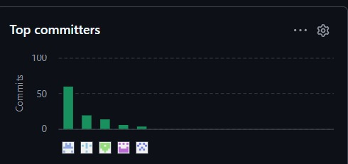

 

Universidad Peruana de Ciencias Aplicadas  
Carrera de Ingeniería de Software  

 

### **1ASI0730**
### **Aplicaciones Web**

NRC
### **8088**

 

### **Informe del Trabajo Final · TB1**

**Borrador revisable — ejecución local y evidencias humanas pendientes**

Docente
### **Bautista Ubillús, Efrain Ricardo**

 

Equipo
### **BlackStartup**

Proyecto
### **FríoTrack**

 

### **Integrantes**

 

**Código** &nbsp;&nbsp;&nbsp;&nbsp;&nbsp;&nbsp;&nbsp;&nbsp; **Apellidos y Nombres**  
u20241f246 &nbsp;&nbsp;&nbsp;&nbsp; Atauje Barreto, Alexander Sebastián  
u202421137 &nbsp;&nbsp;&nbsp;&nbsp; Bardales Rodriguez, Benjamin Elias  
u202219829 &nbsp;&nbsp;&nbsp;&nbsp; Daga Chávez, Joaquín Leonardo  
u20241D811 &nbsp;&nbsp;&nbsp;&nbsp; Saavedra Flores, Rodrigo Andree  
u20231H17 &nbsp;&nbsp;&nbsp;&nbsp;&nbsp; Vera Solsol, Nayely Macarena  

 
 

### **Período 202620**

 

### **Octubre 2026**

Fechas de revisión: 06–07/10/2026. Fecha y hora de entrega: pendiente de confirmar la segunda sesión sincrónica semanal.

---

## Registro de Versiones del Informe

| Versión | Fecha | Autor | Descripción de modificación |
|:-------:|:----------:|:-----------------------------------:|:-------------------------------------------------------------------------------------------------------------------------------------------------------------------------------------------------------------------------:|
| AV1 | 14/09/2026 | Atauje Barreto, Alexander Sebastián | Redacción de Startup Profile: Descripción de la Startup y Perfiles de integrantes del equipo |
| AV1 | 15/09/2026 | Bardales Rodriguez, Benjamin Elias | Modelado de Bounded Contexts y Design-Level EventStorming del Capítulo IV |
| AV1 | 15/09/2026 | Atauje Barreto, Alexander Sebastián | Redacción de Solution Profile: Background & Problemática y Lean UX Process |
| AV1 | 16/09/2026 | Bardales Rodriguez, Benjamin Elias | Elaboración de diagramas de clases y diseño de base de datos del Capítulo IV |
| AV1 | 16/09/2026 | Saavedra Flores, Rodrigo Andree | Redacción del Capítulo V: Software Development Environment Configuration |
| AV1 | 17-09-2026 | Atauje Barreto, Alexander Sebastián | Creación de la estructura base del repositorio y Frontmatter |
| AV1 | 17/09/2026 | Bardales Rodriguez, Benjamin Elias | Implementación de la mayor parte del Landing Page (HTML5, CSS3 y JavaScript) |
| AV1 | 17/09/2026 | Saavedra Flores, Rodrigo Andree | Apoyo en la implementación y despliegue del Landing Page en GitHub Pages |
| AV1 | 18/09/2026 | Daga Chávez, Joaquín Leonardo | Redacción del Capítulo III: definición de Epics y User Stories |
| AV1 | 18/09/2026 | Vera Solsol, Nayely Macarena | Configuración y organización del tablero de Trello (Product Backlog) |
| AV1 | 19/09/2026 | Daga Chávez, Joaquín Leonardo | Redacción de criterios de aceptación (Gherkin) del Capítulo III |
| AV1 | 19/09/2026 | Vera Solsol, Nayely Macarena | Elaboración del Impact Mapping |
| AV1 | 19/09/2026 | Vera Solsol, Nayely Macarena | Diseñar y actualizar los User Stories |
| AV1 | 19/09/2026 | Vera Solsol, Nayely Macarena | Elaboración del Product Backlog |
| TB1 · borrador | 06–07/10/2026 | Revisión técnica; pendiente de validación del equipo | Integración del capítulo III y Student Outcome; corrección del dominio, investigación, arquitectura y sprints; primera aplicación Vue local, pruebas y capturas de ejecución; preparación de entregables. No acredita nuevas contribuciones individuales del equipo. |

## Project Report Collaboration Insights

| Integrante | Tareas Asignadas |
|---|---|
| Atauje Barreto, Alexander Sebastián | Introduction, Startup Profile, Startup Description, Team Member Profiles, Solution Profile, Background & Problematic, Lean UX Process (Problem Statements, Assumptions, Hypothesis Statements, Lean UX Canvas), Target Segments, Services Section (HTML5 & CSS Grid Layout), Milestones / How It Works Section (HTML5 & CSS Layout), Landing Page Modularization & GitHub Branch Management |
| Bardales Rodriguez, Benjamin Elias | Domain-Driven Software Architecture (Chapter 4.6), Design-Level EventStorming, Architecture Context, Container and Component Diagrams, Software Object-Oriented Design Class Diagrams, Database Design and Database Diagrams, mayor parte de la implementación del Landing Page (HTML5, CSS3 y JavaScript) |
| Daga Chávez, Joaquín Leonardo | Requirements Specification (Chapter 3): Epics, User Stories y criterios de aceptación (Gherkin) |
| Saavedra Flores, Rodrigo Andree | Product Implementation, Validation & Deployment (Chapter 5), apoyo en la implementación y despliegue del Landing Page |
| Vera Solsol, Nayely Macarena | Impact Mapping, User Stories and Product Backlog (Chapter 3), configuración y gestión del tablero Trello |

AV1 reportó trabajo en los capítulos I a V. La revisión constató que el capítulo III y Student Outcome no estaban integrados en la rama principal. TB1 incorpora esos archivos y corrige inconsistencias; las entrevistas del dominio de transporte, los artefactos en herramientas solicitadas y las evidencias del equipo conservan estado pendiente cuando falta respaldo.

Debido a que se manejan dos repositorios dentro de la organización, uno para el reporte y otro para el despliegue de la Landing Page, con el fin de aplicar correctamente el flujo de trabajo GitFlow, se presenta a continuación la actividad de commits del repositorio principal del reporte.

Link de la organización: https://github.com/upc-pre-202620-1asi0730-8088-FrioTrack

Collaboration Insight (Repositorio del reporte):
    

## **AV1:**

Durante este avance del trabajo, se desarrollaron los siguientes puntos del reporte para FríoTrack:

- Carátula e información esencial
- Registro de versiones y Project Report Collaboration Insights
- **Capítulo I: Introducción**
- **Capítulo II: Requirements Elicitation & Analysis**
- **Capítulo III: Requirements Specification**
- **Capítulo IV: Product Design**
- **Capítulo V: Product Implementation, Validation & Deployment (Sprint 1)**
- Conclusiones y Anexos

## Commits verificados de la versión integrada

Se cuenta el historial alcanzable desde `HEAD = 3a9a17fcac89bb84e8b86b11fed4d186080dd076`, con fecha de último commit 20/09/2026, incluyendo merges. Comando reproducible: `git shortlog -sn HEAD`. El nombre de autor se relaciona con el integrante; no se mezclan ramas no integradas ni repositorios. La captura AV1 se conserva como antecedente y no acredita los cambios locales de TB1.

| Integrante | Autor Git observado | Commits alcanzables desde HEAD |
|---|---|---:|
| Alexander Atauje | Alexander1Alexander2 | 68 |
| Benjamin Bardales | Benjamin Bardales | 14 |
| Joaquín Daga | Eshnikeee | 6 |
| Rodrigo Saavedra | rodrigoxd67 | 6 |
| Nayely Vera | Macaxprogram29 | 5 |
| **Total** | Incluye merges | **99** |

Las cifras históricas 109/113 no correspondían a un criterio documentado y se sustituyen por este conteo reproducible. La cantidad de commits no demuestra calidad, liderazgo o cumplimiento de responsabilidades. Los cambios de esta revisión permanecen sin commit; no se atribuyen como aportes individuales de TB1.

El código de Nayely aparece como `u20231H17` en el texto y `u20231h171` en el nombre de la foto. Se conserva el texto original hasta confirmarlo en el registro académico.

---

Repositorio de GitHub: [Proyecto](https://github.com/upc-pre-202620-1asi0730-8088-FrioTrack/report-friotrack)

---

## Contenido

Índice de secciones (hasta cuatro niveles):

- [Carátula](#caratula)
- [Registro de Versiones del Informe](#registro-de-versiones-del-informe)
- [Project Report Collaboration Insights](#project-report-collaboration-insights)
- [Student Outcome](report/01-student-outcome.md#student-outcome)
  - [Trabaja en equipo para proporcionar liderazgo en forma conjunta](report/01-student-outcome.md#trabaja-en-equipo-para-proporcionar-liderazgo-en-forma-conjunta)
  - [Crea un entorno colaborativo e inclusivo, establece metas, planifica tareas y cumple objetivos.](report/01-student-outcome.md#crea-un-entorno-colaborativo-e-inclusivo-establece-metas-planifica-tareas-y-cumple-objetivos)
- [Capítulo I: Introducción](report/11-chapter1-introduction.md#capítulo-i-introducción)
  - [1.1. Startup Profile](report/11-chapter1-introduction.md#11-startup-profile)
    - [1.1.1. Descripción de la Startup](report/11-chapter1-introduction.md#111-descripción-de-la-startup)
    - [1.1.2. Perfiles de integrantes del equipo](report/11-chapter1-introduction.md#112-perfiles-de-integrantes-del-equipo)
  - [1.2. Solution Profile](report/11-chapter1-introduction.md#12-solution-profile)
    - [1.2.1. Antecedentes y problemática](report/11-chapter1-introduction.md#121-antecedentes-y-problemática)
    - [1.2.2. Lean UX Process](report/11-chapter1-introduction.md#122-lean-ux-process)
      - [1.2.2.1. Lean UX Problem Statements](report/11-chapter1-introduction.md#1221-lean-ux-problem-statements)
      - [1.2.2.2. Lean UX Assumptions](report/11-chapter1-introduction.md#1222-lean-ux-assumptions)
      - [1.2.2.3. Lean UX Hypothesis Statements](report/11-chapter1-introduction.md#1223-lean-ux-hypothesis-statements)
      - [1.2.2.4. Lean UX Canvas](report/11-chapter1-introduction.md#1224-lean-ux-canvas)
  - [1.3. Segmentos objetivo](report/11-chapter1-introduction.md#13-segmentos-objetivo)
    - [Segmento 1: Empresas de Transporte Refrigerado](report/11-chapter1-introduction.md#segmento-1-empresas-de-transporte-refrigerado)
    - [Segmento 2: Productores/Exportadores y Compradores de Alimentos Perecibles](report/11-chapter1-introduction.md#segmento-2-productoresexportadores-y-compradores-de-alimentos-perecibles)
- [Capítulo II: Requirements Elicitation & Analysis](report/12-chapter2-requirements.md#capítulo-ii-requirements-elicitation--analysis)
  - [2.1. Competidores](report/12-chapter2-requirements.md#21-competidores)
    - [2.1.1. Análisis competitivo](report/12-chapter2-requirements.md#211-análisis-competitivo)
      - [Competitive Analysis Landscape](report/12-chapter2-requirements.md#competitive-analysis-landscape)
      - [Análisis SWOT](report/12-chapter2-requirements.md#análisis-swot)
    - [2.1.2. Estrategias y tácticas frente a competidores](report/12-chapter2-requirements.md#212-estrategias-y-tácticas-frente-a-competidores)
  - [2.2. Entrevistas](report/12-chapter2-requirements.md#22-entrevistas)
    - [2.2.1. Diseño de entrevistas](report/12-chapter2-requirements.md#221-diseño-de-entrevistas)
      - [Datos principales y complementarios para ambos segmentos](report/12-chapter2-requirements.md#datos-principales-y-complementarios-para-ambos-segmentos)
      - [Segmento actual 1: Coordinador Logístico de transporte refrigerado](report/12-chapter2-requirements.md#segmento-actual-1-coordinador-logístico-de-transporte-refrigerado)
      - [Segmento actual 2: Cliente de Carga](report/12-chapter2-requirements.md#segmento-actual-2-cliente-de-carga)
    - [2.2.2. Registro de entrevistas](report/12-chapter2-requirements.md#222-registro-de-entrevistas)
      - [Registros del segmento exploratorio 1: distribuidoras de perecibles](report/12-chapter2-requirements.md#registros-del-segmento-exploratorio-1-distribuidoras-de-perecibles)
      - [Entrevista 1: Jari Hassan ](report/12-chapter2-requirements.md#entrevista-1-jari-hassan-)
      - [Registros del segmento exploratorio 2: compradores minoristas de perecibles](report/12-chapter2-requirements.md#registros-del-segmento-exploratorio-2-compradores-minoristas-de-perecibles)
      - [Entrevista 1: Irma Barreto](report/12-chapter2-requirements.md#entrevista-1-irma-barreto)
      - [Entrevista 2: Santiago Silva Jara](report/12-chapter2-requirements.md#entrevista-2-santiago-silva-jara)
    - [2.2.3. Análisis de entrevistas](report/12-chapter2-requirements.md#223-análisis-de-entrevistas)
      - [Distribución de perecibles: Jari Hassan](report/12-chapter2-requirements.md#distribución-de-perecibles-jari-hassan)
      - [Compradores minoristas: Irma Barreto y Santiago Silva Jara](report/12-chapter2-requirements.md#compradores-minoristas-irma-barreto-y-santiago-silva-jara)
      - [Relación entre hallazgos y decisiones de diseño](report/12-chapter2-requirements.md#relación-entre-hallazgos-y-decisiones-de-diseño)
  - [2.3. Needfinding](report/12-chapter2-requirements.md#23-needfinding)
    - [2.3.1. User Personas](report/12-chapter2-requirements.md#231-user-personas)
      - [Arquetipo histórico: Javier Mendoza](report/12-chapter2-requirements.md#arquetipo-histórico-javier-mendoza)
      - [Arquetipo histórico: Rosa Huamán](report/12-chapter2-requirements.md#arquetipo-histórico-rosa-huamán)
      - [Perfiles preliminares del dominio vigente](report/12-chapter2-requirements.md#perfiles-preliminares-del-dominio-vigente)
    - [2.3.2. User Task Matrix](report/12-chapter2-requirements.md#232-user-task-matrix)
      - [Matriz histórica de inventario y almacenamiento](report/12-chapter2-requirements.md#matriz-histórica-de-inventario-y-almacenamiento)
      - [Matriz propuesta para transporte, por verificar](report/12-chapter2-requirements.md#matriz-propuesta-para-transporte-por-verificar)
    - [2.3.3. User Journey Mapping](report/12-chapter2-requirements.md#233-user-journey-mapping)
      - [Journey histórico: Javier Mendoza](report/12-chapter2-requirements.md#journey-histórico-javier-mendoza)
      - [Journey histórico: Rosa Huamán](report/12-chapter2-requirements.md#journey-histórico-rosa-huamán)
      - [Guion As-Is para investigar el dominio vigente](report/12-chapter2-requirements.md#guion-as-is-para-investigar-el-dominio-vigente)
    - [2.3.4. Empathy Mapping](report/12-chapter2-requirements.md#234-empathy-mapping)
      - [Mapa histórico: Javier Mendoza](report/12-chapter2-requirements.md#mapa-histórico-javier-mendoza)
      - [Mapa histórico: Rosa Huamán](report/12-chapter2-requirements.md#mapa-histórico-rosa-huamán)
      - [Preparación del mapa vigente](report/12-chapter2-requirements.md#preparación-del-mapa-vigente)
  - [2.4. Big Picture EventStorming](report/12-chapter2-requirements.md#24-big-picture-eventstorming)
    - [Lectura y límites del tablero histórico](report/12-chapter2-requirements.md#lectura-y-límites-del-tablero-histórico)
    - [Propuesta de etapas para la sesión de transporte](report/12-chapter2-requirements.md#propuesta-de-etapas-para-la-sesión-de-transporte)
    - [Secuencia candidata del negocio, pendiente de validación](report/12-chapter2-requirements.md#secuencia-candidata-del-negocio-pendiente-de-validación)
  - [2.5. Ubiquitous Language](report/12-chapter2-requirements.md#25-ubiquitous-language)
- [Capítulo III: Requirements Specification](report/13-chapter3-requirements-spec.md#capítulo-iii-requirements-specification)
  - [3.1. User Stories](report/13-chapter3-requirements-spec.md#31-user-stories)
    - [3.1.1. Alcance y reglas comunes](report/13-chapter3-requirements-spec.md#311-alcance-y-reglas-comunes)
    - [3.1.2. Catálogo conjunto de Epics y Stories](report/13-chapter3-requirements-spec.md#312-catálogo-conjunto-de-epics-y-stories)
    - [3.1.3. Corrección de IDs y calidad transversal](report/13-chapter3-requirements-spec.md#313-corrección-de-ids-y-calidad-transversal)
  - [3.2. Impact Mapping](report/13-chapter3-requirements-spec.md#32-impact-mapping)
    - [3.2.1. Business Goals y medición](report/13-chapter3-requirements-spec.md#321-business-goals-y-medición)
    - [3.2.2. Trazabilidad de objetivos, actores e historias](report/13-chapter3-requirements-spec.md#322-trazabilidad-de-objetivos-actores-e-historias)
    - [3.2.3. Evidencia histórica y actualización de UXPressia](report/13-chapter3-requirements-spec.md#323-evidencia-histórica-y-actualización-de-uxpressia)
  - [3.3. Product Backlog](report/13-chapter3-requirements-spec.md#33-product-backlog)
    - [3.3.1. Gestión y evidencia del backlog](report/13-chapter3-requirements-spec.md#331-gestión-y-evidencia-del-backlog)
    - [3.3.2. Relación con AV1 corregido y TB1](report/13-chapter3-requirements-spec.md#332-relación-con-av1-corregido-y-tb1)
- [Capítulo IV: Product Design](report/14-chapter4-product-design.md#capítulo-iv-product-design)
  - [4.1. Style Guidelines](report/14-chapter4-product-design.md#41-style-guidelines)
    - [4.1.1. General Style Guidelines](report/14-chapter4-product-design.md#411-general-style-guidelines)
      - [Logotipo](report/14-chapter4-product-design.md#logotipo)
      - [Tipografía](report/14-chapter4-product-design.md#tipografía)
      - [Paleta de colores](report/14-chapter4-product-design.md#paleta-de-colores)
      - [Espaciado y cuadrícula](report/14-chapter4-product-design.md#espaciado-y-cuadrícula)
      - [Iconografía](report/14-chapter4-product-design.md#iconografía)
      - [Tono de comunicación y lenguaje aplicado](report/14-chapter4-product-design.md#tono-de-comunicación-y-lenguaje-aplicado)
    - [4.1.2. Web Style Guidelines](report/14-chapter4-product-design.md#412-web-style-guidelines)
  - [4.2. Information Architecture](report/14-chapter4-product-design.md#42-information-architecture)
    - [4.2.1. Organization Systems](report/14-chapter4-product-design.md#421-organization-systems)
    - [4.2.2. Labeling Systems](report/14-chapter4-product-design.md#422-labeling-systems)
    - [4.2.3. SEO Tags and Meta Tags](report/14-chapter4-product-design.md#423-seo-tags-and-meta-tags)
    - [4.2.4. Searching Systems](report/14-chapter4-product-design.md#424-searching-systems)
      - [Searching System para envíos](report/14-chapter4-product-design.md#searching-system-para-envíos)
      - [Searching System mediante filtros](report/14-chapter4-product-design.md#searching-system-mediante-filtros)
      - [Searching System para el Coordinador Logístico y para el Cliente de Carga](report/14-chapter4-product-design.md#searching-system-para-el-coordinador-logístico-y-para-el-cliente-de-carga)
    - [4.2.5. Navigation Systems](report/14-chapter4-product-design.md#425-navigation-systems)
      - [Navigation System de la Landing Page](report/14-chapter4-product-design.md#navigation-system-de-la-landing-page)
      - [Navigation System para el Coordinador Logístico](report/14-chapter4-product-design.md#navigation-system-para-el-coordinador-logístico)
      - [Navigation System para el Cliente de Carga](report/14-chapter4-product-design.md#navigation-system-para-el-cliente-de-carga)
      - [Navigation System del detalle de un envío](report/14-chapter4-product-design.md#navigation-system-del-detalle-de-un-envío)
  - [4.3. Landing Page UI Design](report/14-chapter4-product-design.md#43-landing-page-ui-design)
    - [4.3.1. Landing Page Wireframe](report/14-chapter4-product-design.md#431-landing-page-wireframe)
      - [Wireframes de escritorio](report/14-chapter4-product-design.md#wireframes-de-escritorio)
      - [Wireframes móviles](report/14-chapter4-product-design.md#wireframes-móviles)
    - [4.3.2. Landing Page Mock-up](report/14-chapter4-product-design.md#432-landing-page-mock-up)
      - [Mock-ups de escritorio](report/14-chapter4-product-design.md#mock-ups-de-escritorio)
      - [Mock-ups móviles](report/14-chapter4-product-design.md#mock-ups-móviles)
      - [Comportamiento interactivo](report/14-chapter4-product-design.md#comportamiento-interactivo)
  - [4.4. Web Applications UX/UI Design](report/14-chapter4-product-design.md#44-web-applications-uxui-design)
    - [4.4.1. Web Applications Wireframes](report/14-chapter4-product-design.md#441-web-applications-wireframes)
      - [Acceso y cuenta](report/14-chapter4-product-design.md#acceso-y-cuenta)
      - [Coordinador Logístico](report/14-chapter4-product-design.md#coordinador-logístico)
      - [Cliente de Carga](report/14-chapter4-product-design.md#cliente-de-carga)
      - [Versión móvil](report/14-chapter4-product-design.md#versión-móvil)
    - [4.4.2. Web Applications Wireflow Diagrams](report/14-chapter4-product-design.md#442-web-applications-wireflow-diagrams)
      - [Wireflow 1 · Preparar y programar un envío (Coordinador Logístico)](report/14-chapter4-product-design.md#wireflow-1--preparar-y-programar-un-envío-coordinador-logístico)
      - [Wireflow 2 · Atender una alerta (Coordinador Logístico)](report/14-chapter4-product-design.md#wireflow-2--atender-una-alerta-coordinador-logístico)
      - [Wireflow 3 · Verificar un envío y descargar el reporte (Cliente de Carga)](report/14-chapter4-product-design.md#wireflow-3--verificar-un-envío-y-descargar-el-reporte-cliente-de-carga)
      - [Wireflow 4 · Crear una cuenta y recuperar la contraseña](report/14-chapter4-product-design.md#wireflow-4--crear-una-cuenta-y-recuperar-la-contraseña)
      - [Wireflow 5 · Atender una alerta desde el celular](report/14-chapter4-product-design.md#wireflow-5--atender-una-alerta-desde-el-celular)
    - [4.4.3. Web Applications Mock-ups](report/14-chapter4-product-design.md#443-web-applications-mock-ups)
      - [Acceso y cuenta](report/14-chapter4-product-design.md#acceso-y-cuenta)
      - [Coordinador Logístico](report/14-chapter4-product-design.md#coordinador-logístico)
      - [Cliente de Carga](report/14-chapter4-product-design.md#cliente-de-carga)
      - [Versión móvil](report/14-chapter4-product-design.md#versión-móvil)
    - [4.4.4. Web Applications User Flow Diagrams](report/14-chapter4-product-design.md#444-web-applications-user-flow-diagrams)
      - [Flujo 1 · Programar un envío](report/14-chapter4-product-design.md#flujo-1--programar-un-envío)
      - [Flujo 2 · Atender una alerta](report/14-chapter4-product-design.md#flujo-2--atender-una-alerta)
      - [Flujo 3 · Verificar un envío y descargar el reporte (Cliente de Carga)](report/14-chapter4-product-design.md#flujo-3--verificar-un-envío-y-descargar-el-reporte-cliente-de-carga)
  - [4.5. Web Applications Prototyping](report/14-chapter4-product-design.md#45-web-applications-prototyping)
  - [4.6. Domain-Driven Software Architecture](report/14-chapter4-product-design.md#46-domain-driven-software-architecture)
    - [4.6.1. Design-Level EventStorming](report/14-chapter4-product-design.md#461-design-level-eventstorming)
      - [Notación](report/14-chapter4-product-design.md#notación)
      - [Bounded Contexts](report/14-chapter4-product-design.md#bounded-contexts)
      - [Relaciones entre contextos y matriz de interdependencias](report/14-chapter4-product-design.md#relaciones-entre-contextos-y-matriz-de-interdependencias)
      - [Diagrama general](report/14-chapter4-product-design.md#diagrama-general)
      - [BC1 · IAM (Identity & Access Management)](report/14-chapter4-product-design.md#bc1--iam-identity--access-management)
      - [BC2 · Fleet & Resource Management](report/14-chapter4-product-design.md#bc2--fleet--resource-management)
      - [BC3 · Shipment Management](report/14-chapter4-product-design.md#bc3--shipment-management)
      - [BC4 · Monitoring & Telemetry](report/14-chapter4-product-design.md#bc4--monitoring--telemetry)
      - [BC5 · Alert & Reporting](report/14-chapter4-product-design.md#bc5--alert--reporting)
    - [4.6.2. Software Architecture Context Diagram](report/14-chapter4-product-design.md#462-software-architecture-context-diagram)
    - [4.6.3. Software Architecture Container Diagrams](report/14-chapter4-product-design.md#463-software-architecture-container-diagrams)
    - [4.6.4. Software Architecture Component Diagrams](report/14-chapter4-product-design.md#464-software-architecture-component-diagrams)
      - [4.6.4.1. Componentes del frontend](report/14-chapter4-product-design.md#4641-componentes-del-frontend)
      - [4.6.4.2. Componentes del backend](report/14-chapter4-product-design.md#4642-componentes-del-backend)
      - [4.6.4.3. Otros contenedores](report/14-chapter4-product-design.md#4643-otros-contenedores)
  - [4.7. Software Object-Oriented Design](report/14-chapter4-product-design.md#47-software-object-oriented-design)
    - [4.7.1. Class Diagrams](report/14-chapter4-product-design.md#471-class-diagrams)
      - [Modelo del cliente TB1](report/14-chapter4-product-design.md#modelo-del-cliente-tb1)
      - [Diagrama de clases 1 · IAM, Fleet & Resource Management y Shipment Management](report/14-chapter4-product-design.md#diagrama-de-clases-1--iam-fleet--resource-management-y-shipment-management)
      - [Diagrama de clases 2 · Monitoring & Telemetry y Alert & Reporting](report/14-chapter4-product-design.md#diagrama-de-clases-2--monitoring--telemetry-y-alert--reporting)
  - [4.8. Database Design](report/14-chapter4-product-design.md#48-database-design)
    - [4.8.1. Database Diagrams](report/14-chapter4-product-design.md#481-database-diagrams)
- [Capítulo V: Product Implementation, Validation & Deployment](report/15-chapter5-product-impl.md#capítulo-v-product-implementation-validation--deployment)
  - [5.1. Software Configuration Management](report/15-chapter5-product-impl.md#51-software-configuration-management)
    - [5.1.1. Software Development Environment Configuration](report/15-chapter5-product-impl.md#511-software-development-environment-configuration)
    - [5.1.2. Source Code Management](report/15-chapter5-product-impl.md#512-source-code-management)
    - [5.1.3. Source Code Style Guide & Conventions](report/15-chapter5-product-impl.md#513-source-code-style-guide--conventions)
    - [5.1.4. Software Deployment Configuration](report/15-chapter5-product-impl.md#514-software-deployment-configuration)
  - [5.2. Landing Page, Services & Applications Implementation](report/15-chapter5-product-impl.md#52-landing-page-services--applications-implementation)
    - [5.2.1. Sprint 1](report/15-chapter5-product-impl.md#521-sprint-1)
      - [5.2.1.1. Sprint Planning 1](report/15-chapter5-product-impl.md#5211-sprint-planning-1)
      - [5.2.1.2. Aspect Leaders and Collaborators](report/15-chapter5-product-impl.md#5212-aspect-leaders-and-collaborators)
      - [5.2.1.3. Sprint Backlog 1](report/15-chapter5-product-impl.md#5213-sprint-backlog-1)
      - [5.2.1.4. Development Evidence for Sprint Review](report/15-chapter5-product-impl.md#5214-development-evidence-for-sprint-review)
      - [5.2.1.5. Execution Evidence for Sprint Review](report/15-chapter5-product-impl.md#5215-execution-evidence-for-sprint-review)
      - [5.2.1.6. Services Documentation Evidence for Sprint Review](report/15-chapter5-product-impl.md#5216-services-documentation-evidence-for-sprint-review)
      - [5.2.1.7. Software Deployment Evidence for Sprint Review](report/15-chapter5-product-impl.md#5217-software-deployment-evidence-for-sprint-review)
      - [5.2.1.8. Team Collaboration Insights during Sprint](report/15-chapter5-product-impl.md#5218-team-collaboration-insights-during-sprint)
    - [5.2.2. Sprint 2](report/15-chapter5-product-impl.md#522-sprint-2)
      - [5.2.2.1. Sprint Planning 2](report/15-chapter5-product-impl.md#5221-sprint-planning-2)
      - [5.2.2.2. Aspect Leaders and Collaborators](report/15-chapter5-product-impl.md#5222-aspect-leaders-and-collaborators)
      - [5.2.2.3. Sprint Backlog 2](report/15-chapter5-product-impl.md#5223-sprint-backlog-2)
      - [5.2.2.4. Development Evidence for Sprint Review](report/15-chapter5-product-impl.md#5224-development-evidence-for-sprint-review)
      - [5.2.2.5. Execution Evidence for Sprint Review](report/15-chapter5-product-impl.md#5225-execution-evidence-for-sprint-review)
      - [5.2.2.6. Services Documentation Evidence for Sprint Review](report/15-chapter5-product-impl.md#5226-services-documentation-evidence-for-sprint-review)
      - [5.2.2.7. Software Deployment Evidence for Sprint Review](report/15-chapter5-product-impl.md#5227-software-deployment-evidence-for-sprint-review)
      - [5.2.2.8. Team Collaboration Insights during Sprint](report/15-chapter5-product-impl.md#5228-team-collaboration-insights-during-sprint)
- [Conclusiones y Recomendaciones](report/16-backmatter.md#conclusiones-y-recomendaciones)
  - [Conclusiones](report/16-backmatter.md#conclusiones)
  - [Recomendaciones](report/16-backmatter.md#recomendaciones)
- [Bibliografía](report/16-backmatter.md#bibliografía)
- [Anexos](report/16-backmatter.md#anexos)
  - [Anexo A. Participant Performance Report](report/16-backmatter.md#anexo-a-participant-performance-report)
  - [Anexo B. Repositorios y ejecución](report/16-backmatter.md#anexo-b-repositorios-y-ejecución)
  - [Anexo C. Despliegues](report/16-backmatter.md#anexo-c-despliegues)
  - [Anexo D. Tableros y artefactos compartidos](report/16-backmatter.md#anexo-d-tableros-y-artefactos-compartidos)
  - [Anexo E. Videos de exposiciones](report/16-backmatter.md#anexo-e-videos-de-exposiciones)
  - [Anexo F. Matriz de entrega y pendientes](report/16-backmatter.md#anexo-f-matriz-de-entrega-y-pendientes)
  - [Anexo G. Verificación de la versión local](report/16-backmatter.md#anexo-g-verificación-de-la-versión-local)

## Revisión y ejecución local TB1

El frontend Vue/PrimeVue está en [apps/friotrack-web](apps/friotrack-web/README.md). Los datos y perfiles son demostrativos; la API y el despliegue están pendientes. La [checklist](report/TB1_CHECKLIST.md) y la [guía de grabaciones/entrega](report/TB1_DELIVERY_GUIDE.md) describen lo que falta con su fuente.

Los entregables revisables están en `outputs/`. Para generar el informe desde Markdown se incluye `work/report-export/build_report.py --chrome` (requiere Pandoc, Python y Chrome; las rutas del runtime se configuran en el script). La [fuente AV1 archivada](report/archive/) preserva declaraciones históricas; la colaboración de TB1 debe documentarse con tareas y resultados verificables.
