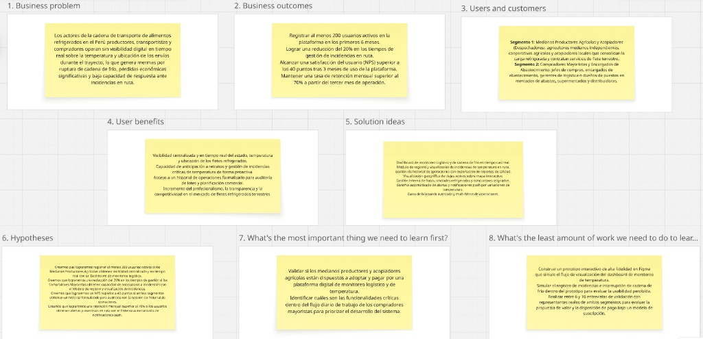

# Capítulo I: Introducción

## 1.1. Startup Profile

### 1.1.1. Descripción de la Startup

BlackStartup nace como una empresa de base tecnológica en el Perú con el propósito directo de atender un punto crítico y tradicionalmente descuidado en el ámbito logístico nacional: el mantenimiento riguroso de la cadena de frío a lo largo del traslado terrestre de alimentos perecibles y productos congelados. Para dar respuesta a este desafío, la startup ha desarrollado **FríoTrack**, un sistema de software basado en la web que monitorea en tiempo casi real variables ambientales clave como la humedad y la temperatura en el compartimento de carga de las unidades frigoríficas. El objetivo de FríoTrack es prevenir el deterioro de los productos por fluctuaciones térmicas, emitir alertas preventivas inmediatas en el momento en que se detecte una anomalía y consolidar un historial de trazabilidad transparente y comprobable que respalde todo el recorrido, desde la salida en el punto de origen hasta su recepción final.

El panorama económico peruano destaca por su liderazgo en la agroexportación dentro de la región, con productos de alta demanda internacional que exigen una cadena de frío ininterrumpida para conservar sus propiedades organolépticas e inocuidad (arándanos, palta Hass, uvas de mesa, mangos, espárragos frescos y variados productos hidrobiológicos). En este contexto, el Instituto Nacional de Estadística e Informática (INEI, 2023) reporta que, pese a la contracción registrada por el Producto Bruto Interno (PBI) nacional en 2023, el subsector agrícola mantuvo un desempeño positivo impulsado por mayores volúmenes cosechados de productos como arándano, uva, mango y palta, lo que confirma el peso de las exportaciones no tradicionales agropecuarias dentro de la economía del país.

A pesar de este impacto económico, el sector de transporte de carga refrigerada en el Perú continúa operando con una infraestructura y coordinación logística por debajo del estándar de la región: el Índice de Desempeño Logístico (*Logistics Performance Index*, LPI) elaborado por el Banco Mundial (2023) ubicó al Perú en el puesto 61 de 139 países evaluados, con un puntaje de 3,0 sobre 5,0 empatado con Chile y Uruguay, y por debajo de Brasil y Panamá dentro de la región, lo que evidencia limitaciones estructurales en infraestructura, coordinación de la cadena de suministro y trazabilidad de la carga.

Esta brecha de trazabilidad origina un problema operativo severo y persistente. Cuando la temperatura de conservación se altera (sea por desperfectos mecánicos en la unidad de refrigeración, aperturas de puerta innecesarias o prolongadas, errores en el empaquetado o picos de calor ambiental en carretera), no existe evidencia técnica e inmediata que permita precisar la hora exacta del incidente, calcular el nivel de afectación de la carga o deslindar la responsabilidad contractual entre los involucrados (transportista, agroexportador y comprador). FríoTrack resuelve esta problemática unificando en un panel interactivo la lectura continua de temperatura y humedad, el posicionamiento geográfico por GPS y la emisión automática de alertas, dotando a los encargados de logística y control de calidad de la información necesaria para coordinar acciones correctivas antes de que la mercadería quede inservible.

A nivel internacional, la Organización de las Naciones Unidas para la Alimentación y la Agricultura (FAO, 2022) advierte que el Perú pierde más de 12 millones de toneladas de alimentos a lo largo de su cadena productiva, y destaca que la automatización y el monitoreo remoto en las etapas de postcosecha y transporte son estrategias clave para reducir las mermas en alimentos con rangos térmicos estrictos. La visión de desarrollo de FríoTrack responde directamente a esta recomendación.

En su etapa inicial, FríoTrack enfoca sus operaciones en el mercado peruano. El Ministerio de Transportes y Comunicaciones (MTC, 2023), a través del *Plan Nacional de Servicios e Infraestructura Logística de Transporte al 2032*, identifica 41 corredores logísticos a nivel nacional, de los cuales los que conectan La Libertad, Ica, Piura y Lambayeque con Lima Metropolitana y el Callao concentran una parte importante de las cadenas logísticas del país. FríoTrack prioriza justamente estos corredores como zona de operación inicial, cubriendo el traslado entre las zonas agrícolas y productivas más importantes del país y los terminales portuarios, plantas procesadoras y principales centros de abasto de Lima Metropolitana. A mediano plazo, la infraestructura del sistema contempla la expansión hacia rutas internacionales de transporte terrestre en la región. Toda la plataforma se encuentra optimizada para funcionar fluidamente desde navegadores web en computadoras y dispositivos móviles, presentando una interfaz limpia y accesible pensada para usuarios con diversos niveles de experiencia tecnológica.

**Misión:** Proteger la calidad, frescura e inocuidad de los alimentos perecibles en el Perú durante su transporte terrestre mediante el monitoreo digital continuo de la cadena de frío, minimizando pérdidas económicas y promoviendo la transparencia entre productores, transportistas y compradores.

**Visión:** Consolidarse hacia el año 2030 como la plataforma líder y referente en trazabilidad y control inteligente de la cadena de frío para el transporte de alimentos a nivel nacional y regional.

### 1.1.2. Perfiles de integrantes del equipo

| Foto | Descripción |
|:---:|:---|
|  | **Atauje Barreto, Alexander Sebastián — u20241f246** Estudiante de la carrera de Ingeniería de Software. Posee conocimientos en desarrollo web frontend con HTML, CSS y JavaScript, así como en el diseño de interfaces de usuario. Aporta al equipo habilidades en prototipado, organización de tareas y aplicación del marco de trabajo Scrum. |
|  | **Bardales Rodriguez, Benjamin Elias — u202421137** Estudiante de la carrera de Ingeniería de Software. Cuenta con experiencia en lógica de programación con C++ y Python, además de gestión de bases de datos relacionales. Su contribución principal se enfoca en la estructuración de la lógica de negocio y arquitectura de software. |
|  | **Daga Chávez, Joaquín Leonardo — u202219829** Estudiante de la carrera de Ingeniería de Software. Especializado en el análisis de requisitos y documentación técnica de proyectos. Domina herramientas de control de versiones con Git y GitHub, aportando rigor en la gestión del repositorio y el aseguramiento de la calidad de la documentación. |
|  | **Saavedra Flores, Rodrigo Andree — u20241D811** Estudiante de la carrera de Ingeniería de Software. Tiene fortalezas en el diseño UX/UI con Figma y modelado de procesos. Aporta al equipo capacidad analítica para la investigación de mercado, definición de segmentos objetivo y experiencia de usuario. |
|  | **Vera Solsol, Nayely Macarena — u20231H17** Mi nombre es Nayely Macarena Vera Solsol, tengo 20 años y estoy cursando el 5to ciclo de la carrera de Ingeniería de Software. Me apasiona el proceso de aprendizaje continuo y el trabajo colaborativo, aportando compromiso, adaptabilidad y buena comunicación al equipo. Cuento con conocimientos en C++ y actualmente me encuentro reforzando mi nivel de inglés para ampliar mis oportunidades profesionales y responder de manera efectiva a los retos tecnológicos actuales. Me comprometo a aportar de forma activa, responsable y dedicado al desarrollo del proyecto para lograr resultados de calidad. |

## 1.2. Solution Profile

**Product Description**

FríoTrack es una plataforma web distribuida enfocada en la gestión inteligente y el monitoreo continuo de la cadena de frío, concebida para transformar los niveles de visibilidad, control operativo y trazabilidad térmica en el transporte terrestre de alimentos perecibles y productos congelados a nivel nacional. La solución centraliza y procesa en tiempo casi real la telemetría recolectada durante cada traslado, registrando de forma sistemática variables críticas como la temperatura ambiental e interna del compartimento frigorífico, la humedad relativa, la ubicación geográfica exacta del vehículo mediante posicionamiento GPS, la tipología de la carga transportada, los puntos de origen y destino, y la generación automática de alertas inmediatas ante cualquier excursión térmica o contingencia detectada durante el trayecto.

### 1.2.1. Antecedentes y problemática

El transporte refrigerado de alimentos en el Perú representa un eslabón determinante dentro de la cadena de valor agroalimentaria y agroexportadora. Un fallo en este proceso genera pérdidas financieras e incrementa riesgos en la inocuidad alimentaria. Como se señaló, el Perú ocupa el puesto 61 de 139 países en el Índice de Desempeño Logístico del Banco Mundial (2023), lo que evidencia que la coordinación de la cadena de suministro y la trazabilidad de la carga refrigerada en el país presentan brechas estructurales frente a otros mercados de la región.

La FAO (2022) señala que el Perú pierde más de 12 millones de toneladas de alimentos a lo largo de la cadena productiva, y que buena parte de esas pérdidas ocurre en etapas donde la ausencia de monitoreo remoto impide corregir a tiempo fallas en la conservación térmica de los productos. Esto es particularmente relevante para alimentos con rangos térmicos estrictos, como los que produce y exporta el Perú (arándanos, palta, uva, productos hidrobiológicos), cuya calidad comercial se deteriora con variaciones de temperatura de pocas horas.

Para estructurar formalmente la problemática, el equipo desarrolló el análisis **5W's + 2H's**:

* **Who (¿Quiénes son los afectados?)**
  * **Productores y exportadores agroindustriales:** organizaciones que transportan mercadería de alta sensibilidad (arándanos, palta, uva, productos hidrobiológicos) hacia plantas de procesamiento, terminales portuarios o centros de distribución, necesitando garantizar la continuidad de la temperatura requerida.
  * **Empresas de transporte refrigerado:** operadores de flete que, dado el nivel de desempeño logístico del país (Banco Mundial, 2023), no cuentan con sistemas de telemetría e integración de datos térmicos en tiempo real.
  * **Compradores, plantas de procesamiento y cadenas de retail:** receptores de carga que exigen verificar la continuidad térmica antes del ingreso o procesamiento del lote.
  * **Gestores de calidad y coordinadores logísticos:** auditores responsables de validar estándares térmicos requeridos por certificaciones de inocuidad y contratos de exportación.

* **What (¿Cuál es el problema?)**
  * La falta de seguimiento telemático e interrupciones en la lectura de temperatura y humedad en el transporte refrigerado, desencadenando:
    * Imposibilidad de detectar fluctuaciones térmicas en tiempo real.
    * Ausencia de alertas preventivas para corregir fallos mecánicos del equipo de refrigeración.
    * Falta de auditorías y registros objetivos para deslindar responsabilidades operativas.
    * Riesgos sanitarios que comprometen la certificación del producto final.

* **Where (¿Dónde ocurre el problema?)**
  * Se presenta en los corredores viales que, según el *Plan Nacional de Servicios e Infraestructura Logística de Transporte al 2032* (MTC, 2023), conectan los principales centros de producción agroexportadora con puertos y centros de consumo:
    * La Libertad → Puerto de Salaverry / Lima (arándanos, espárragos, palta)
    * Ica → Lima / Puerto del Callao (uva, palta, cítricos)
    * Piura → Lima (mango, banano orgánico)
    * Lambayeque → Lima (productos hidrobiológicos congelados)
  * Estos trayectos combinan distancias extensas y variaciones climáticas que elevan la exigencia sobre los equipos de frío.

* **When (¿Cuándo ocurre el problema?)**
  * Es una deficiencia sostenida y operativa presente en los traslados diarios. Se intensifica durante las temporadas de alta demanda de exportación (campañas de fruta fresca), donde el uso intensivo de la flota incrementa la probabilidad de fallas mecánicas.

* **Why (¿Por qué ocurre el problema?)**
  * **Causas tecnológicas:** uso de termómetros manuales o data loggers pasivos sin conexión remota a plataformas web, consistente con la posición del Perú en el Índice de Desempeño Logístico del Banco Mundial (2023).
  * **Causas organizacionales:** dificultad del sector transporte para estandarizar protocolos de mantenimiento de la cadena de frío frente a un mercado logístico todavía en desarrollo (MTC, 2023).
  * **Causas económicas:** las soluciones telemáticas tradicionales de escala corporativa resultan costosas para el perfil operativo de las PYMEs de transporte.

* **How (¿Cómo ocurre el problema?)**
  * Al iniciar el viaje se ajusta manualmente el equipo refrigerador. Durante el traslado no existen revisiones telemáticas continuas. El conductor nota un fallo solo si la unidad emite sonidos anómalos o cuando se descarga el producto en destino, momento en que el daño a la carga es irreversible y no existen registros para determinar el punto de falla.

* **How Much (¿Cuánto impacta el problema?)**
  * Más de 12 millones de toneladas de alimentos se pierden a lo largo de la cadena productiva peruana (FAO, 2022).
  * Desecho total o desvalorización comercial de lotes enteros por excursiones térmicas no detectadas.
  * Conflictos comerciales entre generadores de carga y transportistas ante la falta de evidencias objetivas.
  * Descalificación comercial de transportistas que no ofrecen trazabilidad frente a clientes exportadores.

Para delimitar con precisión el alcance y el impacto del desarrollo del producto de software, el equipo ha establecido los siguientes objetivos:

* **Objetivo General:**
  * Diseñar, desarrollar e implementar un sistema web distribuido (compuesto por una aplicación de interfaz cliente responsive y un RESTful API de desarrollo interno) para la startup BlackStartup, que permita monitorear en tiempo casi real las condiciones de temperatura y humedad del transporte refrigerado de alimentos en el Perú, contribuyendo directamente a la reducción de pérdidas por ruptura de cadena de frío.

* **Objetivos Específicos:**
  * Desarrollar una aplicación frontend responsive que proporcione una experiencia de usuario intuitiva e inclusiva, optimizada para transportistas refrigerados, productores/exportadores y compradores.
  * Construir un RESTful API del lado del servidor robusto y de alto rendimiento que garantice la persistencia segura, la lógica de negocio y la consistencia en el procesamiento de lecturas de sensores y alertas térmicas.
  * Garantizar la cobertura del diseño inclusivo implementando atributos de accesibilidad ARIA e internacionalización (i18n) para soportar los idiomas inglés y español latinoamericano.
  * Integrar de manera fluida un servicio geográfico de terceros que brinde soporte visual e interactivo al trayecto físico de las unidades de transporte refrigerado sobre mapas digitales.
  * Alcanzar los criterios de éxito planteados en la visión de negocio: incorporar al menos 150 usuarios activos en los primeros 8 meses de operación, alcanzar una tasa de retención mensual superior al 75 % a partir del tercer mes y registrar un Net Promoter Score (NPS) mayor a 40 puntos.

El ciclo de vida de desarrollo de FríoTrack está sujeto a un conjunto de restricciones tecnológicas, metodológicas y operativas impuestas para asegurar la calidad y los estándares de la ingeniería de software:

* **Restricciones Tecnológicas del Servidor:** el backend de la plataforma se construirá utilizando C# con ASP.NET Core Web API, empleando Entity Framework Core como ORM y PostgreSQL como sistema gestor de base de datos relacional para el almacenamiento de la telemetría y los datos del sistema.
* **Restricciones Tecnológicas del Cliente:** el frontend cliente se implementará sobre Vue.js utilizando JavaScript/TypeScript y la librería de componentes PrimeVue, garantizando un diseño alineado a los estándares de Material Design y adaptable a distintos dispositivos.
* **Restricciones de Integración y Documentación:** el sistema debe consumir un servicio externo de mapas (Google Maps API o Leaflet/OpenStreetMap) para la visualización gráfica de rutas en tiempo real, e integrarse mediante llamadas API RESTful documentadas técnicamente con OpenAPI Specification (OAS) a través de Swagger.
* **Restricciones de Proceso y Calidad de Código:** el proyecto debe gestionarse bajo el marco de trabajo ágil Scrum. El código fuente debe almacenarse en repositorios dentro de una organización pública en GitHub, aplicando GitFlow, nomenclatura estandarizada en inglés, Conventional Commits, y versionamiento formal bajo Semantic Versioning (SemVer 2.0.0).
* **Restricciones de Idioma y Accesibilidad:** FríoTrack está diseñado de forma nativa en español para asegurar usabilidad óptima entre transportistas y productores peruanos. No obstante, para alinearse con las directrices de ingeniería globales y los requisitos de acreditación del curso, el sistema se desarrollará con un marco de internacionalización (i18n), con soporte técnico en inglés y español, y atributos ARIA para garantizar la accesibilidad web (a11y).

### 1.2.2. Lean UX Process

#### 1.2.2.1. Lean UX Problem Statements

**The current state of** cold chain monitoring for perishable food transportation in Peru **has focused mainly on** manual, non-continuous temperature checks performed by drivers or logistics staff, without digital sensors or centralized records, leaving producers, carriers, and buyers unable to detect cold chain breaks in real time.

**What existing products/services fail to address is** an affordable, sector-specific digital platform that consolidates continuous temperature and humidity monitoring, automated alerts, and route visibility for small and medium-sized refrigerated transport operators in Peru.

**Our product/service will address this gap by** developing FríoTrack, a responsive web platform for near real-time monitoring of refrigerated food shipments, enabling users to track temperature and humidity readings, receive automated alerts on cold chain deviations, visualize shipment routes, and access historical thermal records for quality audits and commercial claims.

**Our initial focus will be** logistics and quality coordinators of small and medium-sized refrigerated transport companies operating on export corridors between Peru's producing regions and Lima Metropolitana, as well as producers and buyers who require verifiable cold chain compliance.

**We'll know we are successful when we see** at least 150 active users within the first 8 months, a monthly user retention rate above 75% starting from month 3, a 30% reduction in cold chain deviation incidents during transit, and a Net Promoter Score (NPS) exceeding 40 points after 3 months of platform usage.

#### 1.2.2.2. Lean UX Assumptions

**Business Assumptions**
1. Creemos que existe un mercado de empresas de transporte refrigerado, productores agrícolas y agroexportadores en el Perú dispuestos a adoptar una plataforma digital de monitoreo térmico, dado el impacto de las pérdidas de alimentos reportadas por la FAO (2022) y las brechas de desempeño logístico señaladas por el Banco Mundial (2023).
2. Creemos que un modelo de negocio basado en suscripción mensual por volumen de flota es viable y comercialmente aceptable para las PYMEs del sector logístico.
3. Creemos que FríoTrack puede diferenciarse de las soluciones de rastreo GPS genéricas mediante su enfoque especializado en trazabilidad térmica, su estructura de costos accesible y una interfaz simplificada.
4. Creemos que la integración con sensores IoT de temperatura/humedad y con servicios externos de geolocalización es técnicamente factible dentro del alcance del proyecto.
5. Creemos que el equipo de ingeniería posee las competencias técnicas requeridas para construir, desplegar y mantener la arquitectura distribuida dentro del ciclo académico programado.

**Business Outcome Assumptions**
1. Creemos que, tras los primeros meses posteriores al lanzamiento, FríoTrack habrá logrado la adopción de un número significativo de empresas y usuarios activos.
2. Creemos que la tasa de retención mensual de usuarios activos se mantendrá en niveles elevados a partir del tercer mes de operación.
3. Creemos que el uso constante de la plataforma contribuirá a reducir la incidencia de pérdidas no detectadas por alteración de temperatura en ruta.
4. Creemos que la acumulación de datos históricos de trazabilidad térmica se convertirá en un activo estratégico para las auditorías de los clientes.
5. Creemos que las recomendaciones de los primeros usuarios (*early adopters*) impulsarán un crecimiento orgánico de la base de clientes.

**User Assumptions**
1. Creemos que los usuarios principales son coordinadores logísticos, jefes de flota y gestores de calidad en empresas de transporte refrigerado.
2. Creemos que un segundo segmento clave está conformado por directores de calidad de empresas agroexportadoras y compradores mayoristas.
3. Creemos que ambos perfiles utilizan smartphones de gama media y computadoras de escritorio como herramientas primarias de trabajo.
4. Creemos que el personal del segmento transportista tiene familiaridad limitada con plataformas telemáticas avanzadas.
5. Creemos que los usuarios del segmento agroexportador/comprador cuentan con mayor alfabetización digital y experiencia con auditorías de calidad.

**User Outcome and Benefit Assumptions**
1. Creemos que los coordinadores logísticos buscan reducir pérdidas financieras y disponer de visibilidad centralizada sin depender de reportes manuales.
2. Creemos que las empresas transportistas necesitan respaldar con evidencias objetivas el cumplimiento de los rangos térmicos exigidos.
3. Creemos que los agroexportadores y compradores necesitan enterarse de inmediato sobre desviaciones de temperatura en ruta.
4. Creemos que ambos perfiles valoran exportar reportes de historial térmico como mecanismo de auditoría.
5. Creemos que los transportistas percibirán la plataforma como una ventaja competitiva ante sus clientes.

**Feature Assumptions**
1. Creemos que un panel interactivo (*dashboard*) en tiempo casi real es la funcionalidad de mayor valor para ambos segmentos.
2. Creemos que un motor de alertas automáticas ante desviaciones térmicas es una característica crítica diferenciadora.
3. Creemos que el módulo de consulta del historial térmico es imprescindible para auditorías y reportes de calidad.
4. Creemos que la representación visual de rutas sobre mapas interactivos incrementará la usabilidad de la plataforma.
5. Creemos que el módulo de administración de flota y conductores es indispensable para la gestión logística diaria.
6. Creemos que las notificaciones dentro de la aplicación aumentarán el engagement diario.
7. Creemos que un sistema de búsqueda y filtros avanzados facilitará la navegación en operaciones de alto volumen.

#### 1.2.2.3. Lean UX Hypothesis Statements

**Hypothesis Statement 1:**
*We believe we will achieve* an active adoption target within the first months of launch
*If* logistics and quality coordinators
*Attain* centralized, near real-time visibility over the temperature, humidity and location of active refrigerated shipments without relying on manual checks
*With* a near real-time monitoring dashboard displaying live sensor readings, status, and location of active transport operations.

**Hypothesis Statement 2:**
*We believe we will achieve* a reduction in undetected cold chain break incidents
*If* logistics coordinators and buyers
*Attain* the ability to be immediately notified when a shipment's temperature or humidity deviates from the configured safe range
*With* an automated thermal alert system integrated directly into the shipment details page.

**Hypothesis Statement 3:**
*We believe we will achieve* a high monthly user retention rate starting from the early months of operation
*If* transport companies and quality coordinators
*Attain* a reliable historical thermal record of past shipments to support quality audits, certifications, and commercial claims
*With* an operation history management module with advanced search, filtering, and exportable thermal logs.

**Hypothesis Statement 4:**
*We believe we will achieve* a high Net Promoter Score (NPS) among early adopters
*If* producers, exporters and buyers
*Attain* an intuitive and highly visual way to track the location and thermal condition of shipments along national transport corridors
*With* an interactive map interface integrated with an external geolocation service.

**Hypothesis Statement 5:**
*We believe we will achieve* a high monthly user retention rate starting from the early months of operation
*If* logistics coordinators
*Attain* an orderly mechanism to register refrigerated units, assign available drivers, and organize dispatch workflows
*With* a fleet and driver management module with status indicators and simplified registry forms.

**Hypothesis Statement 6:**
*We believe we will achieve* a reduction in undetected cold chain break incidents
*If* logistics coordinators and buyers
*Attain* instant awareness of critical thermal deviations to execute contingency plans immediately
*With* an automated system of push alerts and in-app notifications triggered upon threshold breaches.

**Hypothesis Statement 7:**
*We believe we will achieve* a high Net Promoter Score (NPS) among early adopters
*If* logistics coordinators with high daily operational volumes
*Attain* the ability to find specific shipments, units, or routes within seconds, minimizing search fatigue
*With* an advanced search bar and multi-criteria filters on the active shipments dashboard.

#### 1.2.2.4. Lean UX Canvas

El Lean UX Canvas es una herramienta ágil que sintetiza los elementos clave del proceso Lean UX en un único artefacto visual colaborativo. A continuación, se presenta el canvas desarrollado por el equipo para el diseño y concepción de FrioTrack:

*Lean UX Canvas*

   
  <i>Nota. Elaboración propia.</i>

 Enlace público del Lean UX Canvas: https://miro.com/app/board/uXjVHIgbY-o=/?share_link_id=988098140826 

## 1.3. Segmentos objetivo

La delimitación de los segmentos objetivo de FríoTrack responde al diagnóstico sobre las falencias en el transporte terrestre de productos perecibles descritas por la FAO (2022) y el Banco Mundial (2023), la factibilidad de contacto directo para las fases de validación operativa, y el mapa de corredores logísticos identificado por el MTC (2023). A partir de este análisis, se han estructurado dos grupos clave de usuarios cuyos roles interactúan de forma directa y complementaria a lo largo de la cadena de suministro agroalimentaria:

---

### Segmento 1: Empresas de Transporte Refrigerado

**Descripción general**
Este grupo se encuentra integrado por empresas de transporte y operadores logísticos independientes encargados de brindar servicios de traslado terrestre bajo régimen de temperatura controlada para insumos perecibles y productos congelados. Su responsabilidad principal abarca la operación continua y el mantenimiento técnico de las unidades de frío durante todo el itinerario, asegurando que la carga ingrese a su destino respetando estrictamente los parámetros térmicos fijados por el cliente. La dificultad central que atraviesa este sector radica en la falta de visibilidad en tiempo real sobre las condiciones del compartimento de carga mientras las unidades permanecen en carretera, lo que anula la capacidad de reacción inmediata ante averías imprevistas del sistema de refrigeración.

**Características demográficas y estadísticas de contexto**
Las decisiones de gestión en este segmento son tomadas por coordinadores de flota y gerentes de operaciones cuyas edades oscilan mayoritariamente entre los 28 y 55 años. La infraestructura operativa de estas compañías se concentra en Lima Metropolitana y en los principales nodos agroexportadores del país —La Libertad, Ica, Piura y Lambayeque—, coincidentes con los corredores logísticos identificados por el MTC (2023). En lo relativo al nivel educativo, predomina la formación técnica o universitaria en logística, administración y disciplinas afines. Dado el nivel de desempeño logístico general del país (puesto 61/139 en el LPI del Banco Mundial, 2023), es razonable estimar una baja penetración de herramientas tecnológicas de control de flotas y monitoreo térmico remoto entre operadores de pequeña y mediana escala.

**Características psicográficas y conductuales**
Los responsables operativos conviven con un alto nivel de estrés derivado del riesgo constante de que una avería no detectada en el equipo frigorífico derive en la pérdida total de despachos de alto valor comercial. Ante la falta de sistemas integrados, la supervisión de la ruta se efectúa de manera informal mediante llamadas telefónicas periódicas con el conductor y revisiones manuales en puntos de control estratégicos. Si bien estos profesionales emplean cotidianamente computadoras para tareas administrativas y teléfonos inteligentes de gama media, se observa una adopción incipiente de soluciones orientadas al Internet de las Cosas (IoT) o plataformas de gestión remota. No obstante, muestran una elevada receptividad hacia la incorporación de herramientas tecnológicas accesibles que hayan demostrado eficacia en la disminución de pérdidas de productos y en el fortalecimiento de la confianza con sus clientes.

**Puntos de dolor (Pain Points)**
* Incertidumbre permanente respecto al estado térmico real de la mercadería a lo largo de la ruta.
* Ausencia de mecanismos automatizados para la emisión de alertas tempranas ante fallas en los sistemas de refrigeración.
* Dificultad para fundamentar de manera objetiva ante los clientes el cumplimiento continuo del rango de temperatura solicitado durante el traslado.
* Pérdida sostenida de oportunidades de negocio frente a firmas exportadoras que exigen trazabilidad térmica rigurosa como condición imprescindible en sus contratos.

---

### Segmento 2: Productores/Exportadores y Compradores de Alimentos Perecibles

**Descripción general**
Este segmento reúne a los actores de la cadena comercial que despachan o recepcionan insumos y productos perecibles cuya calidad depende de una cadena de frío ininterrumpida. Entre ellos se encuentran los productores agrícolas, las agroexportadoras, las plantas de procesamiento industrial y los compradores finales, tales como cadenas de supermercados, distribuidoras y clientes internacionales. La exigencia fundamental de este grupo reside en disponer de evidencias auditables y confiables que certifiquen que la carga se mantuvo dentro del rango térmico estipulado a lo largo de todo el trayecto, garantizando con ello la inocuidad y los estándares de calidad requeridos para su procesamiento o comercialización.

**Características demográficas y estadísticas de contexto**
El perfil de los profesionales que conforman este segmento abarca un rango etario que va de los 28 a los 60 años. Geográficamente, la actividad se concentra en Lima Metropolitana y en los valles agrícolas de alta productividad dedicados a la exportación —La Libertad, Ica, Piura y Lambayeque—, en línea con el crecimiento de las exportaciones agropecuarias no tradicionales reportado por el INEI (2023). La composición académica y la tipología de negocio son heterogéneas, abarcando desde supervisores de campo con formación técnica hasta gerentes de calidad y logística con estudios universitarios de grado y posgrado. Se trata de organizaciones que mueven volúmenes constantes de carga refrigerada y cuyo nivel de operación está condicionado por la observancia de normas y certificaciones internacionales de inocuidad alimentaria.

**Características psicográficas y conductuales**
Existe una marcada sensibilidad hacia la variable del tiempo y el control de la temperatura, dado que cualquier alteración en la refrigeración compromete de forma directa la vida útil, el valor comercial y la inocuidad del producto. Esta situación genera una constante frustración operativa ante la falta de comunicación proactiva por parte de las empresas de transporte respecto a las condiciones de la carga en tránsito. En comparación con el sector transportista, este segmento exhibe una mayor familiaridad con herramientas digitales de gestión de datos e implementación de sistemas de calidad. Asimismo, demuestran un claro interés por adoptar tecnologías que reduzcan la incertidumbre dentro de sus cadenas de suministro, en un contexto donde la FAO (2022) señala la trazabilidad térmica como un factor crítico para reducir pérdidas de alimentos.

**Puntos de dolor (Pain Points)**
* Incertidumbre sobre el mantenimiento del rango térmico adecuado en los productos recibidos al concluir el traslado.
* Imposibilidad de anticipar el deterioro de la carga antes de su llegada a la planta de recepción para activar planes de contingencia.
* Carencia de un canal de comunicación formal e integrado con el transportista para la notificación inmediata de incidencias térmicas.
* Dificultad para evaluar con criterios objetivos el nivel de cumplimiento y desempeño de sus proveedores de transporte refrigerado debido a la falta de historiales documentados.
* Presión creciente por parte de auditorías de calidad y certificaciones internacionales para respaldar con datos verificables la trazabilidad térmica en toda la cadena de abastecimiento.

---
