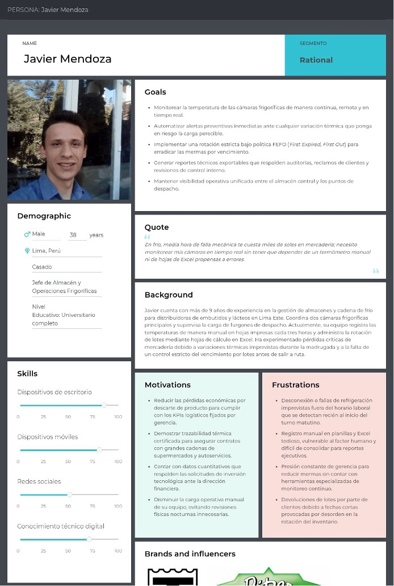
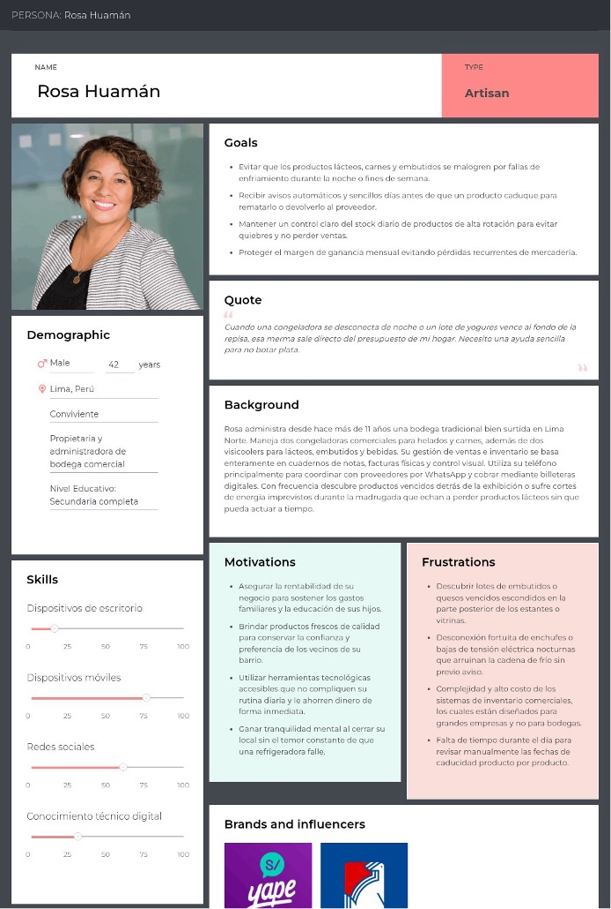
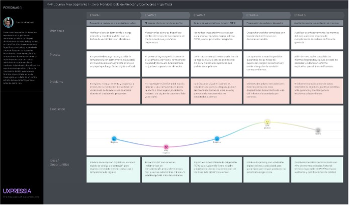
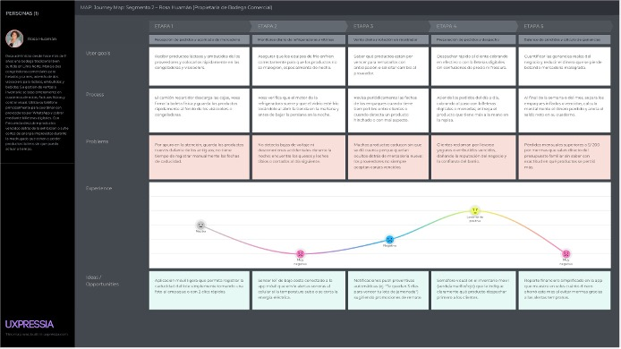
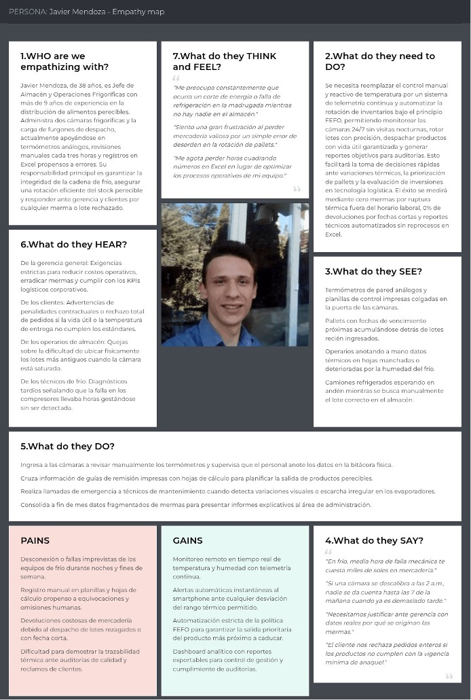
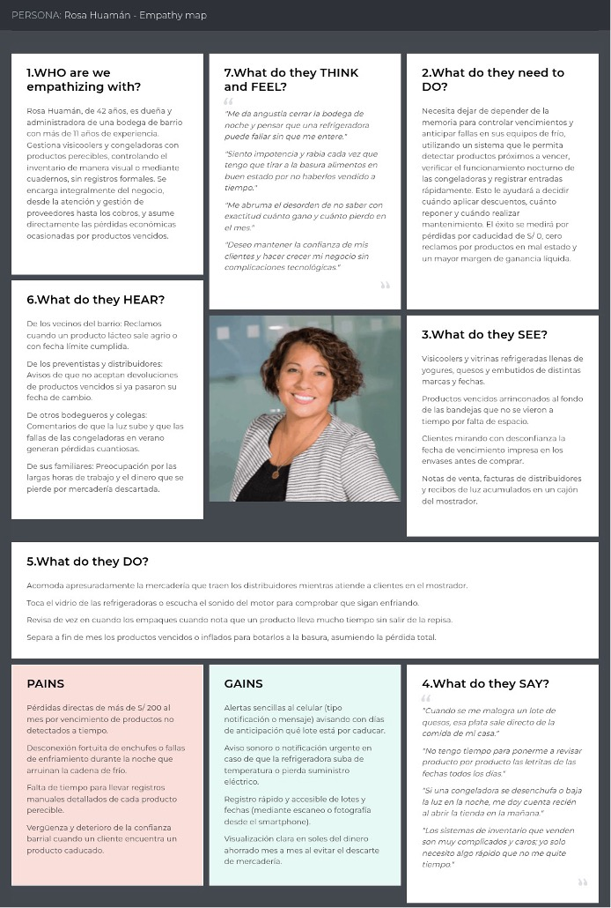
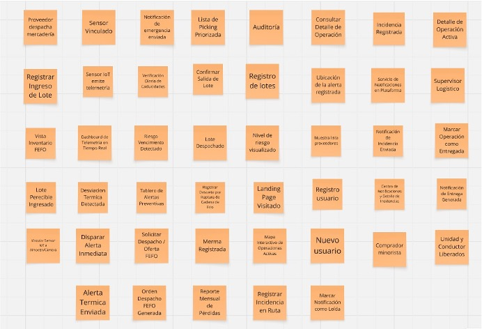

# Capítulo II: Requirements Elicitation & Analysis

# Capítulo II: Requirements Elicitation & Analysis

## 2.1. Competidores

En esta sección se identifican y describen los principales competidores de **FrioTrack**, tanto directos como indirectos. Estos ofrecen soluciones digitales relacionadas con la gestión logística, el control de inventario y el monitoreo de productos sensibles a la temperatura dentro de la cadena de frío.

### 2.1.1. Análisis competitivo

#### Competitive Analysis Landscape

**¿Por qué realizar este análisis?**

El análisis permite identificar oportunidades de diferenciación y aspectos de mejora para la propuesta de valor de **FrioTrack**. Asimismo, permite comparar cómo otras soluciones atienden las necesidades de gestión de inventario, monitoreo y distribución, considerando factores como funcionalidades, precio y experiencia de usuario.

| Perfil | **FrioTrack** | **Óptima ERP (Perú)** | **Sinapsys WMS (Perú)** | **Tive (EE. UU.)** |
|---|---|---|---|---|
| **Descripción general** | Plataforma SaaS orientada al monitoreo de temperatura y gestión de productos perecibles, integrando información de la cadena de frío en una sola solución. | ERP peruano orientado a pymes, con módulos de inventario y facturación electrónica integrada con SUNAT. | Sistema WMS para la gestión de almacenes, incluyendo recepción, picking y despacho. | Plataforma IoT para monitoreo de temperatura y ubicación en la cadena de suministro. |
| **Ventaja competitiva** | Integra monitoreo de temperatura, control de productos perecibles, alertas y trazabilidad en una solución dirigida al mercado peruano. | Integración con SUNAT y experiencia en el mercado peruano de pymes. | Amplia cobertura de procesos de almacén y adaptación a diferentes sectores. | Alta precisión en el monitoreo de temperatura y geolocalización, con cobertura internacional. |

#### Perfil de marketing

| Aspecto | **FrioTrack** | **Óptima ERP** | **Sinapsys WMS** | **Tive** |
|---|---|---|---|---|
| **Mercado objetivo** | Empresas distribuidoras y negocios que comercializan alimentos perecibles y requieren controlar las condiciones de almacenamiento y transporte. | Pymes peruanas de comercio, manufactura y distribución que requieren gestionar inventario y facturación. | Empresas medianas y grandes de distribución y manufactura en Latinoamérica. | Empresas exportadoras, operadores logísticos y cadenas de suministro que manejan productos sensibles a la temperatura. |
| **Estrategias de marketing** | Marketing digital, posicionamiento en buscadores, redes sociales y ventas directas a empresas relacionadas con la cadena de frío. | Publicidad digital, participación en eventos empresariales y referencias de clientes. | Ventas B2B, participación en eventos del sector logístico y alianzas con integradores. | Presencia en medios digitales especializados y eventos internacionales de supply chain, con enfoque en clientes empresariales. |

#### Productos y servicios

| **FrioTrack** | **Óptima ERP** | **Sinapsys WMS** | **Tive** |
|---|---|---|---|
| Monitoreo de temperatura en tiempo real, alertas ante variaciones, trazabilidad de productos y visualización de información mediante un dashboard. | Contabilidad, facturación electrónica, inventario, cuentas por cobrar y pagar y generación de reportes. | Recepción de mercadería, gestión de ubicaciones, picking, embalaje, despacho y control de lotes. | Sensores de temperatura y GPS, plataforma SaaS de monitoreo, alertas, reportes y API de integración. |

#### Precios y costos

| **FrioTrack** | **Óptima ERP** | **Sinapsys WMS** | **Tive** |
|---|---|---|---|
| Modelo de suscripción según las funcionalidades y necesidades del cliente. | Planes desde aproximadamente S/ 89 mensuales, con módulos adicionales. | Solución con costos asociados a implementación y configuración. | Suscripción por sensor más el costo del hardware, principalmente orientada a clientes empresariales. |

#### Canales de distribución

| **FrioTrack** | **Óptima ERP** | **Sinapsys WMS** | **Tive** |
|---|---|---|---|
| Plataforma web accesible desde dispositivos con conexión a internet. | Plataforma web y aplicación de escritorio. | Plataforma web y aplicaciones orientadas a la gestión empresarial. | Plataforma web, API y aplicaciones móviles, complementadas con sensores físicos. |

#### Análisis SWOT

**Fortalezas**

- **FrioTrack:** Plataforma enfocada en la cadena de frío, con monitoreo de temperatura y acceso a la información desde una interfaz web.
- **Óptima ERP:** Experiencia en el mercado peruano e integración con SUNAT.
- **Sinapsys WMS:** Amplia cobertura de procesos relacionados con la gestión de almacenes.
- **Tive:** Alta precisión en sensores y experiencia internacional en monitoreo de temperatura.

**Debilidades**

- **FrioTrack:** Al ser una solución en desarrollo, requiere validación y adopción inicial por parte de los usuarios.
- **Óptima ERP:** No cuenta con un módulo especializado para el monitoreo de temperatura.
- **Sinapsys WMS:** Su implementación puede representar una mayor complejidad y costo para pequeñas empresas.
- **Tive:** Su enfoque empresarial y dependencia de hardware especializado pueden incrementar el costo de implementación.

**Oportunidades**

- **FrioTrack:** Crecimiento de la necesidad de monitorear productos perecibles y reducir pérdidas asociadas a variaciones de temperatura.
- **Óptima ERP:** Incorporar funcionalidades de monitoreo de temperatura para ampliar su propuesta de valor.
- **Sinapsys WMS:** Integrar tecnologías IoT para complementar la gestión de almacenes.
- **Tive:** Establecer alianzas con proveedores locales para ampliar su presencia en nuevos mercados.

**Amenazas**

- **FrioTrack:** Resistencia al cambio tecnológico, competencia de soluciones consolidadas y problemas de conectividad en determinadas zonas.
- **Óptima ERP:** Aparición de soluciones especializadas que integren inventario y monitoreo de temperatura.
- **Sinapsys WMS:** Competencia de plataformas empresariales con funcionalidades similares y mayor reconocimiento.
- **Tive:** Aparición de sensores de menor costo y nuevas plataformas IoT orientadas a pequeñas y medianas empresas.

### 2.1.2. Estrategias y tácticas frente a competidores

A partir del análisis competitivo, **FrioTrack** define las siguientes estrategias y tácticas preliminares para responder a las fortalezas de sus competidores y aprovechar las oportunidades identificadas en el mercado peruano.

**Frente a Óptima ERP**

*Estrategia:* Diferenciación mediante especialización y atención de necesidades específicas.

Óptima ERP cuenta con presencia en el segmento pyme peruano, pero no está especializado en el monitoreo de temperatura ni en la gestión de productos perecibles. **FrioTrack** puede aprovechar esta diferencia mediante el monitoreo térmico en tiempo real, las alertas y la trazabilidad de productos.

*Tácticas:*

- Desarrollar materiales de comunicación que destaquen los beneficios del monitoreo de temperatura y el control de productos perecibles.
- Implementar la importación de datos desde Excel para facilitar la migración de empresas que utilizan hojas de cálculo u otras soluciones.
- Ofrecer un periodo de prueba gratuito para facilitar la adopción de la plataforma.

**Frente a Sinapsys WMS**

*Estrategia:* Competir mediante accesibilidad y facilidad de adopción para el segmento PYME.

Sinapsys WMS ofrece una cobertura amplia para la gestión de almacenes, pero su implementación puede resultar compleja para pequeñas y medianas empresas. **FrioTrack** busca diferenciarse mediante una solución especializada, sencilla y enfocada en las necesidades de la cadena de frío.

*Tácticas:*

- Ofrecer un proceso de incorporación sencillo, acompañado de tutoriales y soporte en español.
- Orientar las campañas de adquisición hacia empresas que busquen una alternativa especializada y de menor complejidad.
- Desarrollar casos de uso para sectores como alimentos, bebidas y otros productos sensibles a la temperatura.

**Frente a Tive**

*Estrategia:* Aprovechar la orientación hacia pymes locales y la accesibilidad de la solución frente a plataformas empresariales internacionales.

Tive ofrece una solución especializada para el monitoreo de temperatura y ubicación. Sin embargo, su orientación hacia clientes empresariales permite que **FrioTrack** se diferencie mediante una propuesta enfocada en las necesidades de pequeñas y medianas empresas del mercado peruano.

*Tácticas:*

- Destacar la compatibilidad de **FrioTrack** con sensores IoT disponibles en el mercado, reduciendo la dependencia de hardware propietario.
- Desarrollar alianzas con proveedores locales de sensores IoT para facilitar la adquisición e implementación de los dispositivos.
- Orientar la comunicación de la marca hacia las necesidades particulares de las empresas peruanas que trabajan con productos perecibles.

**Frente a Sinapsys WMS**

*Estrategia:* Competir mediante accesibilidad económica y facilidad de adopción para el segmento PYME.

Sinapsys WMS ofrece funciones amplias para la gestión de almacenes, pero su implementación puede representar una barrera para pequeñas y medianas empresas. Además, su mayor complejidad puede dificultar la adopción. **FrioTrack** puede aprovechar esta diferencia mediante una solución especializada en cadena de frío, sencilla de utilizar y enfocada en las necesidades del segmento objetivo.

*Tácticas:*

- Posicionar a **FrioTrack** como una solución de fácil adopción, con un proceso de incorporación sencillo, tutoriales en español y soporte al usuario.
- Orientar las campañas hacia empresas que hayan descartado soluciones WMS por su costo o complejidad, destacando funcionalidades específicas como el monitoreo de temperatura y la trazabilidad.
- Publicar casos de uso en sectores como lácteos, cárnicos y frutas y verduras para demostrar la especialización de **FrioTrack**.

**Frente a Tive**

*Estrategia:* Aprovechar la orientación hacia PYMES locales y la accesibilidad de la solución frente a plataformas empresariales internacionales.

Tive ofrece una solución especializada para el monitoreo de temperatura y ubicación. Sin embargo, **FrioTrack** puede diferenciarse mediante una propuesta orientada a las necesidades de pequeñas y medianas empresas, integrando el monitoreo de temperatura con la gestión de productos perecibles.

*Tácticas:*

- Comunicar la compatibilidad de **FrioTrack** con sensores IoT disponibles en el mercado, reduciendo la dependencia de hardware propietario.
- Desarrollar alianzas con proveedores locales de sensores IoT para facilitar la adquisición e implementación de los dispositivos.
- Orientar la comunicación de marca hacia las necesidades del mercado peruano, destacando una solución desarrollada para empresas que trabajan con productos perecibles y requieren controlar sus condiciones de almacenamiento y transporte.

## 2.2. Entrevistas

Se diseñó una investigación mediante entrevistas semiestructuradas dirigidas a representantes de ambos segmentos. En el material recopilado se registran tres entrevistas por segmento y se desarrollaron tres resúmenes en total.

### 2.2.1. Diseño de entrevistas

El diseño de las guías de entrevista siguió buenas prácticas de *needfinding* aplicadas al diseño de experiencia de usuario (Portigal, 2013; Goodman et al., 2012). Las preguntas fueron formuladas de manera abierta para evitar sesgar las respuestas de los entrevistados, priorizando la descripción de comportamientos y experiencias reales sobre opiniones o intenciones.

### Segmento 1: Empresas distribuidoras de productos perecibles

#### Datos del entrevistado

1. ¿Cuál es su nombre y edad?
2. ¿En qué distrito opera su empresa actualmente?
3. ¿Cuál es su cargo o rol dentro de la empresa?
4. ¿En qué sector específico trabaja su empresa? (alimenticio, farmacéutico, agroindustrial, otro)
5. ¿Cuántos años lleva trabajando en el rubro logístico o de distribución?
6. ¿Cuántas personas conforman su equipo operativo actualmente?

#### Gestión de inventario

7. ¿Qué método utilizan actualmente para registrar y controlar el inventario de sus productos perecibles?
8. ¿Con qué frecuencia detectan pérdidas por productos vencidos o en mal estado?
9. ¿Qué tan actualizado se mantiene el stock en sus registros durante las operaciones diarias?
10. ¿Han tenido inconvenientes graves por errores en el registro del inventario? ¿Cómo los manejaron?

#### Control de temperatura y cadena de frío

11. ¿Cómo monitorean la temperatura durante el almacenamiento y el transporte de sus productos?
12. ¿Qué sucede operativamente cuando detectan un fallo en la cadena de frío?
13. ¿Qué tan difícil les resulta identificar mermas o pérdidas en tiempo real dentro del proceso?

#### Logística y distribución

14. ¿Qué herramientas o sistemas utilizan actualmente para planificar y ejecutar su distribución?
15. ¿Cómo realizan el seguimiento de los productos desde el almacén hasta el punto de entrega final?
16. ¿Qué tan eficiente consideran su proceso de distribución actual y en qué basan esa valoración?

#### Impacto económico y operativo

17. ¿Cuánto estiman que pierden mensualmente por fallas en almacenamiento, transporte o control de inventario?
18. ¿Cuál de estos factores afecta más su rentabilidad: gestión de inventario, transporte o control de calidad?
19. ¿Cómo repercuten estos problemas en la satisfacción de sus clientes?

#### Disposición hacia una solución digital

20. ¿Qué tan valioso sería para ustedes contar con visibilidad del stock en tiempo real?
21. ¿Qué importancia le darían a una herramienta que monitoree la temperatura de forma automática y continua?
22. ¿Estarían dispuestos a invertir en una solución que automatice su inventario y distribución? ¿Bajo qué condiciones?
23. ¿Qué funcionalidades serían indispensables en una plataforma de gestión logística como FrioTrack?

### Segmento 2: Tiendas y bodegas con productos perecibles

#### Datos del entrevistado

1. ¿Cuál es su nombre y edad?
2. ¿En qué distrito se ubica su tienda o bodega?
3. ¿Cuántos años lleva gestionando su negocio?
4. ¿Qué tipo de productos perecibles comercializa principalmente?
5. ¿Cuántas personas trabajan en su negocio actualmente?
6. ¿Maneja un solo local o tiene más puntos de venta?

#### Control de inventario

7. ¿Cómo controlan actualmente el stock de sus productos perecibles?
8. ¿Registran las entradas y salidas de forma manual o cuentan con algún sistema digital?
9. ¿Qué tan actualizado suele estar su inventario durante un día normal de operación?
10. ¿Con qué frecuencia se quedan sin stock de productos de alta rotación?

#### Fechas de vencimiento y pérdidas

11. ¿Cómo controlan las fechas de vencimiento de sus productos actualmente?
12. ¿Con qué frecuencia tienen pérdidas por productos vencidos o deteriorados?
13. ¿Qué tipo de productos les generan mayor cantidad de pérdidas y a qué lo atribuyen?

#### Organización y errores frecuentes

14. ¿Qué dificultades enfrentan para mantener ordenado su almacén o área de stock?
15. ¿Qué errores ocurren con mayor frecuencia en el registro o control de su inventario?
16. ¿Qué consecuencias les trae no encontrar un producto rápidamente cuando un cliente lo solicita?

#### Impacto en ventas y clientes

17. ¿Han perdido ventas o clientes por problemas relacionados con una mala gestión del inventario?
18. ¿Cómo deciden actualmente cuándo y cuánto reponer de cada producto?

#### Disposición hacia una solución digital

19. ¿Les resultaría útil recibir alertas automáticas cuando un producto esté próximo a vencerse?
20. ¿Utilizarían una aplicación sencilla para gestionar su inventario desde el celular o computadora?
21. ¿Qué funciones priorizarían: alertas de vencimiento, reportes de ventas o control automático de stock?
22. ¿Cuánto estarían dispuestos a pagar mensualmente por una solución como FrioTrack?

### 2.2.2. Registro de entrevistas

A continuación, se presenta el registro de las entrevistas realizadas a los representantes de cada segmento objetivo.

**Entrevista [N.°]**

| **Campo** | **Detalle** |
|---|---|
| **Nombres y Apellidos** | [Nombre completo del entrevistado] |
| **Edad** | [Edad] |
| **Distrito** | [Distrito] |
| **Enlace al video (Microsoft Stream)** | [Enlace al video de la entrevista] |
| **Timing de inicio y duración** | Inicio: [00:00] - Duración: [00:00 minutos] |
| **Evidencia fotográfica** | [Insertar evidencia fotográfica de la entrevista] |

#### Resumen de la entrevista

[Colocar aquí un resumen breve de los principales aspectos identificados durante la entrevista.]

### 2.2.3. Análisis de entrevistas

## 2.3. Needfinding

Para realizar el proceso de *needfinding* en **FrioTrack**, se llevaron a cabo entrevistas en profundidad con actores clave de los segmentos objetivo. Estas incluyeron representantes de empresas distribuidoras de productos perecibles, así como propietarios y administradores de tiendas y bodegas. Las entrevistas permitieron conocer sus actividades diarias, métodos de control de inventario y principales dificultades relacionadas con la conservación de productos, el control de temperatura, el vencimiento y las pérdidas de productos perecibles.

A partir de esta exploración, se identificaron oportunidades de mejora relacionadas con el uso de controles manuales, la falta de supervisión continua, las dificultades para realizar un seguimiento adecuado del inventario y el acceso limitado a herramientas tecnológicas sencillas. También se evidenció una diferencia entre el registro de información y la capacidad de tomar decisiones preventivas de manera oportuna.

Durante las entrevistas se identificaron necesidades recurrentes, principalmente la posibilidad de recibir alertas ante variaciones de temperatura, contar con mayor visibilidad del inventario y facilitar el control de las fechas de vencimiento. Asimismo, se identificó la necesidad de contar con herramientas que permitan gestionar estos procesos de manera sencilla.

De esta manera, se identificó una oportunidad para desarrollar **FrioTrack**, una plataforma digital orientada al monitoreo de la cadena de frío y la gestión de productos perecibles, buscando reducir las pérdidas y facilitar el control de las operaciones.

### 2.3.1. User Personas

**Segmento objetivo: Jefes de almacén y supervisores logísticos de distribuidoras medianas**

**Segmento Objetivo: Propietarios y administradores de bodegas y puestos en mercados de abastos:**

### 2.3.2. User Task Matrix

| **Task** | **Javier Mendoza (Jefe de Almacén y Logística)** |  | **Rosa Huamán (Propietaria de Bodega)** |  |
|---|---|---|---|---|
|  | **Frequency** | **Importance** | **Frequency** | **Importance** |
| Monitorear temperatura de cámaras/vitrinas | High | High | High | High |
| Registrar fecha de vencimiento y lote de productos | High | High | Medium | High |
| Verificar rotación de inventario bajo criterio FEFO | High | High | Medium | High |
| Detectar desviaciones térmicas fuera de horario laboral | High | High | Low | High |
| Revisar manualmente el estado físico de los equipos de frío | Medium | High | High | High |
| Lanzar promociones o remates por caducidad cercana | Low | Medium | High | High |
| Preparar pedidos o despachos para clientes/rutas | High | High | High | High |
| Generar reportes de mermas y pérdidas económicas | Medium | High | Low | Medium |
| Justificar trazabilidad térmica ante clientes o auditorías | Medium | High | Low | Low |
| Coordinar mantenimiento de equipos de refrigeración | Low | High | Low | High |
| Separar y desechar mercadería deteriorada/vencida | Medium | High | Medium | High |

### 2.3.3. User Journey Mapping

**Segmento objetivo: Jefes de almacén y supervisores logísticos de distribuidoras medianas**

**Segmento objetivo: Propietarios y administradores de bodegas y puestos en mercados de abastos**

### 2.3.4. Empathy Mapping

**Segmento objetivo: Jefes de almacén y supervisores logísticos de distribuidoras medianas**

**Segmento objetivo: Propietarios y administradores de bodegas y puestos en mercados de abastos**

### 2.4. Big Picture EventStorming

En la sesión de **Big Picture EventStorming**, el equipo exploró de forma visual el panorama general del dominio de **FrioTrack**, enfocado en la telemetría IoT para la cadena de frío y la gestión de inventarios de productos perecibles. Se identificaron los principales eventos del ciclo de vida de los productos, desde la recepción e ingreso de la mercadería hasta su despacho, considerando el monitoreo de las condiciones de almacenamiento y transporte.

Asimismo, se identificaron los sistemas externos que interactúan con la plataforma, como los sensores IoT y los servicios utilizados para generar alertas. Esta primera aproximación permitió alinear el entendimiento del equipo sobre el dominio y establecer las bases para el diseño detallado de la solución.

**Primera fase: Eventos**

**Mapa general:** [Miro - Big Picture EventStorming](https://miro.com/app/board/uXjVHn63Wg4=/?share_link_id=209836750968&utm_source=chatgpt.com)

### 2.5. Ubiquitous Language

El **Ubiquitous Language** de **FrioTrack** establece un lenguaje común entre los integrantes del equipo y los usuarios del sistema. Los siguientes términos representan los conceptos principales del dominio de monitoreo de la cadena de frío y gestión de productos perecibles.

- **Cold Chain (Cadena de Frío):** conjunto de procesos de almacenamiento y transporte que mantienen condiciones de temperatura adecuadas para conservar productos perecibles.

- **Perishable Batch (Lote Perecible):** agrupación de productos perecibles que comparten características de identificación y control, como procedencia, fecha de producción o fecha de vencimiento.

- **FEFO Policy (Primero en Vencer, Primero en Salir):** estrategia de gestión de inventario que prioriza la salida de los productos cuya fecha de vencimiento está más próxima.

- **Thermal Telemetry (Telemetría Térmica):** registro y transmisión periódica de datos de temperatura obtenidos mediante sensores.

- **Thermal Threshold (Umbral Térmico):** límite mínimo y máximo de temperatura permitido para mantener un producto en condiciones adecuadas.

- **Cold Breach (Ruptura de Cadena de Frío):** situación en la que la temperatura de almacenamiento o transporte se encuentra fuera del rango permitido durante un periodo determinado.

- **IoT Sensor Node (Nodo Sensor IoT):** dispositivo equipado con sensores que recopila información ambiental y la transmite a la plataforma.

- **Storage Unit (Unidad de Almacenamiento):** espacio destinado al almacenamiento de productos perecibles bajo condiciones controladas de temperatura.

- **Shrinkage / Merma:** pérdida de productos perecibles debido a vencimiento, deterioro o condiciones inadecuadas de almacenamiento.

- **Critical Expiration Window (Ventana Crítica de Caducidad):** periodo previo al vencimiento de un producto durante el cual se requiere tomar acciones para evitar que se convierta en merma.

- **Telemetry Ingestion (Ingesta de Telemetría):** proceso mediante el cual la plataforma recibe, valida y almacena los datos enviados por los sensores.

- **Telemetry Loss (Pérdida de Comunicación Telemétrica):** condición en la que el sensor deja de transmitir información hacia la plataforma.

- **Thermal Deviation Event (Evento de Desviación Térmica):** evento generado cuando una medición de temperatura supera los límites establecidos.

- **Dispatch Order (Orden de Despacho):** instrucción utilizada para preparar los productos que serán transportados o entregados al cliente.

- **Picking List (Lista de Picking):** listado que indica los productos y lotes que deben ser retirados del inventario para preparar un pedido.

- **Emergency Alert (Alerta de Emergencia):** notificación generada ante una condición crítica que requiere atención inmediata.

- **Clearance Discount (Descuento de Liquidación):** reducción de precio aplicada a productos próximos a vencer con el objetivo de acelerar su venta y reducir pérdidas.

- **Warehouse Supervisor (Supervisor de Almacén):** usuario encargado de supervisar las operaciones relacionadas con el almacenamiento, inventario y condiciones de conservación de los productos.

- **Retail Merchant (Comerciante Minorista):** usuario encargado de gestionar productos perecibles en tiendas, bodegas o puestos de mercados de abastos.

- **MQTT Broker (Broker MQTT):** intermediario utilizado para gestionar la comunicación de mensajes entre los sensores IoT y los componentes de la plataforma.

- **Thermal Recovery Time (Tiempo de Recuperación Térmica):** tiempo que necesita una unidad de almacenamiento para volver a su rango de temperatura adecuado después de una alteración térmica.

- **Shelf Life (Vida Útil):** periodo durante el cual un producto perecible puede mantenerse en condiciones adecuadas para su comercialización y consumo.