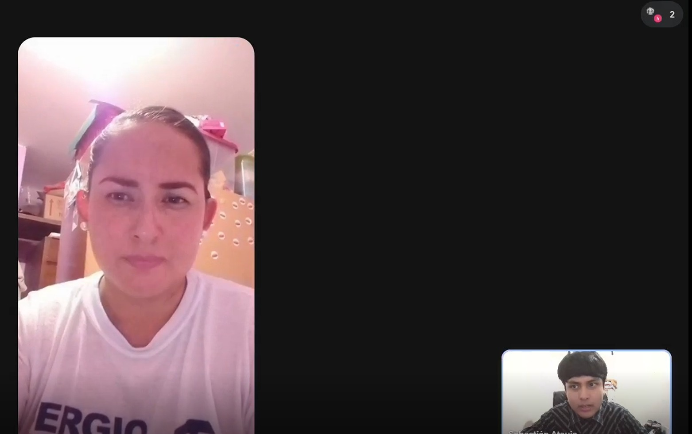
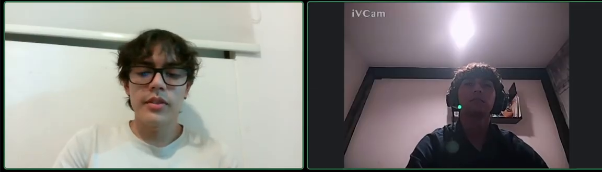
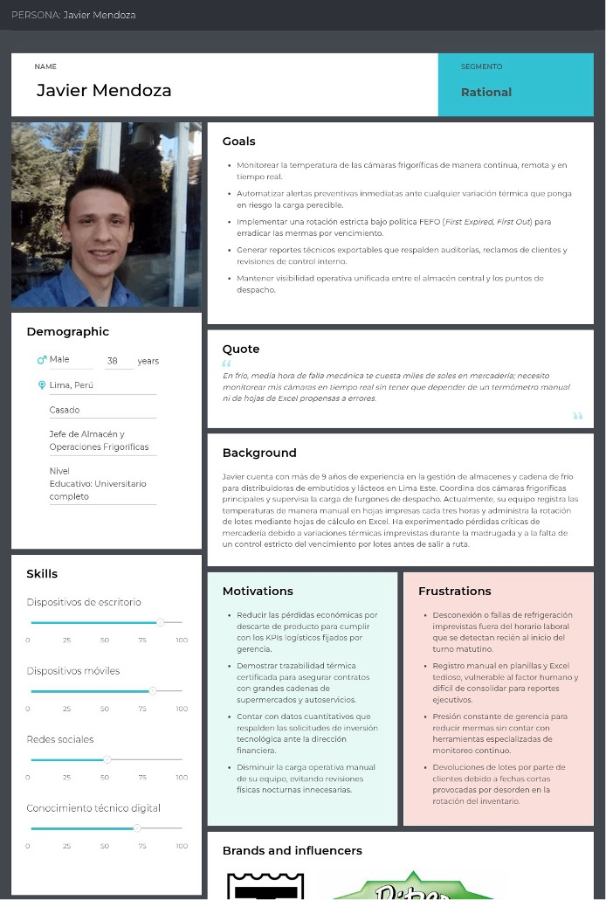
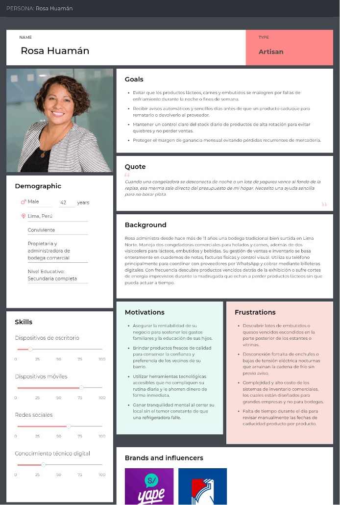
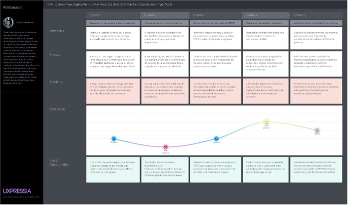
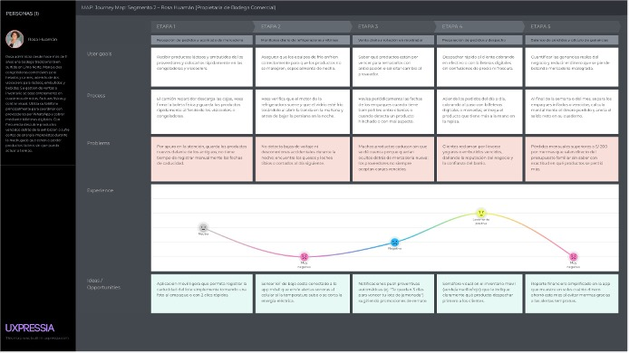
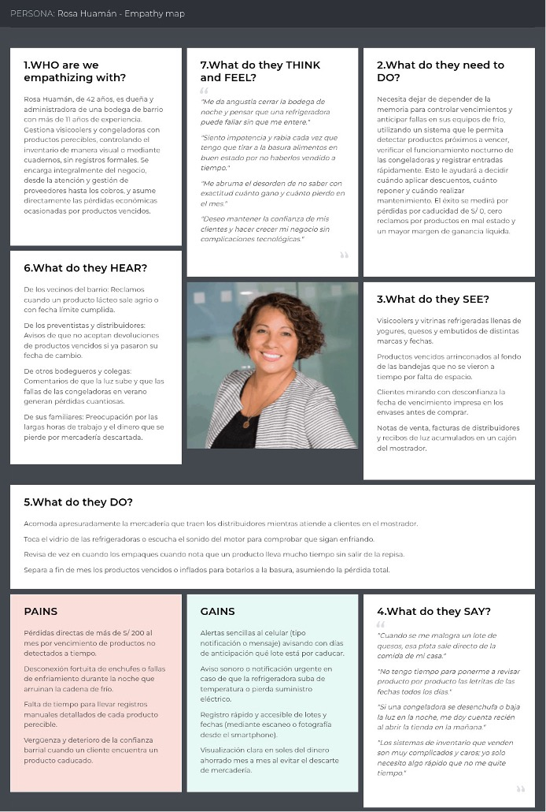
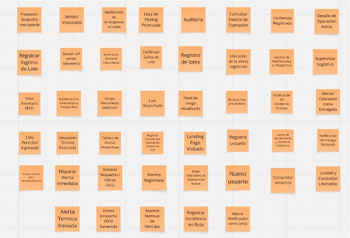

# Capítulo II: Requirements Elicitation & Analysis

Este capítulo relaciona el análisis competitivo y la investigación exploratoria con la propuesta actual de **FríoTrack**: monitorear temperatura, humedad y ubicación de cargas durante el transporte refrigerado de alimentos perecibles. El diseño considera dos perfiles: **Coordinador Logístico**, de una empresa de transporte refrigerado, y **Cliente de Carga**, productor, exportador o comprador.

La evidencia disponible corresponde a una exploración anterior de distribución, almacenamiento e inventario. Se conservan tres registros de entrevistas y sus artefactos originales para mantener trazabilidad. Una entrevista incluye problemas térmicos durante el transporte; las otras dos tratan principalmente inventario y vencimientos en un restaurante y una bodega. Esta muestra aporta indicios, pero no permite afirmar que se hayan validado los dos segmentos actuales ni sus características demográficas.

En este capítulo se distinguen **hallazgos documentados**, **artefactos históricos** y **propuestas de diseño pendientes de validación**. Las últimas orientan el trabajo, pero requieren entrevistas reales antes de convertirse en User Personas y mapas definitivos. El control de inventario, FEFO, promociones por caducidad y gestión de cámaras de almacenamiento se conserva como antecedente exploratorio; no se incluye en el alcance actual de transporte descrito en los capítulos I, III y IV.

## 2.1. Competidores

Se comparan tres productos digitales con funciones de visibilidad de la cadena de frío. **Tive** y **Sensitech / SensiWatch** constituyen referencias directas para el monitoreo de alimentos en tránsito. **Controlant** ofrece capacidades similares, pero su propuesta pública actual se concentra en la cadena farmacéutica; por ello se considera una referencia indirecta por sector. Su existencia no demuestra adopción, precios ni disponibilidad de soporte específico en Perú.

La versión de AV1 comparaba Óptima ERP y Sinapsys WMS. Al no disponer de una fuente primaria que identifique inequívocamente esos productos y respalde sus características, se sustituyen en el análisis vigente. Se retira el precio de S/ 89 y las afirmaciones no sustentadas sobre sus limitaciones. Las versiones anteriores permanecen en el historial del repositorio.

### 2.1.1. Análisis competitivo

#### Competitive Analysis Landscape

**Objetivo del análisis:** ¿qué funciones de seguimiento, alertas y evidencia de un envío ofrecen las soluciones existentes, y qué propuesta para transporte refrigerado de alimentos en Perú podría diferenciar a FríoTrack?

La consulta de las páginas oficiales se realizó el **6 de octubre de 2026**. Las funcionalidades de FríoTrack representan alcance de diseño, salvo donde el capítulo V presente evidencia de implementación. Las ventajas y oportunidades propuestas son hipótesis del equipo, no resultados comerciales comprobados.

| Perfil | **FríoTrack**  | **Tive**  | **Sensitech / SensiWatch**  | **Controlant**  |
| :--- | :--- | :--- | :--- | :--- |
| **Overview** | Propuesta web para seguir cargas de alimentos durante el transporte terrestre refrigerado en Perú. | Plataforma y dispositivos para conocer ubicación y condiciones de envíos. | Plataforma de visibilidad de envíos y dispositivos de monitoreo de la cadena de frío. | Plataforma de visibilidad y monitoreo de envíos orientada a la industria farmacéutica. |
| **Ventaja observada o propuesta** | Propuesta de flujos diferenciados para Coordinador Logístico y Cliente de Carga; pendiente de validación. | Combina seguimiento, sensores y alertas en una plataforma. | Combina visibilidad del envío con seguimiento de condiciones y reportes. | Combina seguimiento con gestión de excursiones y evidencia para calidad farmacéutica. |
| **Mercado objetivo** | Empresas de transporte refrigerado y propietarios o receptores de carga alimentaria. | Cadenas de suministro de alimentos, perecibles y ciencias de la vida. | Cadenas de suministro de alimentos y otras industrias. | Organizaciones farmacéuticas y sus socios logísticos. |
| **Marketing observado / propuesto** | Propuesta: comunicar los flujos de envío, atención de incidencias y consulta por cliente. | Sitio de producto y solicitud de contacto comercial. | Sitio de producto y solicitud de demostración. | Sitio de plataforma y solicitud de demostración. |
| **Productos y servicios verificados / propuestos** | Propuesta: programación, lecturas térmicas y humedad, ubicación, alertas, acciones correctivas e historial por envío. | Monitoreo de temperatura, humedad y ubicación según el modelo de dispositivo; alertas. | SensiWatch para visibilidad de envíos; TempTale GEO para temperatura y ubicación en la cadena alimentaria. | Creación y seguimiento de envíos, temperatura, ubicación, alertas y reportes de entrega. |
| **Precios y costos** | Los planes ilustrativos del diseño requieren validar costos y disposición a pagar con usuarios actuales. | Las páginas citadas no permiten determinar un costo total comparable. Se requiere cotización. | Las páginas citadas no permiten determinar un costo total comparable. Se requiere cotización. | Las páginas citadas no permiten determinar un costo total comparable. Se requiere cotización. |
| **Canales de distribución** | Propuesta: landing informativa y aplicación web responsive. | Oferta digital y dispositivos; contacto comercial en su web. | Plataforma cloud y aplicación móvil; contacto comercial. | Plataforma cloud y contacto comercial. |
| **Fuente primaria** | Alcance de los capítulos I, III y IV; estado real en el V. | [Cold chain monitoring](https://www.tive.com/solutions/cold-chain-monitoring) y [Real-time trackers](https://www.tive.com/products/real-time-trackers). | [SensiWatch Platform](https://www.sensitech.com/en/products/sensiwatch-platform/) y [Food solutions](https://www.sensitech.com/en/industries/food/). | [The Controlant Platform](https://www.controlant.com/platform) y [System overview](https://support.controlant.com/en/20956-39992-system-overview.html). |

**Procedencia de los logotipos:** los SVG de [Tive](https://www.tive.com/), [Sensitech](https://www.sensitech.com/en/) y [Controlant](https://www.controlant.com/) se obtuvieron de las URLs de imagen presentes en las cabeceras de sus sitios oficiales el 07/10/2026, conservando los bytes originales. El logo de FríoTrack procede de `assets/images/logo.svg` de la landing del proyecto. Las URLs de los originales, fecha y hashes constan en `assets/images/chapter-02/competitors/SOURCES.json`. No se infiere que una función esté ausente solo porque no se menciona en una página pública.

#### Análisis SWOT

La tabla distingue capacidades que los proveedores publican de riesgos e hipótesis analíticas del equipo. No atribuye a los competidores fallas, costos superiores ni menor facilidad de uso sin una evaluación comparable.

| Producto | Fortalezas | Debilidades o aspectos por comprobar | Oportunidades (análisis del equipo) | Amenazas (análisis del equipo) |
| :--- | :--- | :--- | :--- | :--- |
| **FríoTrack** | Alcance de diseño enfocado en transporte refrigerado de alimentos y consulta diferenciada de dos roles. | Muestra de investigación insuficiente; integración de sensores, costo y efectividad aún por validar. | Investigar necesidades de coordinación e historial por envío con operadores y clientes del mercado local. | Soluciones consolidadas; conectividad en ruta; dificultad para sostener la operación y captar usuarios. |
| **Tive** | Sensores y plataforma para condiciones y ubicación de envíos, según sus páginas de producto. | Costo integral y adecuación al operador peruano pequeño por comprobar. | Investigar adaptación de su oferta a corredores y procesos locales. | Nuevas alternativas y cambios en requisitos de conectividad o integración. |
| **Sensitech** | Visibilidad de envíos y monitoreo de temperatura y ubicación para alimentos. | Costo integral, incorporación y soporte local por comprobar. | Investigar necesidades de coordinación entre proveedor, transportista y receptor. | Nuevas soluciones de monitoreo y decisiones de compra basadas en integración o costo. |
| **Controlant** | Monitoreo, alertas e historial de envíos en su oferta farmacéutica. | Pertinencia de la oferta actual para el transporte alimentario peruano por comprobar. | Explorar usos adyacentes de la visibilidad térmica; no se afirma que existan planes comerciales para ello. | Cambios del sector y nuevas ofertas de visibilidad especializada. |

### 2.1.2. Estrategias y tácticas frente a competidores

Las estrategias son propuestas por evaluar. FríoTrack no se presenta como más barato, más preciso ni más sencillo mientras no exista una comparación con evidencia.

| Referencia | Estrategia propuesta | Tácticas y evidencia necesaria |
| :--- | :--- | :--- |
| **Tive** | Especializar el flujo de coordinación y consulta en transporte terrestre de alimentos en Perú. | Entrevistar a operadores y clientes; comparar cómo programan un envío, reconocen una desviación y comparten su historial. Evaluar el costo completo antes de comunicar ventajas económicas. |
| **Sensitech / SensiWatch** | Centrar la experiencia en las tareas prioritarias de los dos roles del proyecto. | Probar programación, atención de incidencias y consulta de entregas; observar tiempos, errores y comprensión. Verificar dispositivos e integración antes de anunciar compatibilidad. |
| **Controlant** | Delimitar un producto para alimentos sin prometer las capacidades de una solución validada para farmacia. | Recoger requisitos reales de recepción de carga alimentaria; describir incidentes y acciones correctivas; evitar afirmar certificaciones o liberaciones automáticas que no forman parte del alcance. |

Estas tácticas se relacionan con el Product Backlog cuando las entrevistas confirmen su valor. Alianzas con sensores, importación de datos, periodos de prueba y tarifas siguen siendo decisiones de negocio por acordar, no capacidades ya disponibles.

## 2.2. Entrevistas

El repositorio documenta **tres entrevistas en total**: una a un responsable de distribución de perecibles y dos a compradores minoristas. No hay evidencia de tres entrevistas por segmento. El statement exige **entre tres y cinco entrevistas por cada segmento objetivo** y el Anexo C exige consolidarlas en un solo video de needfinding, con títulos de entrevistado, segmento y fecha.

El déficit numérico del estudio anterior era de dos registros para distribuidoras y uno para compradores minoristas, si todos fueran pertinentes. Sin embargo, completar esas cantidades no corrige por sí solo la relación con los perfiles actuales. Debe confirmarse la participación de cada persona en transporte refrigerado y en la propiedad o recepción de carga antes de asignarla a un segmento actual. No se declara una muestra representativa ni una validación del dominio vigente.

### 2.2.1. Diseño de entrevistas

Las guías anteriores se centraron en inventario, vencimiento, almacenamiento y distribución. Algunas preguntas preguntaban directamente si una función propuesta sería útil. Esas respuestas expresan interés declarado y no prueban adopción ni necesidad observada.

La siguiente guía revisada es un **instrumento para entrevistas futuras**, no una entrevista ya realizada. Se inicia con una experiencia reciente, solicita ejemplos y documentos que el participante pueda compartir y profundiza en decisiones, dificultades y consecuencias. La propuesta FríoTrack se presenta después de investigar la operación actual.

#### Datos principales y complementarios para ambos segmentos

1. ¿Cómo desea que lo identifiquemos en el informe? ¿Cuál es su nombre y apellido y su edad?
2. ¿En qué distrito reside y en cuál trabaja? ¿Qué actividad, organización y cargo desempeña?
3. ¿Cuál es su relación con el transporte refrigerado o la contratación y recepción de carga? ¿Desde cuándo participa en esa actividad?
4. ¿Cómo se organiza su equipo y qué decisiones toma personalmente?
5. ¿Qué formación o experiencia considera relevante para su trabajo?
6. ¿Qué dispositivos, sistema operativo y navegador usa para esas tareas? ¿En qué condiciones dispone de conexión?
7. ¿Qué canales emplea para coordinar con conductores, transportistas, clientes o proveedores?
8. ¿Qué herramientas o marcas usa y por qué las elige? ¿Quién influye en la compra de herramientas para su operación?
9. ¿Qué objetivo considera más importante y qué situación le genera mayor dificultad? Solicite un ejemplo reciente.
10. Si desea compartirlo, ¿qué aspectos de su entorno personal o familiar influyen en su disponibilidad o en el uso de esas herramientas?

Los datos personales se registran solo cuando el participante los proporciona. No se deducen género, estado civil, familia, personalidad, marcas ni destreza tecnológica a partir de su fotografía o edad. Se solicita autorización para grabar y utilizar la evidencia académica.

#### Segmento actual 1: Coordinador Logístico de transporte refrigerado

| Tema | Pregunta principal | Preguntas complementarias |
| :--- | :--- | :--- |
| Preparación | Cuente cómo organizaron el último traslado refrigerado en el que participó. | ¿Quién pidió el servicio? ¿Qué carga, origen y destino tenía? ¿Cómo se acordó el rango de conservación? |
| Asignación | ¿Cómo decidieron qué unidad y conductor atenderían ese envío? | ¿Qué información verificaron? ¿Dónde quedó registrada? ¿Qué hicieron si la unidad no estaba disponible? |
| Seguimiento | Durante ese traslado, ¿cómo supieron dónde estaba la carga y en qué condiciones viajaba? | ¿Quién realizó las mediciones? ¿Con qué frecuencia? ¿Cómo supieron cuándo se había obtenido cada dato? |
| Incidentes | Describa la última desviación de temperatura, pérdida de comunicación o retraso que atendió. | ¿Quién lo detectó? ¿Cuándo se enteró usted? ¿Qué hizo? ¿Qué evidencia conservó? |
| Coordinación | ¿Cómo comunicaron al cliente el estado del envío y los problemas? | ¿Quién recibió la información? ¿Cómo comprobó que fue atendida? |
| Cierre | ¿Cómo cerraron ese traslado y verificaron la entrega? | ¿Qué documentos o mediciones revisaron? ¿Cómo registraron desacuerdos? |
| Historial | Cuente una ocasión en que necesitó reconstruir lo ocurrido en un viaje. | ¿Qué encontró? ¿Qué faltaba? ¿Cuánto tiempo tomó reunir la evidencia? |
| Prioridad y compra | ¿Qué parte de esa operación cambiaría primero y cómo sabría que mejoró? | ¿Quién decide la inversión? ¿Qué condiciones y costos debe evaluar? |

#### Segmento actual 2: Cliente de Carga

| Tema | Pregunta principal | Preguntas complementarias |
| :--- | :--- | :--- |
| Contratación | Cuente el último envío refrigerado que contrató, despachó o recibió. | ¿Qué papel tuvo? ¿Cómo eligió al transportista? ¿Qué condiciones acordaron? |
| Condiciones | ¿Cómo definieron y comunicaron las condiciones necesarias para conservar esa carga? | ¿Quién confirmó los rangos? ¿Qué documento emplearon? |
| Seguimiento | Mientras la carga viajaba, ¿qué información recibió y cómo la obtuvo? | ¿Cuándo la solicitó? ¿Qué información faltaba? ¿Cómo reconoció un dato actualizado? |
| Incidentes | Describa un problema de condición o entrega que haya enfrentado. | ¿Cuándo lo conoció? ¿Qué decidió? ¿Qué hizo el transportista? |
| Recepción | ¿Cómo decidió aceptar, observar o rechazar la carga al recibirla? | ¿Qué comprobaciones y documentos utilizó? ¿Quién tenía autoridad para decidir? |
| Evidencia | ¿Cómo conservó o solicitó el historial de ese envío? | ¿Lo necesitó para un reclamo o control de calidad? ¿Qué dificultad encontró? |
| Permisos | ¿Qué información debería compartir cada participante y cuál necesita mantenerse restringida? | ¿Quiénes trabajan con el mismo envío? ¿Qué acceso tienen actualmente? |
| Prioridad y compra | ¿Qué incertidumbre le gustaría reducir primero y cómo reconocería una mejora? | ¿Quién evalúa herramientas? ¿Cómo compara costos y beneficios? |

El kit de registro y análisis se conserva en [Research Interview Kit](research-interview-kit.md). Las entrevistas de validación de la aplicación se documentarán por separado en el capítulo V cuando corresponda; no sustituyen esta investigación de necesidades.

### 2.2.2. Registro de entrevistas

Se conservan los registros de AV1. Sus enlaces apuntan a grabaciones individuales; **no constituyen todavía el video consolidado** solicitado. Los resúmenes de abajo provienen del informe original y no se presentan como nuevas transcripciones verificadas.

| Evidencia por resolver | Jari Hassan | Irma Barreto | Santiago Silva Jara |
| :--- | :--- | :--- | :--- |
| **Fecha de entrevista** | No consignada; confirmar con el autor o la grabación. | No consignada; confirmar con el autor o la grabación. | No consignada; confirmar con el autor o la grabación. |
| **Distrito** | La ficha dice San Borja y el resumen ubica la empresa en San Luis; aclarar residencia y operación. | San Juan de Lurigancho según el registro original. | Víctor Larco Herrera, Trujillo, según el registro original. |
| **Inicio y duración originales** | 00:40 y 10:42, consignados en AV1; contrastar con el video. | 00:00 y 08:15, consignados en AV1; contrastar con el video. | 00:00 y 04:08, consignados en AV1; contrastar con el video. |
| **Inicio y duración en consolidado** | Pendientes de edición y verificación. | Pendientes de edición y verificación. | Pendientes de edición y verificación. |
| **Relación con perfil actual** | Responsable de distribución con un relato relacionado con transporte; confirmar si representa a la empresa transportista. | Compradora minorista; no se ha verificado contratación o seguimiento de carga refrigerada. | Comprador minorista; no se ha verificado contratación o seguimiento de carga refrigerada. |

No se calcula el inicio del consolidado sumando las duraciones originales: el Anexo C pide editar cada entrevista a aproximadamente tres a cinco minutos y los títulos modifican los tiempos. Quedan pendientes el archivo único, la captura, la URL privada de Stream y sus permisos de visualización.

#### Registros del segmento exploratorio 1: distribuidoras de perecibles

#### Entrevista 1: Jari Hassan 
| Campo                                  | Detalle                                                                                                                                                                                                                                                                                                                                                          |
|:---------------------------------------|:-----------------------------------------------------------------------------------------------------------------------------------------------------------------------------------------------------------------------------------------------------------------------------------------------------------------------------------------------------------------|
| **Titulo**                             | Entrevista 1: Jari Hassan                                                                                                                                                                                                                                                                                                                                        |
| **Segmento**                           | Empresas distribuidoras de productos perecibles                                                                                                                                                                                                                                                                                                                  |
| **Nombres y Apellidos**                | Jari Hassan                                                                                                                                                                                                                                                                                                                                                      |
| **Edad**                               | 25 años                                                                                                                                                                                                                                                                                                                                                          |
| **Distrito**                           | San Borja                                                                                                                                                                                                                                                                                                                                                        |
| **Enlace al video (Microsoft Stream)** | [Entrevista grabada – Microsoft Stream](https://upcedupe-my.sharepoint.com/:v:/g/personal/u20241d811_upc_edu_pe/IQCBD_5MzFsIQ7WwTMg6JH1CAVHjGSGzKYEmoNuR2M1T4X0?e=meBl8F&nav=eyJyZWZlcnJhbEluZm8iOnsicmVmZXJyYWxBcHAiOiJTdHJlYW1XZWJBcHAiLCJyZWZlcnJhbFZpZXciOiJTaGFyZURpYWxvZy1MaW5rIiwicmVmZXJyYWxBcHBQbGF0Zm9ybSI6IldlYiIsInJlZmVycmFsTW9kZSI6InZpZXcifX0%3D) |
| **Timing de inicio y duración**        | Inicio: 00:40 - Duración: 10:42 minutos                                                                                                                                                                                                                                                                                                                          |
| **Evidencia fotográfica**              | *
 
*                                                                                                                                                                                                                                                                     |

**Resumen de la entrevista:**

Jari Hassan es un profesional de 25 años que se desempeña como Jefe de Operaciones y Logística en una empresa del sector alimenticio con base en San Luis, según el resumen original. La ficha indica San Borja y no permite determinar si se refiere a residencia o lugar de trabajo; este dato debe contrastarse con la grabación. Trabaja directamente con la distribución de productos perecibles, como lácteos, embutidos y carnes envasadas, por lo que conoce de cerca las exigencias que implica mantener la cadena de frío y el control del inventario en este tipo de operación.

A partir de su experiencia, señala que uno de los principales problemas en su empresa es la **falta de visibilidad en tiempo real**, tanto del stock como de las condiciones de temperatura durante el transporte. Actualmente combinan un ERP tradicional con registros manuales en Excel, lo que genera desfases en la información, errores de inventario y pérdidas por productos vencidos o en mal estado. También menciona que, cuando ocurre una falla en ruta, muchas veces se enteran demasiado tarde y la mercadería termina en cuarentena o merma.

Jari considera que una solución digital sí podría aportar valor real a su operación, siempre que sea práctica, intuitiva y rápida de implementar. Para él, las funciones más importantes serían:

- Control de lotes con alertas de vencimiento
- Trazabilidad de vehículos por GPS
- Monitoreo térmico en vivo con notificaciones inmediatas

Estas funcionalidades ayudarían a prevenir pérdidas, mejorar la distribución y tomar decisiones con mayor rapidez.

#### Registros del segmento exploratorio 2: compradores minoristas de perecibles

#### Entrevista 1: Irma Barreto

| Campo | Información |
|-------|-------------|
| **Título** | **Entrevista 1: Irma Barreto** |
| Segmento | Tiendas y bodegas con productos perecibles |
| Nombres y apellidos | Irma Barreto |
| Edad | 40 años |
| Distrito | San Juan de Lurigancho |
| Ocupación | Dueña y administradora de un pequeño restaurante familiar |
| Tipo de negocio | Restaurante familiar |
| Número de trabajadores | 4 personas |
| Años gestionando el negocio | 6 años |
| Productos perecibles principales | Frutas, verduras, carnes y otros ingredientes para la preparación de alimentos |
| Volumen de compra aproximado | 30-40 kg de productos perecibles por semana |
| Inicio de la entrevista | 00:00 |
| Duración | 08:15 |
| URL del video | [Video evidencia](https://upcedupe-my.sharepoint.com/personal/u20241f246_upc_edu_pe/_layouts/15/stream.aspx?id=%2Fpersonal%2Fu20241f246%5Fupc%5Fedu%5Fpe%2FDocuments%2Fentrevista%2Dsegmento%2D2%2Dalexander%2Dweb%2Emp4&referrer=StreamWebApp%2EWeb&referrerScenario=AddressBarCopied%2Eview%2E42b0dbe0%2D21c5%2D4a90%2D89ee%2Da7c7e8118144&mode=View) |
| **Fotografía** | 

 |
| **Resumen de la entrevista** | Irma Barreto, de 40 años, es dueña y administradora de un pequeño restaurante familiar ubicado en San Juan de Lurigancho. Cuenta con aproximadamente 6 años de experiencia gestionando su negocio y trabaja junto a otras 3 personas. Actualmente, controla el inventario de sus productos perecibles de manera manual, revisando las cantidades disponibles y anotando algunas compras en un cuaderno. Sus principales dificultades son la falta de actualización del stock en tiempo real, los errores en el registro de productos y la posibilidad de quedarse sin ingredientes durante las horas de mayor atención. También señaló que las frutas y verduras pueden llegar demasiado maduras, maltratadas o en cantidades menores a las solicitadas, generando pérdidas y dificultades para preparar algunos platos del menú. Para reducir estos problemas, mostró interés en utilizar una aplicación sencilla desde su celular Android que le permita controlar automáticamente el inventario, recibir alertas sobre productos próximos a vencer, revisar las existencias y consultar el estado de sus pedidos. Asimismo, consideró importante contar con una solución que facilite la organización de sus compras y disminuya las pérdidas por deterioro de productos. Estaría dispuesta a pagar aproximadamente entre 30 y 50 soles mensuales por una herramienta accesible que le ayude a mejorar la gestión de su inventario y abastecimiento. En general, la entrevista evidencia que el comerciante necesita una solución digital que facilite el control de productos perecibles, reduzca las pérdidas y mejore la disponibilidad de ingredientes para las operaciones diarias del restaurante. |

#### Entrevista 2: Santiago Silva Jara

| Campo | Información |
|-------|-------------|
| **Título** | **Entrevista 2: Santiago Silva Jara** |
| Segmento | Tiendas y bodegas con productos perecibles |
| Nombres y apellidos | Santiago Silva Jara |
| Edad | 22 años |
| Distrito | Víctor Larco Herrera (Trujillo) |
| Inicio de la entrevista | 00:00 |
| Duración | 04:08 |
| URL del video | [Video evidencia](https://upcedupe-my.sharepoint.com/:v:/g/personal/u202421137_upc_edu_pe/IQAEFjC2Gb2fSr-pRZqtPllkAQef9VFRhQM8i7AwkrYuvCA) |
| **Fotografía** | 

 |
| **Resumen de la entrevista** | Santiago Silva Jara, de 22 años, del distrito de Víctor Larco Herrera (Trujillo), posee una bodega en la que vende todo tipo de productos, incluyendo productos perecibles. Registra a mano la fecha de caducidad de estos productos para tener presente cuándo puede cambiarlos y así no afectar a sus clientes. Comentó que sería muy útil contar con una aplicación que le avise sobre estos vencimientos y cambios. |

### 2.2.3. Análisis de entrevistas

El análisis utiliza los resúmenes conservados, con **n = 1** para el grupo exploratorio de distribución y **n = 2** para el grupo exploratorio de compradores minoristas. Los porcentajes describen esta muestra pequeña; no son estimaciones del mercado ni resultados de los segmentos actuales. “No consta” significa que el resumen no permite determinar la respuesta.

#### Distribución de perecibles: Jari Hassan

El único resumen documenta falta de visibilidad térmica durante el transporte, detección tardía de fallas en ruta e interés por GPS y monitoreo con avisos. Es un indicio para investigar el seguimiento de envíos y la respuesta a incidentes. También contiene necesidades de inventario y lotes que pertenecían a la propuesta anterior y no se trasladan automáticamente al alcance vigente.

| Característica | Evidencia documentada | Proporción en el grupo exploratorio | Límite de interpretación |
| :--- | :--- | :--- | :--- |
| Falta de visibilidad térmica durante transporte | Jari. | 1/1 = 100 %. | Un relato; no prueba que todos los transportistas tengan el mismo problema. |
| Uso combinado de ERP y Excel | Jari. | 1/1 = 100 %. | No se conoce la configuración, volumen ni frecuencia de errores. |
| Interés declarado en GPS y avisos térmicos | Jari. | 1/1 = 100 %. | No demuestra adopción, disposición a pagar ni eficacia. |
| Cargo y edad consignados | Jefe de Operaciones y Logística, 25 años. | 1/1 = 100 %. | No permite definir rangos etarios del perfil actual. |

No se cuantificaron pérdidas, tiempo de detección o ahorro. Se requiere verificar el rol del entrevistado, la fecha, el distrito y la referencia temporal de cada afirmación en la grabación.

#### Compradores minoristas: Irma Barreto y Santiago Silva Jara

Los dos resúmenes describen registros manuales e interés por alertas de vencimiento. Irma relata dificultades de stock y problemas con ingredientes recibidos; el resumen de Santiago se limita a caducidad y cambios de productos. Por ello no se atribuyen a ambos la experiencia de entregas incompletas, el uso de Android ni una disposición a pagar.

| Característica | Irma | Santiago | Proporción documentada (n = 2) |
| :--- | :--- | :--- | :--- |
| Registro manual de inventario o vencimiento | Sí: cantidades y compras. | Sí: fecha de caducidad. | 2/2 = 100 %; tareas relacionadas, pero distintas. |
| Interés por aviso de vencimiento | Sí. | Sí. | 2/2 = 100 % de interés declarado. |
| Falta de actualización del stock | Sí. | No consta. | 1/2 = 50 % con mención; no equivale a 50 % de ausencia. |
| Productos maltratados, maduros o incompletos al recibir | Sí. | No consta. | 1/2 = 50 % con mención. |
| Uso de celular Android | Sí. | No consta. | 1/2 = 50 % con mención. |
| Disposición declarada a pagar S/ 30–50 por gestión de inventario | Sí. | No consta. | 1/2 = 50 % con mención; no es precio validado para transporte. |
| Contratación y consulta térmica de un envío refrigerado | No consta. | No consta. | 0/2 documentados; no demuestra que nunca realicen esa actividad. |

Las edades consignadas son 40 y 22 años, respectivamente. No se dispone de evidencia común para género declarado, estado civil, familia, personalidad, marcas, influencias, navegador o habilidades cuantificadas. Estos campos deben recolectarse y codificarse; no pueden completarse por inferencia visual.

#### Relación entre hallazgos y decisiones de diseño

| Hallazgo documentado | Decisión o hipótesis derivada | Evidencia faltante |
| :--- | :--- | :--- |
| Jari describe visibilidad tardía de condiciones en ruta. | Proponer lecturas con fecha y hora y alertas vinculadas a un envío. | Casos de operadores de transporte; intervalos, rangos y protocolos reales. |
| Jari solicita trazabilidad GPS. | Proponer ubicación con fecha de última actualización. | Tareas y decisiones que cada rol toma con esa información. |
| Irma describe dificultades al recibir productos. | Investigar qué evidencia necesita un receptor al aceptar u observar carga. | Experiencias específicas de recepción de transporte refrigerado. |
| Irma y Santiago solicitan alertas de vencimiento. | Mantener ese hallazgo en el estudio histórico de inventario. | No justifica por sí solo una función de FEFO en el producto de transporte. |

Para completar el capítulo según el statement se requieren de tres a cinco entrevistas pertinentes por segmento actual, sus resúmenes completos y la reconstrucción de sus arquetipos. La pertinencia de los registros existentes debe verificarse; no se reemplaza esa comprobación con un cambio de etiqueta.

## 2.3. Needfinding

El needfinding distingue la actividad actual de las personas de las funciones que propone la aplicación. La exploración de AV1 identificó dificultades de inventario y un relato de seguimiento térmico durante distribución. El diseño vigente se enfoca en envíos refrigerados y toma ese relato como punto de partida de una investigación que debe ampliarse.

Se conservan las imágenes de UXPressia del estudio anterior. Su conservación permite explicar qué cambió en la propuesta y evita convertir supuestos del equipo en testimonios. Las tablas propuestas para transporte que acompañan esas imágenes son instrumentos de discusión y no resultados de nuevas entrevistas.

### 2.3.1. User Personas

Las fichas históricas describen a **Javier Mendoza**, Jefe de Almacén y Operaciones Frigoríficas, y **Rosa Huamán**, propietaria de bodega. No son los entrevistados registrados y no se dispone de trazabilidad que respalde todos sus datos, marcas, citas y habilidades con los tres resúmenes. Sus nombres, fotografías y demografía no se reasignan a los perfiles de transporte.

#### Arquetipo histórico: Javier Mendoza

  

  

La ficha enfatiza cámaras frigoríficas, controles manuales y rotación FEFO. El resumen de Jari respalda interés por seguimiento térmico y describe ERP y Excel, pero no acredita la edad de 38 años, estado civil, experiencia, citas textuales o preferencias de marcas de Javier. Esos campos permanecen como supuestos de la ficha anterior y necesitan verificación o retiro al reconstruir el arquetipo.

#### Arquetipo histórico: Rosa Huamán

  

  

La ficha presenta control de stock, pérdidas por caducidad y equipos de frío en una bodega. Los resúmenes de Irma y Santiago respaldan registros manuales e interés por avisos, pero no permiten afirmar la edad de 42 años, estado civil, once años de experiencia, marcas o pérdidas mensuales de Rosa. La ficha también requiere revisar el campo demográfico “Male”; no se corrige atribuyendo un género a partir de la fotografía.

#### Perfiles preliminares del dominio vigente

Las siguientes fichas textuales delimitan responsabilidades para el diseño y se identifican como **PP01** y **PP02**. No son User Personas validadas ni reemplazan las fichas que deben elaborarse en UXPressia.

| Campo | PP01 — Coordinador Logístico | PP02 — Cliente de Carga |
| :--- | :--- | :--- |
| **Segmento propuesto** | Empresas de transporte refrigerado de alimentos. | Productores, exportadores y compradores vinculados a carga refrigerada. |
| **Responsabilidad de diseño** | Organizar envíos, coordinar unidad y conductor y atender incidentes. | Conocer las condiciones de sus envíos y disponer de evidencia para recepción o reclamos. |
| **Objetivo propuesto** | Reconocer una desviación y coordinar una respuesta durante el trayecto. | Reducir incertidumbre sobre el traslado y revisar el historial de su carga. |
| **Indicio disponible** | Jari relata visibilidad tardía durante distribución; falta verificar representatividad transportista. | Irma relata problemas de productos recibidos; falta verificar operación de transporte refrigerado. |
| **Datos personales y tecnológicos** | Por recolectar; sin nombre ficticio, edad, marcas o habilidades atribuidas. | Por recolectar; sin nombre ficticio, edad, marcas o habilidades atribuidas. |
| **Validación pendiente** | Tres a cinco entrevistas pertinentes, análisis y ficha UXPressia trazable. | Tres a cinco entrevistas pertinentes, análisis y ficha UXPressia trazable. |

El Impact Mapping y los diseños pueden referirse a PP01/PP02 como hipótesis de rol, con esa limitación visible. Las características definitivas deben provenir de las entrevistas y no de las pantallas ya diseñadas.

### 2.3.2. User Task Matrix

La matriz relaciona tareas del negocio, realizadas con o sin FríoTrack, con frecuencia e importancia para cada perfil. Las valoraciones de la tabla histórica se conservan como asignaciones del diseño de AV1; no existe una medición documentada que las convierta en frecuencias observadas.

#### Matriz histórica de inventario y almacenamiento

| **Task** | **Javier Mendoza — Frequency** | **Javier Mendoza — Importance** | **Rosa Huamán — Frequency** | **Rosa Huamán — Importance** |
| :--- | :--- | :--- | :--- | :--- |
| Monitorear temperatura de cámaras/vitrinas | High | High | High | High |
| Registrar fecha de vencimiento y lote de productos | High | High | Medium | High |
| Verificar rotación de inventario bajo criterio FEFO | High | High | Medium | High |
| Detectar desviaciones térmicas fuera de horario laboral | High | High | Low | High |
| Revisar manualmente el estado físico de los equipos de frío | Medium | High | High | High |
| Lanzar promociones o remates por caducidad cercana | Low | Medium | High | High |
| Preparar pedidos o despachos para clientes/rutas | High | High | High | High |
| Generar reportes de mermas y pérdidas económicas | Medium | High | Low | Medium |
| Justificar trazabilidad térmica ante clientes o auditorías | Medium | High | Low | Low |
| Coordinar mantenimiento de equipos de refrigeración | Low | High | Low | High |
| Separar y desechar mercadería deteriorada/vencida | Medium | High | Medium | High |

En esta versión histórica ambos arquetipos recibieron alta importancia para conservación y caducidad; el jefe de almacén recibió más peso en trazabilidad y FEFO y la propietaria en promociones. Estas diferencias explican el diseño anterior, pero requieren evidencia para considerarse hallazgos y no justifican agregar esas funciones al alcance actual.

#### Matriz propuesta para transporte, por verificar

| **Task independiente del software** | **PP01 — Frequency** | **PP01 — Importance** | **PP02 — Frequency** | **PP02 — Importance** |
| :--- | :--- | :--- | :--- | :--- |
| Acordar carga, origen, destino y condiciones de conservación | Por verificar | Por verificar | Por verificar | Por verificar |
| Asignar unidad y conductor aptos para el traslado | Por verificar | Por verificar | Por verificar | Por verificar |
| Comprobar ubicación y condiciones durante el viaje | Por verificar | Por verificar | Por verificar | Por verificar |
| Reconocer falta de información de la carga | Por verificar | Por verificar | Por verificar | Por verificar |
| Coordinar respuesta a una desviación o incidencia | Por verificar | Por verificar | Por verificar | Por verificar |
| Comunicar avances y problemas a las partes involucradas | Por verificar | Por verificar | Por verificar | Por verificar |
| Verificar condiciones y evidencia al entregar o recibir | Por verificar | Por verificar | Por verificar | Por verificar |
| Reconstruir el historial para un reclamo o revisión | Por verificar | Por verificar | Por verificar | Por verificar |

Como hipótesis de diseño, PP01 coordina recursos y respuesta operativa y PP02 evalúa la información de su carga y recepción. Se espera que coincidan en seguimiento y evidencia, pero no se afirma qué tarea es más frecuente o importante. Las entrevistas deben registrar cuántas veces se realiza cada tarea, consecuencias de omitirla y quién tiene autoridad para resolverla. Después se traducirán esas respuestas a una escala explícita y se priorizará el backlog.

### 2.3.3. User Journey Mapping

Los journeys deben representar la experiencia **As-Is**, antes de FríoTrack, desde el inicio de una actividad hasta su cierre. Las imágenes históricas fueron elaboradas para Javier y Rosa en UXPressia. Se conservan vinculadas a sus fichas, con límites de evidencia; sus curvas emocionales y oportunidades no son mediciones de participantes actuales.

#### Journey histórico: Javier Mendoza

  

La imagen recorre recepción e ingreso, monitoreo, selección y rotación FEFO, preparación del despacho y revisión de mermas. Describe discontinuidad de información y trabajo manual en almacenamiento. El relato de Jari permite investigar esa discontinuidad durante distribución, pero no respalda todas las etapas, horarios ni emociones atribuidas al arquetipo. Las oportunidades de la imagen son propuestas de solución y no deben insertarse como actividades de un journey As-Is.

#### Journey histórico: Rosa Huamán

  

La imagen recorre reposición, control de stock y vencimiento, revisión del frío, atención al cliente y cierre del negocio. La asociación con registros manuales y avisos de vencimiento tiene indicios en Irma y Santiago; los fallos eléctricos nocturnos y las emociones requieren verificar su procedencia. Este recorrido trata venta minorista y no equivale al seguimiento y recepción de un envío refrigerado.

#### Guion As-Is para investigar el dominio vigente

| Etapa propuesta | PP01: pregunta de observación | PP02: pregunta de observación | Evidencia que debe recolectarse |
| :--- | :--- | :--- | :--- |
| Antes del traslado | ¿Cómo prepara recursos y confirma condiciones? | ¿Cómo solicita el traslado y acuerda condiciones? | Caso real, actores, documentos y canales. |
| Salida | ¿Cómo verifica que la carga puede iniciar el viaje? | ¿Cómo recibe la confirmación de despacho? | Registro o relato concreto de salida. |
| En tránsito | ¿Cómo conoce ubicación y condiciones? | ¿Qué información recibe o solicita? | Frecuencia, canal, antigüedad y ausencia de datos. |
| Incidencia | ¿Cómo decide y coordina una respuesta? | ¿Cómo se entera y qué puede decidir? | Último caso, secuencia, responsables y consecuencias. |
| Entrega y cierre | ¿Cómo registra entrega y conserva evidencia? | ¿Cómo acepta u observa carga y obtiene historial? | Comprobaciones, documentos y reclamos. |

Este guion no es una validación ni una curva emocional terminada. Tras las entrevistas se completarán acciones, pensamientos y emociones observadas, pains y canales, diferenciando citas, inferencias y oportunidades, y se exportarán las nuevas imágenes desde UXPressia.

### 2.3.4. Empathy Mapping

El Empathy Map organiza observaciones sobre lo que cada persona hace, ve, oye, dice, piensa y siente, junto con sus pains y gains. Para evitar atribuir frases inventadas, las citas deben vincularse a entrevistado y minuto del video; las inferencias del equipo deben identificarse.

#### Mapa histórico: Javier Mendoza

  

El mapa histórico agrupa preocupación por equipos de frío, registros manuales y pérdidas en almacén, y propone avisos e información continua como gains. Solo hay indicios parciales en el resumen de Jari; las frases entre comillas, mediciones de experiencia y escenas nocturnas de la imagen no se presentan como citas verificadas.

#### Mapa histórico: Rosa Huamán

  

El mapa relaciona control manual y caducidad con tiempo, pérdidas y preocupación al cerrar el negocio. Los dos registros minoristas apoyan parte del problema de caducidad, pero no acreditan todas las frases, interrupciones eléctricas o monto mensual de pérdida que muestra la imagen. Su alcance sigue siendo inventario minorista.

#### Preparación del mapa vigente

| Dimensión | PP01: tema a investigar | PP02: tema a investigar |
| :--- | :--- | :--- |
| **Who / Needs to do** | Responsabilidad y límites para organizar y atender envíos. | Responsabilidad y límites al contratar, seguir o recibir carga. |
| **Sees / Hears** | Información de unidad, conductor, cliente y mediciones que recibe actualmente. | Información que recibe del transportista y requisitos que escucha de calidad o recepción. |
| **Says / Does** | Acciones y expresiones del último caso real, con referencia al video. | Acciones y expresiones del último envío real, con referencia al video. |
| **Thinks / Feels** | Preocupaciones que el participante exprese; no inferirlas de la interfaz. | Incertidumbres que el participante exprese; no suponer frustración. |
| **Pains / Gains** | Obstáculos documentados y mejora que la persona considera valiosa. | Obstáculos documentados y evidencia que necesita para decidir. |

El proceso pendiente consiste en seleccionar a participantes pertinentes, ubicar el perfil al centro del mapa, codificar observaciones y citas, contrastar entre entrevistas y revisar contradicciones. Las nuevas fichas y mapas se construirán en UXPressia con esa trazabilidad.

## 2.4. Big Picture EventStorming

El artefacto histórico representa la exploración anterior de lotes, inventario, FEFO, telemetría, alertas y despacho. No consta en el informe una fecha, lista de participantes ni registro de etapas que permita afirmar cómo se realizó una sesión colaborativa. La explicación siguiente documenta el artefacto existente y propone la corrección para transporte; no inventa un taller realizado.

  
  
<i>Figura 2.1. Tablero histórico de exploración del dominio; requiere separar eventos, comandos, actores y vistas.</i>

### Lectura y límites del tablero histórico

La imagen contiene hechos como “Lote Perecible Ingresado”, “Desviación Térmica Detectada”, “Alerta Térmica Emitida” y “Lote Despachado”. También incluye comandos (“Registrar Ingreso de Lote”), vistas (“Dashboard de Telemetría”), un actor (“Comprador minorista”) y un canal (“Landing Page”) como notas del mismo color. Sin una leyenda y una secuencia no se distinguen hechos del negocio de acciones o elementos de software.

El flujo FEFO y sus promociones se conserva como antecedente, pero no se traslada al dominio vigente de transporte. La corrección debe partir del ciclo de un envío y de decisiones reales de los dos perfiles, antes de modelar componentes de software.

### Propuesta de etapas para la sesión de transporte

| Etapa | Trabajo propuesto | Resultado que debe evidenciarse |
| :--- | :--- | :--- |
| **1. Eventos** | Identificar hechos significativos ya ocurridos durante un envío y escribirlos en pasado. | Captura inicial de eventos y casos de entrevistas que los sustentan. |
| **2. Secuencia** | Ordenar salida, tránsito, incidencias y entrega; separar recorridos normales y alternativos. | Captura de la línea de tiempo y discusión de excepciones. |
| **3. Actores y acciones** | Identificar quién puede realizar la acción que origina cada evento y quién recibe información. | Captura con comandos y actores diferenciados por leyenda. |
| **4. Políticas y dependencias** | Discutir rangos, avisos, falta de lecturas, respuesta a incidentes y terceros involucrados. | Reglas confirmadas y decisiones que aún necesitan evidencia. |
| **5. Hotspots y alcance** | Señalar conflictos, términos ambiguos y fronteras del negocio. | Preguntas abiertas, alcance acordado y glosario actualizado. |

### Secuencia candidata del negocio, pendiente de validación

| Hecho candidato | Actor o fuente por confirmar | Continuación propuesta |
| :--- | :--- | :--- |
| **Shipment Scheduled** | Coordinador Logístico y acuerdo con Cliente de Carga. | Verificar condiciones, disponibilidad de unidad y conductor. |
| **Vehicle Assigned / Driver Assigned** | Coordinador Logístico. | Preparar y confirmar la salida. |
| **Shipment Departed** | Operación de transporte. | Recoger evidencia de ubicación y condiciones durante el trayecto. |
| **Condition Reading Recorded** | Medición de la carga. | Evaluar los rangos acordados y la vigencia de la lectura. |
| **Temperature Excursion Detected** | Evaluación de la lectura según condiciones acordadas. | Avisar a responsables y coordinar una respuesta. |
| **Communication Gap Detected** | Ausencia de una lectura esperada. | Distinguir falta de datos de condiciones normales de carga. |
| **Corrective Action Recorded** | Responsable operativo autorizado. | Conservar acción y responsable sin asumir recuperación automática. |
| **Shipment Delivered** | Operación de transporte y recepción. | Revisar condiciones, registrar observaciones y conservar evidencia. |

Estos hechos candidatos no acreditan reglas aprobadas ni una integración IoT implementada. El equipo debe realizar y registrar la sesión, incluir participantes y fecha reales, exportar las capturas de cada etapa desde la herramienta indicada y explicar decisiones y hotspots. Ese resultado alimentará el Design-Level EventStorming del capítulo IV.

## 2.5. Ubiquitous Language

El glosario propone términos de negocio para el transporte refrigerado y utiliza inglés con definición en español. Debe revisarse con los participantes; evita vocabulario técnico de implementación y delimita el significado de cada término en este proyecto. Los conceptos de almacenamiento, picking, promociones y FEFO pertenecen al estudio anterior y no al alcance vigente.

| Término | Definición en el dominio de FríoTrack |
| :--- | :--- |
| **Cold Chain (Cadena de frío)** | Condiciones de conservación acordadas que deben mantenerse durante el traslado de la carga refrigerada. |
| **Shipment (Envío)** | Traslado identificado de una carga desde un origen hasta un destino, con condiciones, participantes y estado propios. |
| **Perishable Cargo (Carga perecible)** | Alimentos transportados cuya calidad depende de sus condiciones de conservación y del tiempo. |
| **Refrigerated Carrier (Transportista refrigerado)** | Empresa u operador que realiza el traslado de carga con una unidad de refrigeración. |
| **Logistics Coordinator (Coordinador Logístico)** | Persona del transportista que organiza recursos y coordina la operación y respuesta a incidencias. |
| **Cargo Client (Cliente de Carga)** | Productor, exportador o comprador relacionado con un envío y autorizado a consultar información de su carga. |
| **Driver (Conductor)** | Persona asignada a conducir la unidad que transporta un envío. |
| **Refrigerated Vehicle (Vehículo refrigerado)** | Unidad utilizada para el traslado de carga bajo condiciones de conservación acordadas. |
| **Origin / Destination (Origen / Destino)** | Lugares acordados de salida y recepción de un envío. |
| **Route (Ruta)** | Trayecto planificado o recorrido por la unidad entre origen y destino; ambos deben distinguirse al mostrarlos. |
| **Agreed Temperature Range (Rango térmico acordado)** | Límite inferior y superior de temperatura establecido para un envío; depende de la carga y del acuerdo operativo. |
| **Agreed Humidity Range (Rango de humedad acordado)** | Límite inferior y superior de humedad, cuando su seguimiento sea pertinente para la carga. |
| **Condition Reading (Lectura de condiciones)** | Medición de temperatura o humedad de la carga, identificada por su momento de obtención. |
| **Last Known Location (Última ubicación conocida)** | Posición más reciente reportada para un envío, con su fecha y hora; no implica posición actual si está desactualizada. |
| **Temperature Excursion (Desviación térmica)** | Medición fuera del rango acordado; su severidad y respuesta deben definirse según las reglas del envío. |
| **Communication Gap (Intervalo sin información)** | Periodo en que no se dispone de una lectura esperada; no prueba que la carga esté dentro ni fuera de rango. |
| **Alert (Alerta)** | Aviso de una condición que exige revisión por los responsables; se relaciona con un envío y un hecho identificable. |
| **Shipment Incident (Incidencia de envío)** | Situación registrada durante el traslado que puede afectar condiciones, continuidad o entrega. |
| **Corrective Action (Acción correctiva)** | Acción registrada por un responsable ante una incidencia; su registro no demuestra por sí solo que se haya resuelto. |
| **Delivery (Entrega)** | Llegada y transferencia de la carga al receptor; debe distinguirse de su aceptación de calidad. |
| **Receiving Observation (Observación de recepción)** | Condición o desacuerdo documentado por quien recibe la carga. |
| **Shipment History (Historial de envío)** | Secuencia conservada de mediciones, ubicaciones, cambios de estado, incidencias y acciones de un envío. |
| **Cold Chain Evidence (Evidencia de cadena de frío)** | Registros disponibles que permiten revisar condiciones del traslado; no equivale automáticamente a una certificación de inocuidad. |
| **Product Loss (Pérdida de producto / Merma)** | Pérdida de carga por deterioro u otra causa documentada; su magnitud no se infiere de una alerta aislada. |

**Pendientes para cerrar el capítulo:** entrevistas pertinentes y completas; video consolidado con tiempos verificados; trazabilidad de características; User Personas, journeys y Empathy Maps actuales en UXPressia; y taller de EventStorming real con capturas. Las propuestas y correcciones textuales de esta versión no sustituyen esas evidencias.
