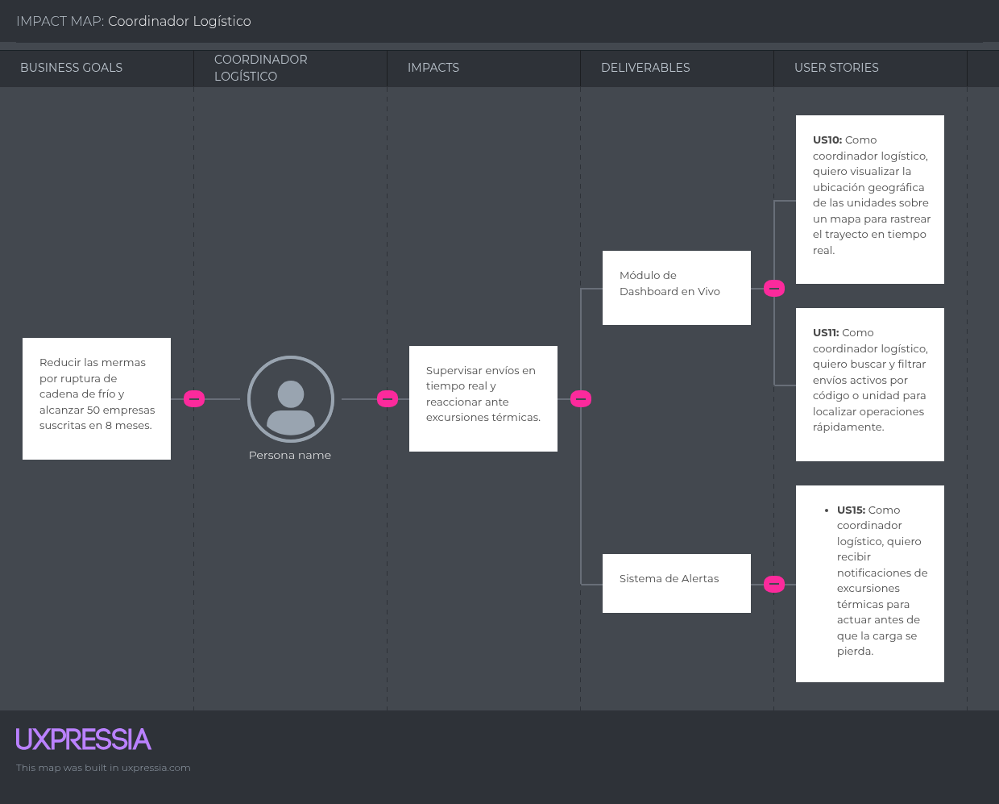
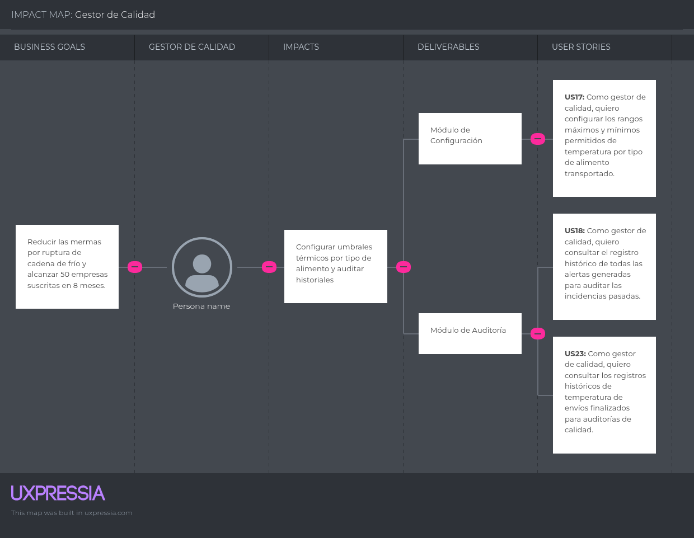
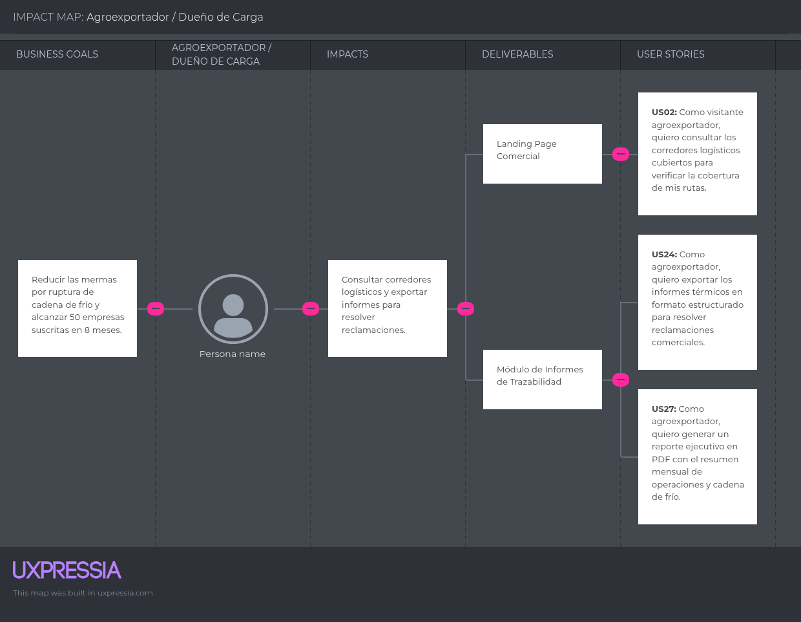

# Capítulo III: Requirements Specification

## 3.1. User Stories
## Epics
| Epic ID | Título | Descripción |
| :--- | :--- | :--- |
| **EP01** | Gestión de la Landing Page y Captación | Épica que agrupa los requerimientos asociados al sitio web estático institucional de presentación de FríoTrack. |
| **EP02** | Autenticación y Gestión de Usuarios | Épica orientada al control de accesos, inicio de sesión y seguridad de los perfiles de usuario en la plataforma web. |
| **EP03** | Panel de Monitoreo en Tiempo Real (Dashboard) | Épica que agrupa las funcionalidades para la supervisión telemática casi en tiempo real de temperatura, humedad y ubicación de la flota. |
| **EP04** | Sistema de Alertas Automatizadas | Épica encargada de la generación, emisión y notificación de alertas ante excursiones térmicas o anomalías en ruta. |
| **EP05** | Gestión de Flota y Conductores | Épica dedicada al registro, administración y asignación de unidades frigoríficas y personal de transporte. |
| **EP06** | Historial y Auditoría de Envíos | Épica enfocada en el almacenamiento, consulta y exportación de registros térmicos históricos para auditorías de calidad. |
| **EP07** | RESTful API Backend & Servicios | Épica técnica dedicada al desarrollo de la API de servicios bajo arquitectura REST y C# / ASP.NET Core. |

## User Stories 
| ID | Título | Descripción | Criterios de Aceptación (Gherkin) | Epic ID |
| :--- | :--- | :--- | :--- | :--- |
| **US01** | Propuesta de valor en Landing | Como **visitante transportista**, quiero visualizar la propuesta de valor principal en la página de inicio para comprender los beneficios del monitoreo térmico. | - Dado que el usuario accede a la web, cuando se renderiza la sección principal, entonces muestra la propuesta enfocada en la cadena de frío. - Dado que visualiza la interfaz, cuando se evalúan los elementos, entonces son totalmente responsivos. | EP01 |
| **US02** | Corredores logísticos en Landing | Como **visitante agroexportador**, quiero consultar los corredores logísticos cubiertos para verificar la cobertura de mis rutas. | - Dado que navega a la sección de corredores, cuando carga la página, entonces lista las rutas de La Libertad, Ica, Piura y Lambayeque. - Dado que despliega detalles, entonces muestra puntos de origen y destino. | EP01 |
| **US03** | Formulario de contacto comercial | Como **visitante interesado**, quiero registrar mis datos en un formulario para solicitar una demostración comercial. | - Dado que visualiza el formulario, cuando ingresa datos válidos y envía, entonces almacena la solicitud y muestra éxito. - Dado que introduce correo incorrecto, cuando intenta enviar, entonces bloquea el envío y muestra alerta. | EP01 |
| **US04** | Casos de éxito y testimonios | Como **visitante del sitio**, quiero leer casos de éxito de otros transportistas para validar la efectividad de la plataforma. | - Dado que accede a testimonios, cuando desplaza la vista, entonces muestra experiencias reales de adopción en logística. | EP01 |
| **US05** | Preguntas frecuentes (FAQ) | Como **visitante interesado**, quiero consultar preguntas frecuentes para resolver dudas sobre la implementación del sistema. | - Dado que hace clic en FAQ, cuando selecciona una pregunta, entonces despliega la respuesta técnica y comercial correspondiente. | EP01 |
| **US06** | Inicio de sesión en el sistema | Como **coordinador logístico**, quiero autenticar mis credenciales en el sistema para acceder al panel operativo. | - Dado que está en login, cuando ingresa credenciales válidas, entonces genera sesión y redirige al panel. - Dado que ingresa contraseña incorrecta, cuando intenta acceder, entonces rechaza el acceso con error. | EP02 |
| **US07** | Cierre de sesión seguro | Como **usuario del sistema**, quiero cerrar mi sesión activa de forma segura para evitar accesos no autorizados. | - Dado que tiene sesión activa, cuando hace clic en cerrar sesión, entonces invalida el token y redirige al login. | EP02 |
| **US08** | Recuperación de contraseña | Como **usuario del sistema**, quiero solicitar un enlace de recuperación de contraseña para restablecer mi acceso. | - Dado que ingresa su correo en recuperación, cuando el servidor valida el registro, entonces envía un enlace temporal al correo. | EP02 |
| **US09** | Gestión de perfiles de usuario | Como **administrador**, quiero administrar los roles y permisos de los usuarios para controlar el acceso a módulos. | - Dado que accede al módulo de usuarios, cuando modifica un rol y guarda, entonces actualiza los privilegios en la plataforma. | EP02 |
| **TS01** | Endpoint de autenticación JWT | Como **developer**, quiero construir un endpoint POST en la API para autenticar usuarios y emitir tokens JWT seguros. | - Dado que el cliente envía credenciales válidas, cuando el servidor procesa, entonces responde HTTP 200 con el token. - Dado que envía credenciales inválidas, entonces responde HTTP 401 Unauthorized. | EP02 |
| **US10** | Telemetría en vivo en el panel | Como **coordinador logístico**, quiero visualizar un panel con lecturas actualizadas de temperatura para supervisar envíos. | - Dado que accede al panel, cuando selecciona un envío activo, entonces muestra métricas de temperatura en tiempo casi real. - Dado que llegan lecturas, cuando se actualiza la interfaz, entonces refleja los valores sin recargar la página. | EP03 |
| **US11** | Mapa interactivo de rutas | Como **coordinador logístico**, quiero visualizar la ubicación geográfica de las unidades sobre un mapa para rastrear el trayecto. | - Dado que ingresa a mapas, cuando el servicio procesa coordenadas, entonces dibuja la ruta activa y posición del vehículo. - Dado que usa el zoom, entonces la interfaz escala la visualización correctamente. | EP03 |
| **US12** | Búsqueda y filtros de envíos | Como **coordinador logístico**, quiero buscar y filtrar envíos activos por código o unidad para localizar operaciones rápidamente. | - Dado que utiliza la barra de búsqueda, cuando introduce criterio válido, entonces filtra la lista mostrando coincidencias. | EP03 |
| **US13** | Indicadores visuales de severidad | Como **coordinador logístico**, quiero observar indicadores visuales de color según el estado térmico para priorizar incidencias. | - Dado que lista envíos activos, cuando mantiene temperatura segura muestra verde; si excede rango, cambia a alerta. | EP03 |
| **US14** | Detalle de telemetría por unidad | Como **coordinador logístico**, quiero consultar el detalle técnico de una unidad en ruta para verificar variables de humedad y vibración. | - Dado que selecciona una unidad, cuando hace clic en detalles, entonces muestra gráficos detallados de los sensores activos. | EP03 |
| **TS02** | Endpoint de consulta de envíos activos | Como **developer**, quiero desarrollar un endpoint GET en la API para listar los envíos activos con filtros de búsqueda. | - Dado que realiza petición GET con token válido, cuando la BD procesa, entonces retorna arreglo JSON con registros y HTTP 200. | EP03 |
| **US15** | Detección de excursiones térmicas | Como **comprador de alimentos**, quiero recibir notificaciones automáticas cuando la temperatura supere el rango seguro. | - Dado que un sensor registra lectura fuera de umbral, cuando el motor procesa, entonces genera alerta prioritaria en la interfaz. | EP04 |
| **US16** | Notificaciones push en plataforma | Como **coordinador logístico**, quiero visualizar avisos emergentes dentro de la aplicación para enterarme de incidencias. | - Dado que ocurre incidencia crítica, cuando el servidor emite aviso, entonces aparece notificación flotante con resumen del evento. | EP04 |
| **US17** | Configuración de umbrales térmicos | Como **gestor de calidad**, quiero configurar los rangos máximos y mínimos permitidos por tipo de alimento transportado. | - Dado que accede a configuración, cuando define límites térmicos y guarda, entonces actualiza parámetros del motor de alertas. | EP04 |
| **US18** | Historial de alertas emitidas | Como **coordinador logístico**, quiero consultar el registro histórico de todas las alertas generadas para auditar incidencias. | - Dado que ingresa al módulo de alertas, cuando selecciona rango de fechas, entonces despliega listado cronológico registrado. | EP04 |
| **TS03** | Endpoint de consulta de alertas | Como **developer**, quiero desarrollar un endpoint GET en la API para consultar el listado de alertas térmicas registradas. | - Dado que solicita recurso de alertas con filtros, cuando el servidor procesa, entonces retorna JSON con incidencias y HTTP 200. | EP04 |
| **US19** | Registro de nueva unidad refrigerada | Como **coordinador logístico**, quiero registrar nuevas unidades frigoríficas en el sistema para asociarlas a los despachos. | - Dado que ingresa placa y capacidad y confirma, entonces almacena la unidad en la base de datos. - Dado que deja campos vacíos, entonces despliega errores de validación. | EP05 |
| **US20** | Edición de datos de unidad | Como **coordinador logístico**, quiero actualizar la información de una unidad frigorífica para mantener la base de datos al día. | - Dado que selecciona unidad existente, cuando modifica datos y guarda, entonces persiste los cambios correctamente. | EP05 |
| **US21** | Registro de conductores | Como **coordinador logístico**, quiero registrar los datos de los conductores en el sistema para asignarlos a los viajes. | - Dado que ingresa nombre y licencia del conductor, cuando confirma, entonces almacena el perfil en el directorio. | EP05 |
| **US22** | Asignación de conductor a vehículo | Como **coordinador logístico**, quiero asignar un conductor disponible a una unidad de transporte para organizar despachos. | - Dado que selecciona unidad y conductor activo, cuando confirma asignación, entonces vincula ambos elementos al viaje. | EP05 |
| **TS04** | Endpoint de gestión de flotas | Como **developer**, quiero crear endpoints CRUD en la API para la administración de unidades frigoríficas y vehículos. | - Dado que envía petición HTTP a flotas, cuando procesa creación o actualización, entonces persiste y retorna estado HTTP. | EP05 |
| **US23** | Consulta de historial térmico | Como **gestor de calidad**, quiero consultar los registros históricos de temperatura de envíos finalizados para auditorías. | - Dado que accede al historial y selecciona envío finalizado, entonces despliega registro tabular y gráfico de telemetría. | EP06 |
| **US24** | Exportación de informes de trazabilidad | Como **agroexportador**, quiero exportar informes térmicos en formato estructurado para resolver reclamaciones comerciales. | - Dado que visualiza historial, cuando hace clic en exportar informe, entonces genera y descarga archivo consolidado. | EP06 |
| **US25** | Gráficos estadísticos comparativos | Como **gestor de calidad**, quiero visualizar gráficos de comportamiento térmico por ruta para identificar variaciones. | - Dado que selecciona conjunto de envíos históricos, cuando solicita gráfico, entonces muestra curva térmica consolidada. | EP06 |
| **US26** | Registro de bitácora de auditoría | Como **auditor de calidad**, quiero consultar el registro de acciones de los usuarios en la plataforma para trazabilidad interna. | - Dado que accede a auditoría, cuando filtra por usuario o fecha, entonces muestra el historial detallado de operaciones. | EP06 |
| **US27** | Generación de reportes PDF ejecutivos | Como **gerente logístico**, quiero generar un reporte ejecutivo en PDF con el resumen mensual de operaciones y cadena de frío. | - Dado que selecciona periodo mensual, cuando presiona generar PDF, entonces el sistema compila el documento y lo descarga. | EP07 |
| **US28** | Panel de analítica de incidencias | Como **gestor de calidad**, quiero visualizar métricas agregadas de fallas térmicas para identificar proveedores o rutas críticas. | - Dado que accede al módulo de analítica, cuando selecciona el trimestre, entonces muestra gráficos de incidencias por zona. | EP07 |
| **US29** | Configuración de dispositivos IoT | Como **administrador técnico**, quiero asociar tokens y dispositivos sensores IoT a las unidades de transporte desde el panel. | - Dado que ingresa código del dispositivo IoT, cuando lo vincula a una unidad, entonces habilita la recepción de telemetría. | EP07 |
| **US30** | Gestión de multi-idioma (i18n) | Como **usuario del sistema**, quiero alternar entre español e inglés en la interfaz para facilitar la operación a socios extranjeros. | - Dado que selecciona el selector de idioma, cuando cambia a inglés, entonces traduce todos los textos estáticos y dinámicos. | EP07 |
| **TS05** | Endpoint de recepción de telemetría IoT | Como **developer**, quiero implementar un endpoint POST en la API para recibir y almacenar lecturas masivas de sensores. | - Dado que el sensor envía JSON con telemetría, cuando valida esquema, entonces persiste en PostgreSQL y responde HTTP 201. | EP07 |
| **TS06** | Endpoint de exportación de reportes | Como **developer**, quiero implementar un endpoint en la API que compile y exporte datos históricos en archivos estructurados. | - Dado que cliente solicita exportación de envío concluido, cuando genera archivo, entonces retorna flujo para descarga. | EP07 |
| **TS07** | Documentación Swagger OpenAPI | Como **developer**, quiero configurar la especificación OpenAPI (OAS) mediante Swagger para documentar los endpoints. | - Dado que la aplicación arranca en desarrollo, cuando inicializa middleware Swagger, entonces la interfaz se muestra accesible. | EP07 |
## 3.2. Impact Mapping

## 3.3. Product Backlog
