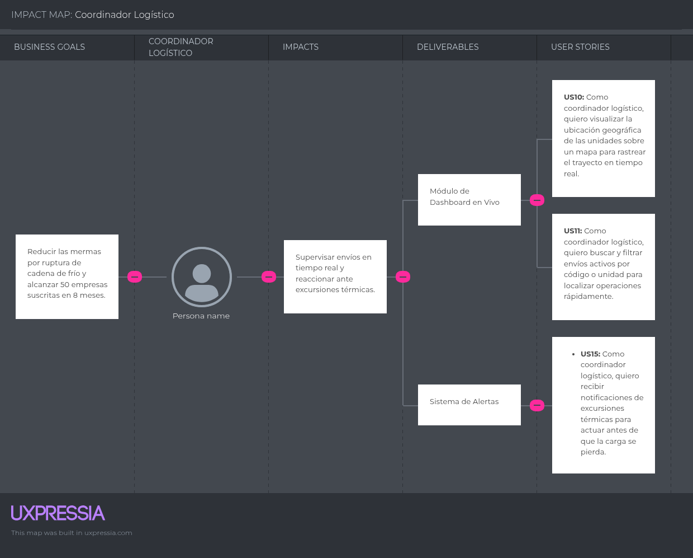
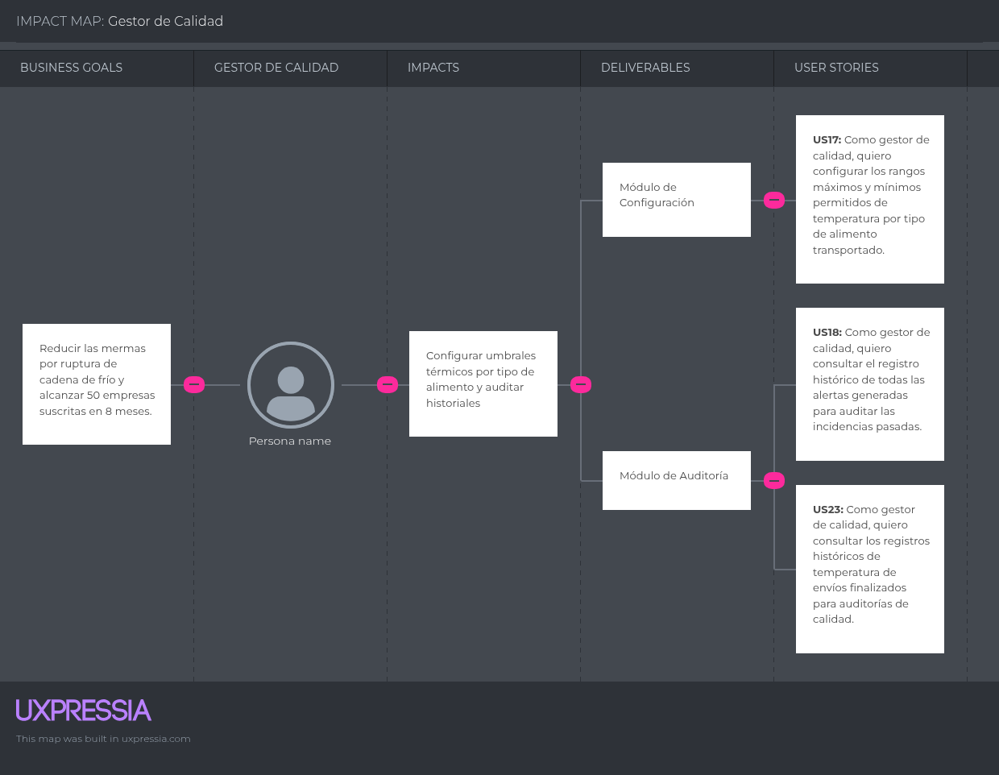
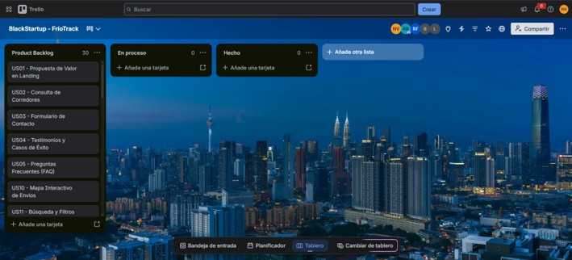

# Capítulo III: Requirements Specification

## 3.1. Epics

| Epic ID | Título | Descripción |
| :--- | :--- | :--- |
| **EP01** | Panel de Monitoreo en Tiempo Real (Dashboard) | Épica que agrupa las funcionalidades clave para la supervisión telemática en tiempo real de temperatura, humedad y ubicación de la flota agroexportadora. |
| **EP02** | Sistema de Alertas Automatizadas | Épica encargada de la detección temprana, emisión y notificación de alertas ante excursiones térmicas o anomalías críticas en ruta. |
| **EP03** | Historial, Auditoría e Informes de Envíos | Épica enfocada en el almacenamiento, consulta, exportación y análisis de registros térmicos históricos para auditorías de calidad y cumplimiento normativo. |
| **EP04** | Gestión de Flota, Conductores y Dispositivos IoT | Épica dedicada al registro, administración, asignación de unidades frigoríficas, personal de transporte y asociación de dispositivos sensores IoT. |
| **EP05** | Autenticación y Gestión de Usuarios | Épica orientada al control de accesos, inicio de sesión seguro, recuperación de credenciales y administración de perfiles. |
| **EP06** | Gestión de la Landing Page y Captación | Épica que agrupa los requerimientos asociados al sitio web estático institucional de presentación, propuesta de valor y captación de clientes de FríoTrack. |
| **EP07** | RESTful API Backend & Servicios Transversales | Épica técnica dedicada al desarrollo de la API de servicios bajo arquitectura REST (C# / ASP.NET Core), seguridad, gestión de reportes ejecutivos en PDF, multi-idioma (i18n) y analítica avanzada. |

## 3.2. User Stories

| Epic/ Story ID | Título | Descripción | Criterios de Aceptación | Relacionado con (Epic ID) |
| :--- | :--- | :--- | :--- | :--- |
| **US01** | Telemetría en vivo en el panel | Como **coordinador logístico**, quiero visualizar un panel con lecturas actualizadas de temperatura para supervisar envíos. | - **Escenario 1:** Dado que accede al panel y selecciona un envío activo, cuando llegan nuevas lecturas, entonces la interfaz refleja los valores actualizados sin recargar la página.  - **Escenario 2:** Dado que el servicio pierde conexión con el servidor, cuando intenta actualizar la telemetría, entonces muestra un aviso de pérdida de señal y retiene la última lectura válida. | EP01 |
| **US02** | Mapa interactivo de rutas | Como **coordinador logístico**, quiero visualizar la ubicación geográfica de las unidades sobre un mapa para rastrear el trayecto. | - **Escenario 1:** Dado que ingresa a mapas, cuando el servicio procesa coordenadas válidas, entonces dibuja la ruta activa y posición del vehículo fluidamente.  - **Escenario 2:** Dado que el servicio de mapas no responde o falla al cargar coordenadas, entonces muestra un mensaje de error y un botón de reintento. | EP01 |
| **US03** | Búsqueda y filtros de envíos | Como **coordinador logístico**, quiero buscar y filtrar envíos activos por código o unidad para localizar operaciones rápidamente. | - **Escenario 1:** Dado que utiliza la barra de búsqueda con un código existente, cuando introduce el criterio, entonces filtra la lista mostrando las coincidencias exactas.  - **Escenario 2:** Dado que introduce un código o término inexistente, cuando ejecuta la búsqueda, entonces muestra un mensaje indicando que no se encontraron registros. | EP01 |
| **US04** | Indicadores visuales de severidad | Como **coordinador logístico**, quiero observar indicadores visuales de color según el estado térmico para priorizar incidencias. | - **Escenario 1:** Dado que lista envíos activos, cuando la temperatura se mantiene en rango seguro, entonces muestra el indicador en verde.  - **Escenario 2:** Dado que la temperatura excede los límites permitidos, cuando el sistema detecta la anomalía, entonces cambia inmediatamente el indicador visual a color rojo de alerta crítica. | EP01 |
| **US05** | Detalle de telemetría por unidad | Como **coordinador logístico**, quiero consultar el detalle técnico de una unidad en ruta para verificar variables de humedad y vibración. | - **Escenario 1:** Dado que selecciona una unidad activa, cuando hace clic en detalles, entonces muestra gráficos avanzados de sensores de humedad y vibración.  - **Escenario 2:** Dado que la unidad seleccionada no posee registros históricos recientes, cuando abre el detalle, entonces muestra un aviso de ausencia de datos para el periodo. | EP01 |
| **TS01** | Endpoint de consulta de envíos activos | Como **developer**, quiero desarrollar un endpoint GET en la API para listar los envíos activos con filtros de búsqueda. | - **Escenario 1:** Dado que realiza petición GET con token válido, cuando la BD procesa los filtros, entonces retorna un arreglo JSON con los registros y HTTP 200 OK.  - **Escenario 2:** Dado que el token de autorización está ausente o malformado, cuando realiza la petición GET, entonces responde HTTP 401 Unauthorized. | EP07 |
| **US06** | Detección de excursiones térmicas | Como **comprador de alimentos**, quiero recibir notificaciones automáticas cuando la temperatura supere el rango seguro. | - **Escenario 1:** Dado que un sensor registra una lectura fuera del umbral permitido, cuando el motor de reglas procesa el evento, entonces genera una alerta prioritaria en la interfaz.  - **Escenario 2:** Dado que el sistema experimenta un retraso masivo en la recepción de tramas IoT, cuando se evalúan las lecturas atrasadas, entonces registra la alerta marcándola con etiqueta de recepción tardía. | EP02 |
| **US07** | Notificaciones push en plataforma | Como **coordinador logístico**, quiero visualizar avisos emergentes dentro de la aplicación para enterarme de incidencias. | - **Escenario 1:** Dado que ocurre una incidencia crítica, cuando el servidor emite el aviso, entonces aparece una notificación flotante con el resumen del evento.  - **Escenario 2:** Dado que el navegador tiene bloqueadas las notificaciones emergentes, cuando el sistema intenta alertar, entonces muestra un banner interno de advertencia en la cabecera. | EP02 |
| **US08** | Configuración de umbrales térmicos | Como **gestor de calidad**, quiero configurar los rangos máximos y mínimos permitidos por tipo de alimento transportado. | - **Escenario 1:** Dado que accede a configuración, cuando define límites térmicos válidos por tipo de alimento y guarda, entonces actualiza los parámetros del motor.  - **Escenario 2:** Dado que ingresa un umbral mínimo mayor al máximo permitido, cuando intenta guardar, entonces bloquea la acción y muestra un mensaje de validación. | EP02 |
| **US09** | Historial de alertas emitidas | Como **coordinador logístico**, quiero consultar el registro histórico de todas las alertas generadas para auditar incidencias. | - **Escenario 1:** Dado que ingresa al módulo de alertas y selecciona un rango de fechas válido, entonces despliega el listado cronológico registrado.  - **Escenario 2:** Dado que selecciona un rango de fechas invertido (desde mayor que hasta), cuando consulta, entonces muestra un error de validación de fechas. | EP02 |
| **TS02** | Endpoint de consulta de alertas | Como **developer**, quiero desarrollar un endpoint GET en la API para consultar el listado de alertas térmicas registradas. | - **Escenario 1:** Dado que solicita el recurso de alertas con filtros de fecha correctos, cuando el servidor procesa, entonces retorna JSON con las incidencias y HTTP 200 OK.  - **Escenario 2:** Dado que envía parámetros de filtro con tipos de datos incorrectos, cuando valida el esquema, entonces retorna HTTP 400 Bad Request. | EP07 |
| **US10** | Consulta de historial térmico | Como **gestor de calidad**, quiero consultar los registros históricos de temperatura de envíos finalizados para auditorías. | - **Escenario 1:** Dado que accede al historial y selecciona un envío finalizado, entonces despliega el registro tabular y gráfico completo de telemetría.  - **Escenario 2:** Dado que el envío seleccionado no contiene registros guardados por fallo del sensor, cuando consulta, entonces muestra una pantalla de aviso de datos incompletos. | EP03 |
| **US11** | Exportación de informes de trazabilidad | Como **agroexportador**, quiero exportar informes térmicos en formato estructurado para resolver reclamaciones comerciales. | - **Escenario 1:** Dado que visualiza el historial de un envío, cuando hace clic en exportar informe, entonces genera y descarga exitosamente el archivo estructurado.  - **Escenario 2:** Dado que ocurre una falla en el servidor durante la compilación del reporte, cuando intenta exportar, entonces cancela el proceso y notifica al usuario con opción de reintentar. | EP03 |
| **US12** | Gráficos estadísticos comparativos | Como **gestor de calidad**, quiero visualizar gráficos de comportamiento térmico por ruta para identificar variaciones. | - **Escenario 1:** Dado que selecciona un conjunto de envíos históricos de una misma ruta, cuando solicita el gráfico, entonces muestra la curva térmica consolidada.  - **Escenario 2:** Dado que selecciona un conjunto de datos sin coincidencia de rutas, cuando solicita la comparativa, entonces muestra una advertencia de incompatibilidad de datos. | EP03 |
| **US13** | Registro de bitácora de auditoría | Como **auditor de calidad**, quiero consultar el registro de acciones de los usuarios en la plataforma para trazabilidad interna. | - **Escenario 1:** Dado que accede al módulo de auditoría y filtra por usuario y fecha válida, entonces muestra el historial detallado de operaciones.  - **Escenario 2:** Dado que el usuario introducido en el filtro no existe en el sistema, cuando busca, entonces retorna una lista vacía con mensaje informativo. | EP03 |
| **US14** | Registro de nueva unidad refrigerada | Como **coordinador logístico**, quiero registrar nuevas unidades frigoríficas en el sistema para asociarlas a los despachos. | - **Escenario 1:** Dado que ingresa una placa válida y capacidad correcta, cuando confirma, entonces almacena la unidad exitosamente en la base de datos.  - **Escenario 2:** Dado que introduce una placa que ya se encuentra registrada en el sistema, cuando intenta guardar, entonces rechaza el registro indicando que la placa está duplicada. | EP04 |
| **US15** | Edición de datos de unidad | Como **coordinador logístico**, quiero actualizar la información de una unidad frigorífica para mantener la base de datos al día. | - **Escenario 1:** Dado que selecciona una unidad existente, cuando modifica sus datos correctamente y guarda, entonces persiste los cambios en el sistema.  - **Escenario 2:** Dado que deja campos obligatorios vacíos durante la edición, cuando intenta guardar, entonces despliega errores de validación en pantalla. | EP04 |
| **US16** | Registro de conductores | Como **coordinador logístico**, quiero registrar los datos de los conductores en el sistema para asignarlos a los viajes. | - **Escenario 1:** Dado que ingresa nombre completo y licencia de conducir vigente, cuando confirma, entonces almacena el perfil en el directorio.  - **Escenario 2:** Dado que ingresa un número de licencia con formato inválido o vencido, cuando intenta registrar, entonces bloquea el guardado y muestra alerta. | EP04 |
| **US17** | Asignación de conductor a vehículo | Como **coordinador logístico**, quiero asignar un conductor disponible a una unidad de transporte para organizar despachos. | - **Escenario 1:** Dado que selecciona una unidad libre y un conductor activo, cuando confirma la asignación, entonces vincula ambos elementos al viaje.  - **Escenario 2:** Dado que el conductor seleccionado ya se encuentra asignado a otra ruta en curso, cuando intenta vincularlo, entonces muestra un mensaje de conflicto de disponibilidad. | EP04 |
| **US18** | Configuración de dispositivos IoT | Como **administrador técnico**, quiero asociar tokens y dispositivos sensores IoT a las unidades de transporte desde el panel. | - **Escenario 1:** Dado que ingresa un código de dispositivo IoT válido, cuando lo vincula a una unidad, entonces habilita la recepción de telemetría.  - **Escenario 2:** Dado que el código del dispositivo IoT no existe en el inventario o ya está asignado, cuando intenta vincularlo, entonces muestra un error de serial inválido. | EP04 |
| **TS03** | Endpoint de gestión de flotas | Como **developer**, quiero crear endpoints CRUD en la API para la administración de unidades frigoríficas y vehículos. | - **Escenario 1:** Dado que envía petición HTTP POST/PUT a flotas con datos correctos, cuando procesa, entonces persiste la unidad y retorna HTTP 201 Created o 200 OK.  - **Escenario 2:** Dado que intenta registrar una unidad con campos incompletos o violando restricciones únicas, cuando procesa, entonces responde HTTP 422 Unprocessable Entity. | EP07 |
| **TS04** | Endpoint de recepción de telemetría IoT | Como **developer**, quiero implementar un endpoint POST en la API para recibir y almacenar lecturas masivas de sensores. | - **Escenario 1:** Dado que el sensor IoT envía un JSON con telemetría válida, cuando el validador corrobora los campos, entonces persiste en la base de datos y responde HTTP 201 Created.  - **Escenario 2:** Dado que el JSON recibido está corrupto o carece de campos obligatorios como el ID de sensor, cuando procesa, entonces descarta la trama y responde HTTP 400 Bad Request. | EP07 |
| **US19** | Inicio de sesión en el sistema | Como **coordinador logístico**, quiero autenticar mis credenciales en el sistema para acceder al panel operativo. | - **Escenario 1:** Dado que está en la pantalla de login, cuando ingresa credenciales válidas, entonces genera la sesión y redirige al panel principal.  - **Escenario 2:** Dado que ingresa una contraseña incorrecta o correo no registrado, cuando intenta acceder, entonces rechaza el acceso mostrando un mensaje genérico de error. | EP05 |
| **US20** | Cierre de sesión seguro | Como **usuario del sistema**, quiero cerrar mi sesión activa de forma segura para evitar accesos no autorizados. | - **Escenario 1:** Dado que tiene una sesión activa, cuando hace clic en cerrar sesión, entonces invalida el token de acceso y redirige al login.  - **Escenario 2:** Dado que la sesión ha expirado previamente por inactividad, cuando el usuario intenta hacer clic en cerrar sesión, entonces limpia el almacenamiento local y redirige directamente al login. | EP05 |
| **US21** | Recuperación de contraseña | Como **usuario del sistema**, quiero solicitar un enlace de recuperación de contraseña para restablecer mi acceso. | - **Escenario 1:** Dado que ingresa su correo en la opción de recuperación, cuando el servidor valida el registro, entonces envía un enlace temporal al correo.  - **Escenario 2:** Dado que ingresa un correo electrónico con formato erróneo o no registrado en la base de datos, cuando intenta enviar, entonces muestra un mensaje de error o aviso de seguridad. | EP05 |
| **US22** | Gestión de perfiles de usuario | Como **administrador**, quiero administrar los roles y permisos de los usuarios para controlar el acceso a módulos. | - **Escenario 1:** Dado que el administrador accede al módulo y modifica un rol guardando cambios, entonces actualiza los privilegios en la plataforma.  - **Escenario 2:** Dado que el administrador intenta quitarle el rol al último usuario administrador activo, cuando intenta guardar, entonces bloquea la acción indicando que debe existir al menos un administrador. | EP05 |
| **TS05** | Endpoint de autenticación JWT | Como **developer**, quiero construir un endpoint POST en la API para autenticar usuarios y emitir tokens JWT seguros. | - **Escenario 1:** Dado que el cliente envía credenciales válidas por POST, cuando el servidor procesa, entonces responde HTTP 200 OK con el token JWT firmado.  - **Escenario 2:** Dado que envía un payload con credenciales inválidas o expiradas, cuando procesa la petición, entonces responde HTTP 401 Unauthorized. | EP07 |
| **US23** | Propuesta de valor en Landing | Como **visitante transportista**, quiero visualizar la propuesta de valor principal en la página de inicio para comprender los beneficios del monitoreo térmico. | - **Escenario 1:** Dado que el usuario accede a la web, cuando se renderiza la sección principal, entonces muestra la propuesta enfocada en la cadena de frío de forma responsiva.  - **Escenario 2:** Dado que se accede desde un dispositivo con ancho de pantalla extremadamente reducido, cuando carga el componente principal, entonces adapta el diseño en modo colapsado sin desbordar la interfaz. | EP06 |
| **US24** | Corredores logísticos en Landing | Como **visitante agroexportador**, quiero consultar los corredores logísticos cubiertos para verificar la cobertura de mis rutas. | - **Escenario 1:** Dado que navega a la sección de corredores, cuando carga la página, entonces lista las rutas de La Libertad, Ica, Piura y Lambayeque con sus detalles.  - **Escenario 2:** Dado que falla la carga de datos estáticos desde el servidor, cuando entra a la sección, entonces muestra un mensaje alternativo de rutas principales disponibles en caché. | EP06 |
| **US25** | Formulario de contacto comercial | Como **visitante interesado**, quiero registrar mis datos en un formulario para solicitar una demostración comercial. | - **Escenario 1:** Dado que visualiza el formulario, cuando ingresa datos válidos de contacto y envía, entonces almacena la solicitud y muestra mensaje de éxito.  - **Escenario 2:** Dado que introduce un formato de correo electrónico incorrecto o deja campos vacíos, cuando intenta enviar, entonces bloquea el envío y muestra alertas de campo requerido. | EP06 |
| **US26** | Casos de éxito y testimonios | Como **visitante del sitio**, quiero leer casos de éxito de otros transportistas para validar la efectividad de la plataforma. | - **Escenario 1:** Dado que accede a testimonios, cuando desplaza la vista, entonces muestra experiencias reales de adopción en logística.  - **Escenario 2:** Dado que las imágenes multimedia de los testimonios fallan al cargar, cuando el usuario navega por la sección, entonces muestra textos de respaldo con diseño adaptado. | EP06 |
| **US27** | Preguntas frecuentes (FAQ) | Como **visitante interesado**, quiero consultar preguntas frecuentes para resolver dudas sobre la implementación del sistema. | - **Escenario 1:** Dado que hace clic en FAQ, cuando selecciona una pregunta, entonces despliega la respuesta técnica y comercial correspondiente de manera fluida.  - **Escenario 2:** Dado que el contenido de las preguntas frecuentes no se puede sincronizar con el CMS, cuando accede, entonces muestra la versión estática almacenada localmente. | EP06 |
| **US28** | Generación de reportes PDF ejecutivos | Como **gerente logístico**, quiero generar un reporte ejecutivo en PDF con el resumen mensual de operaciones y cadena de frío. | - **Escenario 1:** Dado que selecciona un periodo mensual válido, cuando presiona generar PDF, entonces el sistema compila el documento ejecutivo y descarga el archivo.  - **Escenario 2:** Dado que no existen registros de operaciones para el periodo mensual seleccionado, cuando solicita generar el PDF, entonces interrumpe el proceso y muestra un aviso de datos insuficientes. | EP07 |
| **US29** | Panel de analítica de incidencias | Como **gestor de calidad**, quiero visualizar métricas agregadas de fallas térmicas para identificar proveedores o rutas críticas. | - **Escenario 1:** Dado que accede al módulo de analítica y selecciona el trimestre, entonces muestra gráficos consolidados de incidencias por zona.  - **Escenario 2:** Dado que el motor analítico experimenta un tiempo de espera agotado (timeout) por exceso de datos, cuando consulta, entonces muestra un aviso de consulta pesada. | EP07 |
| **US30** | Gestión de multi-idioma (i18n) | Como **usuario del sistema**, quiero alternar entre español e inglés en la interfaz para facilitar la operación a socios extranjeros. | - **Escenario 1:** Dado que selecciona el selector de idioma, cuando cambia a inglés, entonces traduce todos los textos estáticos y dinámicos de la interfaz.  - **Escenario 2:** Dado que falta la clave de traducción para un componente específico, cuando renderiza, entonces muestra la cadena por defecto en español como fallback. | EP07 |
| **TS06** | Endpoint de exportación de reportes | Como **developer**, quiero implementar un endpoint en la API que compile y exporte datos históricos en archivos estructurados. | - **Escenario 1:** Dado que el cliente solicita la exportación de un envío concluido, cuando genera el archivo, entonces retorna el flujo de bytes para descarga con HTTP 200 OK.  - **Escenario 2:** Dado que el ID del envío solicitado no existe o no ha finalizado, cuando procesa la solicitud, entonces responde HTTP 404 Not Found. | EP07 |
| **TS07** | Documentación Swagger OpenAPI | Como **developer**, quiero configurar la especificación OpenAPI mediante Swagger para documentar los endpoints. | - **Escenario 1:** Dado que la aplicación arranca en desarrollo, cuando inicializa el middleware Swagger, entonces la interfaz gráfica se muestra accesible en la ruta `/swagger`.  - **Escenario 2:** Dado que la aplicación arranca en entorno de producción, cuando intenta invocar la ruta de documentación, entonces el sistema bloquea el acceso respondiendo HTTP 403 Forbidden. | EP07 |

## 3.2. Impact Mapping

## 3.3. Product Backlog

| # Orden | User Story Id | Título | Descripción | Story Points (1 / 2 / 3 / 5 / 8) |
| :---: | :---: | :--- | :--- | :---: |
| 1 | **US01** | Propuesta de Valor en Landing | Como visitante, quiero visualizar la propuesta de valor para entender el servicio de monitoreo en frío. | 3 |
| 2 | **US02** | Consulta de Corredores | Como agroexportador, quiero consultar los corredores logísticos cubiertos para verificar la cobertura de mis rutas. | 3 |
| 3 | **US03** | Formulario de Contacto | Como usuario potencial, quiero enviar un formulario de contacto para solicitar cotizaciones. | 2 |
| 4 | **US04** | Testimonios y Casos de Éxito | Como visitante, quiero ver casos de éxito para generar confianza en la plataforma. | 2 |
| 5 | **US05** | Preguntas Frecuentes (FAQ) | Como usuario, quiero resolver dudas rápidas sobre el monitoreo IoT de alimentos. | 1 |
| 6 | **US10** | Mapa Interactivo de Envíos | Como coordinador logístico, quiero ver la ubicación de las unidades en tiempo real sobre un mapa. | 8 |
| 7 | **US11** | Búsqueda y Filtros de Envíos | Como coordinador, quiero filtrar envíos activos por código o unidad para localizarlos rápido. | 3 |
| 8 | **US12** | Indicadores Visuales de Estado | Como operador, quiero ver estados visuales rápidos de cada trayecto en curso. | 2 |
| 9 | **US13** | Telemetría en Vivo | Como operador, quiero visualizar la temperatura actual del contenedor en tiempo real. | 5 |
| 10 | **US14** | Historial de Coordenadas | Como operador, quiero consultar el recorrido pasado de un viaje finalizado. | 3 |
| 11 | **US15** | Alertas de Excursiones Térmicas | Como coordinador, quiero recibir notificaciones ante salidas de rango térmico. | 5 |
| 12 | **US16** | Notificaciones Push | Como coordinador, quiero alertas instantáneas en dispositivo móvil. | 3 |
| 13 | **US17** | Configuración de Umbrales | Como gestor de calidad, quiero definir rangos térmicos por tipo de alimento transportado. | 5 |
| 14 | **US18** | Historial de Alertas | Como gestor de calidad, quiero consultar registros de alertas pasadas para auditorías. | 3 |
| 15 | **US19** | Registro de Unidades | Como administrador, quiero registrar vehículos y contenedores de frío en el sistema. | 3 |
| 16 | **US20** | Edición de Unidades | Como administrador, quiero actualizar las características de la flota registrada. | 2 |
| 17 | **US21** | Registro de Conductores | Como administrador, quiero registrar al personal de conducción autorizado. | 3 |
| 18 | **US22** | Asignación de Chofer a Ruta | Como coordinador, quiero vincular un conductor a una unidad y envío específico. | 3 |
| 19 | **US23** | Consulta de Historial Térmico | Como gestor de calidad, quiero revisar registros de envíos pasados para control de calidad. | 5 |
| 20 | **US24** | Exportación de Trazabilidad | Como agroexportador, quiero exportar reportes térmicos para resolver reclamaciones comerciales. | 5 |
| 21 | **US25** | Gráficos Estadísticos | Como agroexportador, quiero ver gráficos de estabilidad térmica mensual. | 3 |
| 22 | **US26** | Bitácora de Auditoría | Como gestor de calidad, quiero auditar el registro de modificaciones críticas. | 3 |
| 23 | **US27** | Reportes Ejecutivos en PDF | Como agroexportador, quiero generar reportes ejecutivos mensuales con resumen de operaciones. | 5 |
| 24 | **US28** | Panel de Analítica Global | Como administrador, quiero visualizar métricas globales del desempeño del sistema. | 5 |
| 25 | **US29** | Configuración IoT | Como técnico, quiero asociar sensores de temperatura físicos a las unidades de transporte. | 5 |
| 26 | **US30** | Soporte Multi-idioma (i18n) | Como usuario internacional, quiero cambiar el idioma de la plataforma. | 3 |
| 27 | **US06** | Registro de Cuenta | Como usuario nuevo, quiero registrarme ingresando mis datos básicos de acceso. | 3 |
| 28 | **US07** | Inicio de Sesión (Login) | Como usuario registrado, quiero autenticarme de forma segura en la plataforma. | 3 |
| 29 | **US08** | Recuperación de Contraseña | Como usuario, quiero recuperar mi acceso si olvidé mi clave de ingreso. | 2 |
| 30 | **US09** | Gestión de Perfil | Como usuario, quiero editar mis datos personales y de contacto en el sistema. | 2 |

## Referencia y Enlace Público
- **Herramienta de gestión:** Trello
- **URL Pública del Product Backlog:** https://trello.com/b/6qrvOukt/blackstartup-fr%C3%ADotrack

## Captura de pantalla 

  

