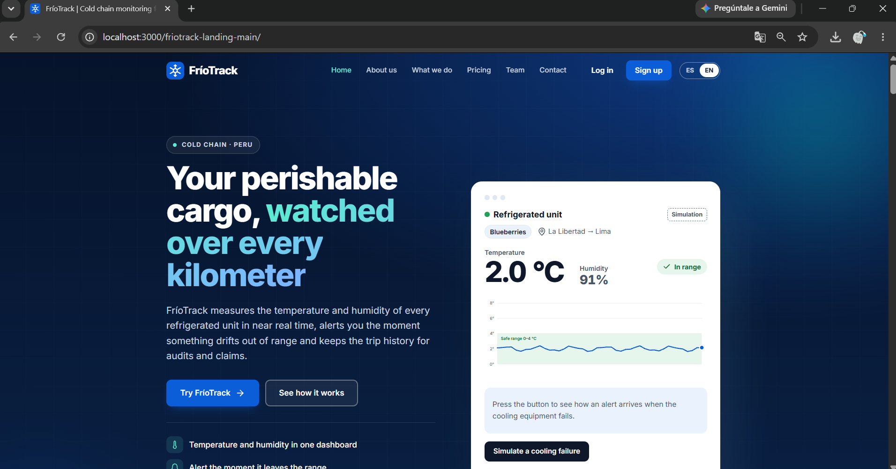
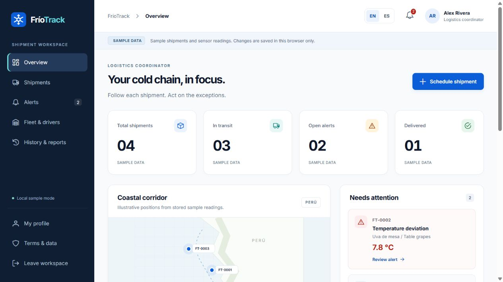
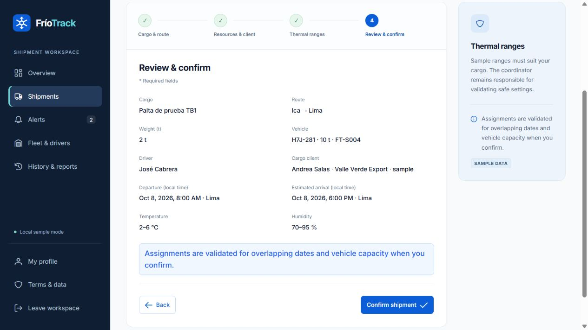
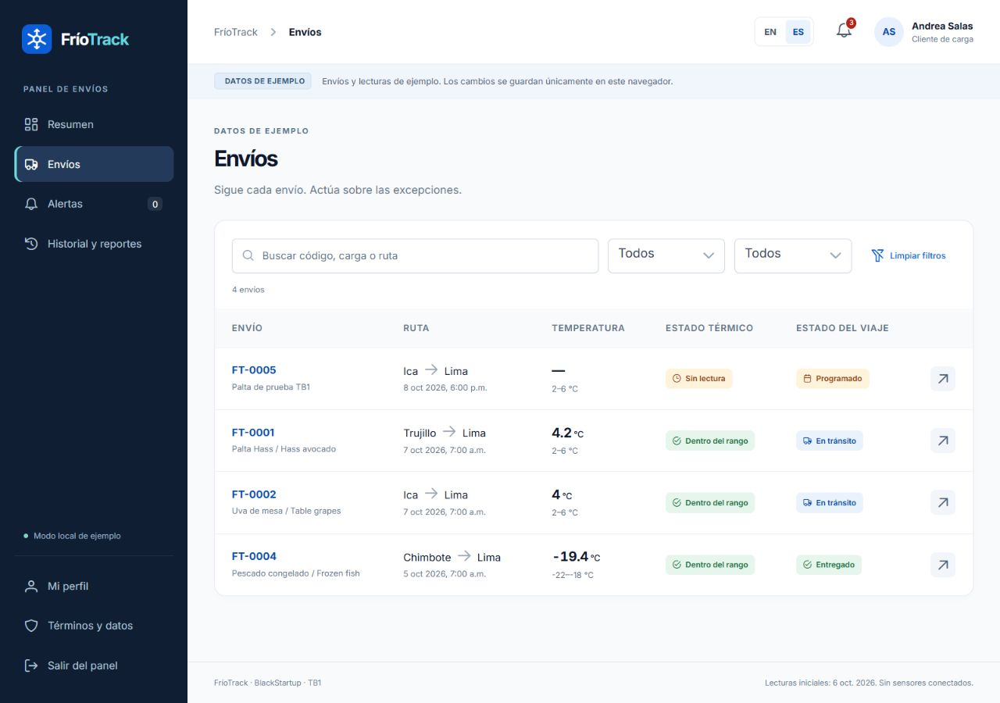
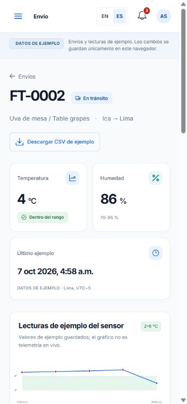
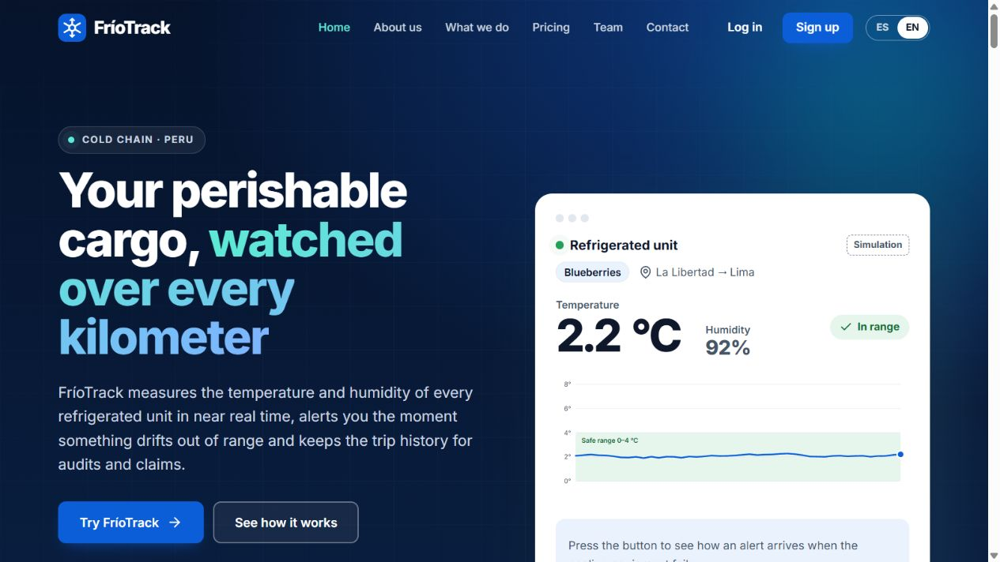
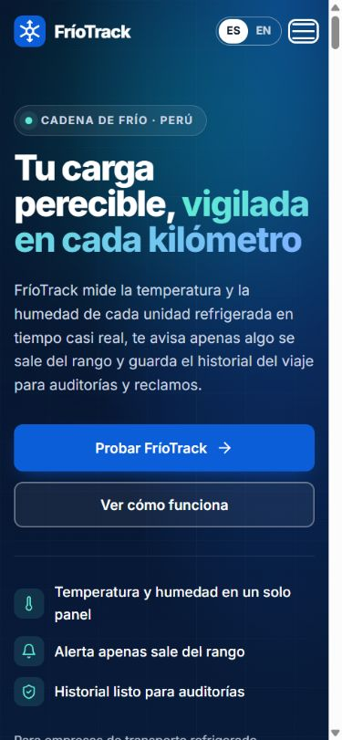
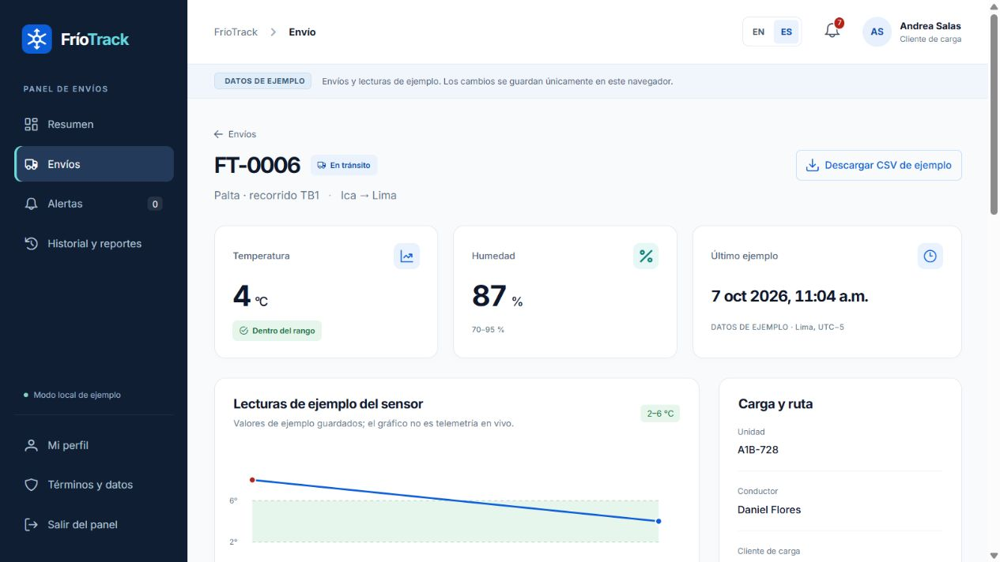

# Capítulo V: Product Implementation, Validation & Deployment

Se presenta el estado comprobable de cada producto. La landing AV1 conserva su URL pública histórica. Las fuentes del informe, landing corregida, primera aplicación Vue y diseño de la API se publicaron en cuatro ramas de GitHub con PRs draft hacia develop. No se realizaron merges, releases ni nuevos despliegues. La API, la autenticación real, los sensores y PostgreSQL no están implementados en esta entrega. La primera API desplegada corresponde a AV2 según el statement, salvo indicación adicional del docente.

## 5.1. Software Configuration Management

### 5.1.1. Software Development Environment Configuration

| Disciplina | Herramientas/tecnologías | Estado y uso |
|---|---|---|
| Project Management | Trello, GitHub | Tablero histórico; nueva planificación pendiente de validación del equipo |
| Requirements Management | Markdown, catálogo JSON, Gherkin | Catálogo canónico y criterios verificables en capítulo III |
| Product UX/UI Design | Figma, UXPressia, Miro, Structurizr/PlantUML | Material histórico y fuentes editables locales; falta actualizar herramientas compartidas y prototipos Figma |
| Landing development | HTML5, CSS, JavaScript | Fuente estática sin compilación; i18n, planes y CTA |
| Frontend development | Vue, JavaScript, PrimeVue, Vite, Leaflet | Primera aplicación en [friotrack-frontend](https://github.com/upc-pre-202620-1asi0730-8088-FrioTrack/friotrack-frontend/tree/feature/tb1-frontend-application); responsive con datos de prueba |
| Backend development | ASP.NET Core, C#, EF Core, PostgreSQL | Arquitectura propuesta para AV2; sin servidor ni base de datos funcionando |
| Software Testing | Node test runner, navegador y build Vite | Validación del dominio de la demo y revisión de flujos; resultados en anexos de verificación |
| Software Documentation | Markdown, PDF, OpenAPI futuro | README enlaza informe; PDF generado desde las secciones Markdown |
| Deployment | GitHub Pages para landing histórica; AWS o Azure para frontend TB1 | Aplicación preparada localmente; despliegue cloud pendiente de cuenta y verificación |

El repositorio demo guarda estado en localStorage, sin claves ni contraseñas. Los mapas solicitan teselas públicas OpenStreetMap y muestran atribución. No hay streaming de telemetría real ni servicio de contacto configurado.

### 5.1.2. Source Code Management

Los cuatro repositorios son públicos dentro de [BlackStartup/FríoTrack](https://github.com/upc-pre-202620-1asi0730-8088-FrioTrack). Las ramas de esta integración contienen el avance revisable; `main` conserva el estado anterior. Los repositorios nuevos de frontend y API tienen un `develop` inicial basado en su commit de creación.

| Repositorio / fuente publicada | Rama | Pull request | Estado al registrar |
|---|---|---|---|
| [report-friotrack](https://github.com/upc-pre-202620-1asi0730-8088-FrioTrack/report-friotrack/tree/feature/tb1-report-corrections) | `feature/tb1-report-corrections` | [PR #12](https://github.com/upc-pre-202620-1asi0730-8088-FrioTrack/report-friotrack/pull/12) | Draft hacia `develop`; sin merge |
| [friotrack-landing](https://github.com/upc-pre-202620-1asi0730-8088-FrioTrack/friotrack-landing/tree/feature/tb1-landing-corrections) | `feature/tb1-landing-corrections` | [PR #7](https://github.com/upc-pre-202620-1asi0730-8088-FrioTrack/friotrack-landing/pull/7) | Draft hacia `develop`; sin merge |
| [friotrack-frontend](https://github.com/upc-pre-202620-1asi0730-8088-FrioTrack/friotrack-frontend/tree/feature/tb1-frontend-application) | `feature/tb1-frontend-application` | [PR #1](https://github.com/upc-pre-202620-1asi0730-8088-FrioTrack/friotrack-frontend/pull/1) | Draft hacia `develop`; sin merge |
| [friotrack-api](https://github.com/upc-pre-202620-1asi0730-8088-FrioTrack/friotrack-api/tree/feature/av2-api-design) | `feature/av2-api-design` | [PR #1](https://github.com/upc-pre-202620-1asi0730-8088-FrioTrack/friotrack-api/pull/1) | Draft hacia `develop`; sin merge |

**GitFlow aplicado a la integración.** Las cuatro ramas `feature/` parten de `develop` y sus PRs apuntan a `develop`. Se conservaron los historiales de AV1 y las ramas principales. Los cuatro PRs permanecen draft, sin merge ni aprobación cruzada registrada. `main` conserva versiones estables; `release/<major.minor.patch>` y `hotfix/<major.minor.patch>-<issue>` son convenciones para futuras entregas, no ramas ni releases creados por esta publicación.

**Conventional Commits aplicados:** `type(scope): imperative English description`, con cuerpo en inglés que explica cambio y motivo. Los diez mensajes/cuerpos exactos están en 5.2.2.4. Los tipos usados son docs, fix, chore y feat; test/refactor/build están disponibles cuando el cambio corresponda. No se alteraron autores históricos ni se generaron commits para igualar cifras.

**SemVer:** MAJOR para cambios incompatibles, MINOR para funcionalidad compatible, PATCH para correcciones. La primera aplicación se identifica como versión de desarrollo `0.1.0`; no se declara una etiqueta release publicada. Landing e informe pueden tener versiones distintas; una etiqueta no demuestra despliegue.

La fuente publicada no sustituye un despliegue. AWS/Azure, la API ejecutable, la base de datos y las revisiones del resto del equipo siguen pendientes. El [registro de integración](GITHUB_TB1_INTEGRATION.md) explica el corte de evidencia.

### 5.1.3. Source Code Style Guide & Conventions

| Tecnología | Convención |
|---|---|
| HTML/CSS | Estructura semántica, atributos entre comillas, alt significativo, clases inglesas y variables de marca; 2 espacios |
| JavaScript | camelCase para variables/funciones, PascalCase para clases/componentes, constantes UPPER_SNAKE_CASE, módulos explícitos, nombres en inglés |
| Vue/PrimeVue | Componentes PascalCase, props explícitas, estado reactivo, etiquetas asociadas a inputs; lógica de negocio separada en módulos |
| C#/ASP.NET Core | PascalCase para tipos/métodos públicos, camelCase para parámetros, `_camelCase` privados, interfaces `I<Name>`, DTO y capas separados; no guía Java |
| Gherkin | Given–When–Then o Dado–Cuando–Entonces, presente y tercera persona; escenario centrado en resultado observable, IDs del catálogo |
| Markdown | Encabezados hasta nivel 4 cuando corresponda, tablas textuales, rutas relativas verificadas, imágenes con notas y estado |

Ejemplo de especificación: Dado que la salida precede a la llegada y el rango mínimo es menor al máximo, cuando el coordinador programa con recursos disponibles, entonces el envío queda programado; si existe solapamiento, se rechaza y no reserva parcialmente un recurso. El vocabulario vigente es **requisito**, **biblioteca**, **aplicación**, **despliegue** y **pruebas**. Inventario/FEFO se excluyen del dominio vigente.

### 5.1.4. Software Deployment Configuration

**Landing:** servir la raíz del sitio estático. La URL histórica AV1 se conserva en 5.2.1.7. `assets/js/config.js` contiene una URL local de frontend; antes de publicar deberá reemplazarse con una URL HTTPS desplegada y comprobada. El endpoint de contacto permanece null y su interfaz informa que es demo.

**Frontend:** instalar dependencias con el lockfile, ejecutar las pruebas y `npm run build`; servir `dist` con un hosting estático. Las rutas hash permiten refrescar sin configuración de fallback del servidor. El base path se define para el destino real. Para revisión local: `npm run dev -- --host 127.0.0.1 --port 5173`. Para comprobar el build: `npm run preview -- --host 127.0.0.1 --port 4173`.

**API y base de datos:** en AV2 se configurarán conexión, secretos del entorno, CORS limitado al frontend, migraciones EF Core, HTTPS y OpenAPI. Ninguna clave debe quedar en el cliente o repositorio. Esta es configuración prevista, no evidencia de infraestructura existente.

## 5.2. Landing Page, Services & Applications Implementation

### 5.2.1. Sprint 1

#### 5.2.1.1. Sprint Planning 1

La fuente AV1 se conserva en `archive/15-chapter5-product-impl-av1.md`. La fecha 08/09/2026, hora 19:00, reunión virtual y asistentes allí declarados no cuentan con acta adicional en este checkout; se identifican como antecedentes no confirmados. La velocity de 18 y suma de 11 no coincidían con historias; no se conservan como mediciones válidas.

**Sprint Goal corregido (reformulación retrospectiva, no acta):**

Our focus is on communicating the cold-chain transport proposal to both target segments.

We believe it delivers a clear understanding of shipment monitoring to logistics coordinators and cargo clients.

This will be confirmed when a visitor can identify both segments, consult four proposed corridors and three reference plans, switch between English and Spanish, and access a role-appropriate entry point; contact simulation must not claim message delivery.

La métrica propuesta evalúa esos cinco recorridos. No mide reducción real de pérdidas. La selección retrospectiva US01/US02/US03/US31 suma **10 SP propuestos** (3+3+2+2); no convierte esa cifra en velocity alcanzada ni en estimación originalmente acordada.

#### 5.2.1.2. Aspect Leaders and Collaborators

La matriz L/C AV1 está preservada en el archivo histórico. Su validez debe contrastarse con tareas y commits; se retira la nota conversacional. El registro de versiones declara: Alexander, capítulo I/frontmatter; Benjamin, capítulo IV y landing; Joaquín, historias; Rodrigo, capítulo V/apoyo landing; Nayely, Impact Mapping/backlog. No se reasignan liderazgos ni se afirma cumplimiento individual sin evidencia.

| Integrante | GitHub username declarado | Aspecto AV1 declarado |
|---|---|---|
| Alexander Atauje | Alexander1Alexander2 | Introducción y frontmatter |
| Benjamin Bardales | Benja72312 | Arquitectura, diseño y landing |
| Joaquín Daga | Eshnikeee | Historias y criterios |
| Rodrigo Saavedra | rodrigoxd67 | Implementación/documentación/despliegue |
| Nayely Vera | Macaxprogram29 | Impact Mapping y backlog |

#### 5.2.1.3. Sprint Backlog 1

Se corrigen títulos e IDs al catálogo vigente sin cambiar el significado de las historias. Estados del producto se presentan como To-Review al no contar con aceptación completa ni acta. Las horas son propuestas de revisión, no horas reportadas por personas.

| Story ID | Título canónico | Task ID | Título y descripción | Horas propuestas | Responsable real | Estado |
|---|---|---|---|---:|---|---|
| US01 | Propuesta de valor en Landing | S1-T01 | Revisar propuesta, segmentos y alcance del contenido | 2 | Pendiente de confirmar | To-Review |
| US02 | Corredores logísticos en Landing | S1-T02 | Comprobar cuatro rutas e identificación de cobertura propuesta | 2 | Pendiente de confirmar | To-Review |
| US03 | Formulario de contacto comercial | S1-T03 | Validar datos y corregir errores; receptor real sigue pendiente | 3 | Pendiente de confirmar | In-Process |
| US31 | Planes de referencia y CTA por segmento | S1-T04 | Verificar mensual/anual y enlaces a perfiles locales | 3 | Pendiente de confirmar | To-Review |

Tablero histórico: [Trello BlackStartup](https://trello.com/b/6qrvOukt/blackstartup-friotrack). Las capturas históricas del backlog se conservan en capítulo III; no acreditan correspondencia actual. Captura y URL con los IDs corregidos requieren actualización del tablero.

#### 5.2.1.4. Development Evidence for Sprint Review

Se verificó el repositorio real `friotrack-landing`, sustituyendo nombres ajenos `friotrack-website` y `refrio-website`. Los hashes antiguos de esos nombres permanecen en el archivo histórico, sin presentarse como evidencia de este checkout.

| Repository | Branch observada | Commit ID | Commit Message | Body | Committed on |
|---|---|---|---|---|---|
| friotrack-landing | main/HEAD | 02b76e5 | Merge pull request #6 from .../develop | Historial de merge; ver commit | 2026-09-19 |
| friotrack-landing | Historial alcanzable | c63b6b0 | Merge pull request #3 from .../feature/terms-and-conditions | No cuerpo adicional citado | 2026-09-19 |
| friotrack-landing | Historial alcanzable | c64f54f | Merge pull request #2 from .../feature/landing-page | No cuerpo adicional citado | 2026-09-19 |
| friotrack-landing | Historial alcanzable | 4b602ba | docs: actualizar el README con el nuevo diseño y la estructura de archivos | No cuerpo adicional citado | 2026-09-19 |

Las correcciones TB1 ya tienen commits publicados y cuatro PRs draft, detallados en 5.2.2.4; el corte de Sprint 1 anterior conserva su carácter histórico. El historial de merges no prueba por sí solo quién implementó cada archivo ni cuántas aprobaciones hubo.

#### 5.2.1.5. Execution Evidence for Sprint Review

Las siguientes capturas son **históricas AV1**, no capturas de ejecución TB1. Muestran la landing original con sus secciones; la interacción del modal de acceso era demostrativa y el contacto no tenía receptor. FEFO y resultados de clientes no son alcance validado del producto.

La versión local revisada añade entrada a la SPA por perfil, inglés por defecto y manejo honesto de contacto. El video consolidado de ejecución de Sprint1 y su URL Stream no fueron proporcionados.

#### 5.2.1.6. Services Documentation Evidence for Sprint Review

No se desarrolló API interna en Sprint1. No aplica evidencia OpenAPI de servicios ejecutados. CONTACT_ENDPOINT=null es un estado de integración pendiente; la validación de un formulario no acredita recepción ni correo.

#### 5.2.1.7. Software Deployment Evidence for Sprint Review

La landing histórica está publicada en [GitHub Pages FríoTrack](https://upc-pre-202620-1asi0730-8088-friotrack.github.io/friotrack-landing/). Las capturas de configuración se conservan como evidencia AV1:

El sitio estático se publica desde main y raíz. Las correcciones actuales no se han enviado al remoto ni desplegado. No se presupone CI/CD propio, nivel de disponibilidad o validación de todas las rutas sin comprobación específica.

#### 5.2.1.8. Team Collaboration Insights during Sprint

Se preservan los commits y PRs visibles. El conteo reproducible del informe está en frontmatter (99 alcanzables desde HEAD incluyendo merges); es otro repositorio y no se suma a landing. Los cambios locales requieren documentar los aportes individuales de Sprint 2.

### 5.2.2. Sprint 2

#### 5.2.2.1. Sprint Planning 2

Este registro constituye una **propuesta de planificación y revisión TB1**, preparada y revisada el 06–07/10/2026. No afirma que el equipo haya celebrado una sesión Scrum.

| Campo | Valor verificable o dato pendiente |
|---|---|
| Sprint # | 2 |
| Date / Time / Location | Pendientes de una sesión real y su acta |
| Prepared By | Responsable académico pendiente de confirmación |
| Attendees | Pendiente de participantes reales; no se presume asistencia de los cinco |
| Sprint 1 Review Summary | Landing histórica disponible; III/SO no integrados, IDs contradictorios, contacto demo y arquitectura incompleta |
| Sprint 1 Retrospective Summary | Análisis técnico propone integrar temprano, validar IDs/evidencia, revisar roles y documentar cambios; no es retrospectiva celebrada |
| Sprint 2 Velocity | No medida; requiere historias aceptadas y sprints comparables |
| Sum of Story Points | 55 SP propuestos; no compromiso ni velocity |

**Sprint Goal propuesto:**

Our focus is on demonstrating the cold-chain shipment workflow in the first Vue web application.

We believe it delivers operational visibility and traceable corrective actions to logistics coordinators and cargo clients.

This will be confirmed when a coordinator completes the four-step scheduling flow with valid resources, consults sample thermal readings and location, records a corrective action, and a cargo client can read only assigned shipments, in desktop/mobile and both supported languages.

Métrica: cuatro recorridos reproducibles (programación, monitoreo, acción y consulta cliente), con casos de error de rango, fecha, recursos y permisos locales. Las pruebas de dominio y la revisión del navegador respaldan únicamente la demostración. No se mide satisfacción de usuarios ni eficacia de cadena de frío.

#### 5.2.2.2. Aspect Leaders and Collaborators

Los integrantes y usuarios se conocen del informe; sus responsabilidades Sprint2 aún requieren acuerdo real. La matriz evita presentar una propuesta como liderazgo ejercido.

| Integrante / GitHub username | Requisitos | UX/UI | Frontend | Pruebas | Despliegue |
|---|---|---|---|---|---|
| Alexander Atauje / Alexander1Alexander2 | Por confirmar | Por confirmar | Por confirmar | Por confirmar | Por confirmar |
| Benjamin Bardales / Benja72312 | Por confirmar | Por confirmar | Por confirmar | Por confirmar | Por confirmar |
| Joaquín Daga / Eshnikeee | Por confirmar | Por confirmar | Por confirmar | Por confirmar | Por confirmar |
| Rodrigo Saavedra / rodrigoxd67 | Por confirmar | Por confirmar | Por confirmar | Por confirmar | Por confirmar |
| Nayely Vera / Macaxprogram29 | Por confirmar | Por confirmar | Por confirmar | Por confirmar | Por confirmar |

En la sesión real, registrar L y C por aspecto y asociar cada rol a tareas y PRs. La automatización produce cambios revisables; el equipo debe revisarlos y comprenderlos antes de asumirlos como entrega propia.

#### 5.2.2.3. Sprint Backlog 2

Se selecciona una propuesta de historias core compatibles con el dominio. Todas conservan su significado del capítulo III. La implementación usa datos de prueba; estados To-Review significan “revisión de la demo local”, no historia aceptada contra todo el producto objetivo. Las horas son estimaciones propuestas, sin atribuir tiempo a personas.

| Story ID | Título canónico | Task ID | Título / descripción | Horas propuestas | Responsable | Estado |
|---|---|---|---|---:|---|---|
| US10 | Telemetría en vivo en el panel | S2-T01 | Dashboard y lecturas de prueba con alcance visible | 4 | Pendiente de asignación real | To-Review |
| US11 | Mapa de rutas y posiciones | S2-T02 | Mapa Leaflet, posiciones de ejemplo y atribución OSM | 4 | Pendiente de asignación real | To-Review |
| US12 | Búsqueda y filtros de envíos | S2-T03 | Búsqueda y filtros de envíos por atributos | 3 | Pendiente de asignación real | To-Review |
| US14 | Detalle de telemetría por unidad | S2-T04 | Detalle de temperatura y humedad con rango | 3 | Pendiente de asignación real | To-Review |
| US17 | Configuración de umbrales térmicos | S2-T05 | Validación y configuración de rango térmico | 3 | Pendiente de asignación real | To-Review |
| US18 | Historial de alertas emitidas | S2-T06 | Consulta del historial de alertas de prueba | 3 | Pendiente de asignación real | To-Review |
| US19 | Registro de nueva unidad refrigerada | S2-T07 | Registro y edición de unidad con placa única | 3 | Pendiente de asignación real | To-Review |
| US21 | Registro de conductores | S2-T08 | Registro y edición de conductor con licencia única | 3 | Pendiente de asignación real | To-Review |
| US22 | Asignación de conductor a vehículo | S2-T09 | Asignación y verificación de solapamiento de recursos | 3 | Pendiente de asignación real | To-Review |
| US23 | Consulta de historial térmico | S2-T10 | Historial filtrado de envíos de prueba | 4 | Pendiente de asignación real | To-Review |
| US30 | Gestión de idiomas (i18n) | S2-T11 | Idioma inglés/español y preferencia local | 3 | Pendiente de asignación real | To-Review |
| US33 | Programación de envío refrigerado | S2-T12 | Programación de cuatro pasos con fechas y cliente | 4 | Pendiente de asignación real | To-Review |
| US34 | Gestión de estados del envío | S2-T13 | Transiciones de estado y controles de permisos | 3 | Pendiente de asignación real | To-Review |
| US35 | Registro de acción correctiva | S2-T14 | Registrar acción correctiva con comentario y aviso interno | 3 | Pendiente de asignación real | To-Review |
| US36 | Consulta de envíos del Cliente de Carga | S2-T15 | Consulta limitada a envíos asignados al perfil cliente | 4 | Pendiente de asignación real | To-Review |

Suma propuesta: **55 SP**, calculada una sola vez por historia, sin duplicar puntos por tarea. La aplicación incluye otros controles auxiliares, pero no se añaden puntos por funcionalidades no comprometidas. Captura y URL pública del board Sprint2 siguen pendientes de actualización real en Trello.

#### 5.2.2.4. Development Evidence for Sprint Review

Corte de evidencia: diez commits de integración publicados el 07/10/2026; las fechas siguientes son las fechas ISO 8601 reales de Git, no fechas de revisión. Autor de los diez commits: **Alexander Sebastián Atauje Barreto**, correo vinculado `300703256+Alexander1Alexander2@users.noreply.github.com`. La publicación se realizó con la cuenta autorizada `Alexander1Alexander2`.

| Repository | Branch | Commit ID | Commit Message / Body (English, exact) | Date (ISO 8601) |
|---|---|---|---|---|
| report-friotrack | `feature/tb1-report-corrections` | [f464354a8be8](https://github.com/upc-pre-202620-1asi0730-8088-FrioTrack/report-friotrack/commit/f464354a8be8a8599aff78046737dbf35d4debc0) | **docs(history): preserve AV1 sources and exclude local artifacts** Archive the inherited AV1 chapter III and retain earlier source snapshots while excluding private configuration and generated workspace files. | 2026-10-07T19:32:14-05:00 |
| report-friotrack | `feature/tb1-report-corrections` | [77339d1d1ddf](https://github.com/upc-pre-202620-1asi0730-8088-FrioTrack/report-friotrack/commit/77339d1d1ddff1cc9fa9163469339afee815b893) | **docs(requirements): reconcile TB1 research scope and backlog** Align target segments, interview instruments, canonical stories and sprint criteria with the statement and teacher feedback. Keep unperformed research and team decisions pending. | 2026-10-07T19:32:14-05:00 |
| report-friotrack | `feature/tb1-report-corrections` | [8a1762e73bfe](https://github.com/upc-pre-202620-1asi0730-8088-FrioTrack/report-friotrack/commit/8a1762e73bfe8041a875d54e7faa8512ca8150db) | **docs(architecture): align frontend and planned backend designs** Document the Vue frontend and planned ASP.NET Core domain model with editable diagrams. Preserve historical assets and distinguish design from executable backend functionality. | 2026-10-07T19:32:15-05:00 |
| report-friotrack | `feature/tb1-report-corrections` | [a581e2b2eace](https://github.com/upc-pre-202620-1asi0730-8088-FrioTrack/report-friotrack/commit/a581e2b2eaceed9a36b95582239fc453f8415191) | **docs(tb1): add implementation evidence and delivery guidance** Document the local frontend, landing corrections, observed checks and delivery artifacts. Keep cloud hosting, interviews and group evidence explicitly pending. | 2026-10-07T19:32:49-05:00 |
| friotrack-landing | `feature/tb1-landing-corrections` | [e1c0d416fe18](https://github.com/upc-pre-202620-1asi0730-8088-FrioTrack/friotrack-landing/commit/e1c0d416fe18283e5b4938b5d621be0b81025624) | **fix(landing): align bilingual entry and contact workflows** Default new visitors to English, route role CTAs to the local Vue sample and preserve failed contact requests. Add the supplied team photos without claiming message delivery or a new deployment. | 2026-10-07T19:32:49-05:00 |
| friotrack-landing | `feature/tb1-landing-corrections` | [7c7a4ea2badd](https://github.com/upc-pre-202620-1asi0730-8088-FrioTrack/friotrack-landing/commit/7c7a4ea2badd215e4749dc85e7938d9bd8ab07b2) | **docs(landing): document TB1 source integration and limits** Explain standalone frontend setup, centralized configuration and actual contact behavior. Preserve the historical Pages reference and document the pending AWS or Azure deployment. | 2026-10-07T19:32:50-05:00 |
| friotrack-frontend | `feature/tb1-frontend-application` | [47de7fabc006](https://github.com/upc-pre-202620-1asi0730-8088-FrioTrack/friotrack-frontend/commit/47de7fabc006d426ce94e4a1df788c6deb4aa773) | **chore(project): configure standalone Vue frontend tooling** Configure Vue, PrimeVue and Vite with the dependency lockfile, portable environment example and exclusions for dependencies, builds and private settings. | 2026-10-07T19:32:50-05:00 |
| friotrack-frontend | `feature/tb1-frontend-application` | [473d5c1b04c4](https://github.com/upc-pre-202620-1asi0730-8088-FrioTrack/friotrack-frontend/commit/473d5c1b04c405d96f0ed4dcd06bb56475a9f252) | **feat(operations): add TB1 sample shipment workspace** Implement local shipment planning, lifecycle, monitoring, fleet, client views and bilingual navigation. Include domain tests for ownership, resource allocation and lifecycle invariants; the adapter remains a local sample. | 2026-10-07T19:33:08-05:00 |
| friotrack-frontend | `feature/tb1-frontend-application` | [eeac3703f79d](https://github.com/upc-pre-202620-1asi0730-8088-FrioTrack/friotrack-frontend/commit/eeac3703f79d1a5c087fcb6e51c7da8ebe117b3b) | **docs(frontend): document setup validation and cloud limits** Describe portable setup, the verified standalone build and domain tests, sample-data behavior and known constraints. Keep real authentication, backend integration and AWS or Azure hosting pending. | 2026-10-07T19:33:08-05:00 |
| friotrack-api | `feature/av2-api-design` | [05d95306d58e](https://github.com/upc-pre-202620-1asi0730-8088-FrioTrack/friotrack-api/commit/05d95306d58e41c09c96313aa760c659ce6f5e10) | **docs(api): prepare AV2 scope and domain design** Document the planned ASP.NET Core, C# and EF Core service with the existing editable domain designs. No executable API, database, endpoints, authentication, migrations or passing API tests are claimed. | 2026-10-07T19:33:09-05:00 |

| Repositorio / fuente publicada | Rama | Pull request | Estado al registrar |
|---|---|---|---|
| [report-friotrack](https://github.com/upc-pre-202620-1asi0730-8088-FrioTrack/report-friotrack/tree/feature/tb1-report-corrections) | `feature/tb1-report-corrections` | [PR #12](https://github.com/upc-pre-202620-1asi0730-8088-FrioTrack/report-friotrack/pull/12) | Draft hacia `develop`; sin merge |
| [friotrack-landing](https://github.com/upc-pre-202620-1asi0730-8088-FrioTrack/friotrack-landing/tree/feature/tb1-landing-corrections) | `feature/tb1-landing-corrections` | [PR #7](https://github.com/upc-pre-202620-1asi0730-8088-FrioTrack/friotrack-landing/pull/7) | Draft hacia `develop`; sin merge |
| [friotrack-frontend](https://github.com/upc-pre-202620-1asi0730-8088-FrioTrack/friotrack-frontend/tree/feature/tb1-frontend-application) | `feature/tb1-frontend-application` | [PR #1](https://github.com/upc-pre-202620-1asi0730-8088-FrioTrack/friotrack-frontend/pull/1) | Draft hacia `develop`; sin merge |
| [friotrack-api](https://github.com/upc-pre-202620-1asi0730-8088-FrioTrack/friotrack-api/tree/feature/av2-api-design) | `feature/av2-api-design` | [PR #1](https://github.com/upc-pre-202620-1asi0730-8088-FrioTrack/friotrack-api/pull/1) | Draft hacia `develop`; sin merge |

Este registro documenta los diez commits iniciales antes de la actualización documental que incorpora sus enlaces; no anticipa el hash de esa actualización. Los PRs son draft y no se han fusionado. Solo se acredita la integración publicada bajo la identidad Git indicada: siguen pendientes las contribuciones y revisiones sustantivas de los otros cuatro integrantes, los analytics y el board. No se atribuye a los compañeros la autoría de estos commits ni se igualan sus cantidades. La API aporta diseño previsto para AV2, no implementación ni Story Points de frontend terminados.

#### 5.2.2.5. Execution Evidence for Sprint Review

La demo usa Vue y PrimeVue, con navegación responsive y persistencia local. Presenta dashboard, lista/detalle, cuatro pasos para programar, flota/conductores, acciones e historial. Los perfiles locales permiten revisar el coordinador y el cliente; no equivalen a autenticación real. La recuperación de cuenta, correo y API permanecen pendientes. Los datos de temperatura, humedad y posición son muestras, sin sensores conectados.

**Ejecución local verificada el 07/10/2026.** Se revisó la aplicación en navegador con viewport de escritorio de 1280 px y móvil de 390 × 844 px. El servidor local se hizo accesible al navegador de revisión; se verificaron recorridos reales de la versión Vue, sin sustituirlos por mock-ups.

| Recorrido / comprobación | Resultado observado | Límite |
|---|---|---|
| Programación | Pasos 1, 2, 3 y 4 consecutivos; se crea FT-0005 con recursos/cliente y persiste al recargar | Datos y reserva locales de prueba |
| Errores del formulario | Bloquea campos vacíos, llegada anterior a salida y mínimo de temperatura mayor al máximo | Otros casos de negocio se cubren en pruebas de dominio |
| Consulta y mapa | Muestra temperatura, humedad, rango y ubicación; ocho teselas OSM cargaron con atribución | Posición y lecturas son muestras; mapa externo requiere red |
| Acción correctiva | Reconoce la alerta FT-0002 sin cerrarla; aviso interno dirigido al cliente asignado | No envía correo, SMS ni avisos externos |
| Recuperación térmica | Añadir lectura de ejemplo de 4 °C y 86 % cierra la alerta térmica; alertas abiertas pasan de dos a una | La lectura se ingresó manualmente, no proviene de un sensor |
| Cliente de carga | Andrea consulta FT-0001/2/4/5; FT-0003 devuelve “Envío no disponible”; no muestra controles de gestión | Permiso de la demostración local, sin seguridad de servidor |
| Historial y CSV | Filtro FT-0002 devuelve un envío; descarga contiene cinco lecturas e historial, identificados como datos de ejemplo | No es un certificado de auditoría ni reporte emitido por servidor |
| Idiomas e integración | Inglés inicial; español es-419; CTA de plan abre registro coordinador, CTA cliente conserva rol/lang; lang explícito prevalece sobre preferencia | URL de frontend local, no despliegue público |
| Teclado y móvil | Diálogo cierra con Escape y devuelve foco; drawer inicia foco y lo mantiene con Tab/Shift+Tab; Escape devuelve al menú; drawer cerrado oculto e inerte | Revisión dirigida de controles, sin auditoría completa WCAG |
| Desbordamiento | Documento móvil de 375 px dentro de viewport 390 px; la tabla desplaza columnas en su contenedor | Verificado en lista y detalle de cliente; no certifica todos los dispositivos |
| Cancelación (US34) | Control visible en FT-0005 programado y ausente en FT-0006 en tránsito y FT-0004 entregado | Visibilidad comprobada en navegador; rechazo y liberación de recursos comprobados por pruebas de dominio. La demo no persiste DRAFT |

Las siguientes imágenes son **capturas de ejecución TB1 local** del 07/10/2026. Los nombres visibles de perfiles, empresas y cargas son datos de ejemplo.

**Ejecución TB1 · panel de coordinador en inglés**

**Ejecución TB1 · cuarto paso de programación**

**Ejecución TB1 · acción correctiva y alerta reconocida**

**Ejecución TB1 · nueva lectura normal**

**Ejecución TB1 · consulta del cliente en escritorio**

**Ejecución TB1 · consulta del cliente en móvil**

**Landing TB1 · ejecución local en escritorio**

**Landing TB1 · ejecución local en móvil**

La landing muestra las cinco fotografías al recorrer la sección del equipo. Su formulario sin endpoint identifica validación de prueba y no afirma envío ni reunión agendada. Se comprobó alternancia mensual/anual (79/199 al mes y 790/1990 al año), acceso a términos en ambos idiomas y entrada por segmento. Se preservan los precios como referenciales.

**Verificación automática.** Las 15 pruebas de dominio pasan y la compilación de Vite 7.3.7 transforma 223 módulos sin advertencias. Se revisan permisos de consulta/gestión locales, solapamiento de recursos, validaciones, versiones obsoletas, transiciones, reconocimiento/cierre de alertas y exportación CSV. Las seis comprobaciones de fuente de la landing incluyen respuesta HTTP fallida, fallo de red, éxito HTTP y ausencia de endpoint. Los diccionarios del frontend tienen 234 claves por idioma y 166 referencias estáticas revisadas sin faltantes. Las referencias y anclas del informe se verifican con un script separado. En los recorridos observados no hubo errores ni avisos en los registros de consola capturados.

Se calcularon tres muestras de contraste del detalle del frontend a partir de colores efectivos leídos del DOM: título 17,06:1, descripción 4,55:1 y control CSV 5,58:1. Cumplen el umbral de 4,5:1 para esas combinaciones; no cubren todos los colores, estados ni fondos de ambos productos. La fuente incluye reglas y guardas para `prefers-reduced-motion`; la preferencia del navegador observado estaba desactivada, por lo que no se declara una prueba funcional con ella activada.

Las pruebas publicadas están en [tests/operations.test.js](https://github.com/upc-pre-202620-1asi0730-8088-FrioTrack/friotrack-frontend/blob/feature/tb1-frontend-application/tests/operations.test.js). El ZIP compartido contiene la verificación local original en `apps/friotrack-web/verification.json`, los scripts `work/verify_sources.py`, `work/verify_landing.mjs`, `work/verify_frontend_i18n.mjs` y el recibo `work/verification-results.json`; las carpetas work/outputs no forman parte de los repositorios Git. Estos resultados **no prueban** autenticación, API, persistencia compartida, exactitud de sensores ni cumplimiento integral de accesibilidad.

**Video local de ejecución · 07/10/2026**

Se preparó un MP4 silencioso de **4 minutos y 46 segundos**, mediante 152 capturas muestreadas del navegador durante un recorrido real, conservando el tiempo transcurrido entre capturas. Se muestran los cuatro pasos de programación de FT-0006, validación de rangos, inicio del viaje de ejemplo, lectura manual de 8 °C, acción correctiva sin cierre prematuro, lectura normal de 4 °C / 87 %, consulta del cliente asignado, inglés/español y detalle móvil. Es una grabación de pantalla muestreada; los intervalos sin captura mantienen el último fotograma. Los datos, perfiles y lecturas son muestras locales.

Archivo del ZIP compartido: `outputs/upc-pre-202620-1asi0730-8088-blackstartup-productnavigation-sprint-2.mp4`. La verificación técnica se registra en `work/product-video-verification.json` dentro del mismo ZIP. No tiene narración, cámaras del equipo ni URL de Stream. Falta revisar el guion con el equipo y completar narración/publicación cuando corresponda. Este video no sustituye las entrevistas, el video del prototipo ni la exposición con todos los integrantes.

#### 5.2.2.6. Services Documentation Evidence for Sprint Review

No hay Web Services internos implementados en Sprint2. El cliente usa LocalDemoRepository; OpenStreetMap suministra teselas, no API de operaciones del negocio. No se fabrica Swagger ni endpoints ejecutados. Los criterios TS del capítulo III son contratos previstos para AV2; documentarán verbo/ruta/parámetros/códigos/ejemplos y commits cuando existan servicios.

#### 5.2.2.7. Software Deployment Evidence for Sprint Review

| Producto | URL/ubicación | Estado TB1 |
|---|---|---|
| Landing AV1 | URL GitHub Pages de 5.2.1.7 | Histórica publicada |
| Landing corregida | [Fuente publicada](https://github.com/upc-pre-202620-1asi0730-8088-FrioTrack/friotrack-landing/tree/feature/tb1-landing-corrections); revisión local 4175 | PR draft; nuevo despliegue pendiente, Pages AV1 no actualizado |
| Primera aplicación frontend | [Fuente publicada](https://github.com/upc-pre-202620-1asi0730-8088-FrioTrack/friotrack-frontend/tree/feature/tb1-frontend-application); puerto local 5173 o preview 4173 | PR draft y build local; AWS o Azure pendiente de cuenta, publicación y URL verificada |
| API / PostgreSQL | Sin URL ni servicio | No aplicable como primera entrega desplegada hasta AV2 |

El frontend de TB1 se desplegará en AWS o Azure, según el requisito del equipo. La preparación continúa localmente mientras se crea la cuenta. Después se publicará el contenido compilado de dist, se actualizará frontendBaseUrl en assets/js/config.js de la landing y se comprobarán la URL HTTPS, rutas y CTA de ambos perfiles e idiomas. Los datos de ejemplo de localStorage pertenecen a cada origen y no se trasladan automáticamente a la URL cloud. La evidencia de despliegue se incorporará tras verificar la publicación efectiva.

#### 5.2.2.8. Team Collaboration Insights during Sprint

La integración de diez commits bajo la identidad Git de Alexander está documentada en 5.2.2.4. Las demás contribuciones individuales y revisiones de TB1 están pendientes de documentar. Cada integrante debe registrar sus tareas, resultados, commits y revisiones correspondientes, participar en la exposición y aportar las evidencias necesarias para que el Team Leader evalúe su desempeño. Student Outcome y Performance Report se completarán con esos registros.

La evidencia que debe incorporarse incluye los analytics del repositorio de cada producto, periodo/ramas de conteo, tareas cerradas, PRs revisados y conclusiones grupales basadas en hechos. No se fabrican commits para equilibrar cifras.
